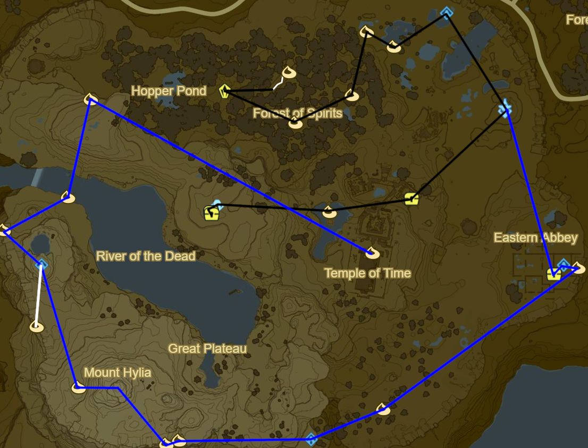

# Great Plateau

* Grab Well-Worn Trousers and Old Shirt
* Exit Shrine of Resurrection
* Korok 001: Dive into lily pads
* Main Quest: Follow the Sheikah Slate
* Grab Hylian Trousers from Temple Ruins
* Great Plateau Tower
* Main Quest: The Isolated Plateau
* Oman Au Shrine (1/120)
* Korok 002: Magnesis Stump SE of Oman Au
* Korok 003: Rock under balanced rocks to NW
* Korok 004: Rock under leaves to SW
* Korok 005: Rock on hill to SW
* Stone Talus to NW (1/40)
* Korok 006: Flower trail to NE
* Warp to Great Plateau Tower
* Jai Baji Shrine South of Great Plateau Tower (2/120)
* Nintendo Switch Shirt: DLC Chest outside Jai Baji
* Korok 007: Rock beneath iron door, behind Jai Baji Shrine
* Korok 008: Fairylights atop hut to SW
* Head West across the ravine and use the small ledges to climb to Owa Daim Shrine (3/120)
* Korok 009: Rock around corner of rampart SE of Mount Hylia
* Korok 010: Rock under slab to W
* Warm Doublet atop Mount Hylia
* Korok 011: Rock Circle West of Mount Hylia
* Continue NW to Keh Namut Shrine (4/120)
* Korok 012: Ice block at end of rampart NW of Keh Namut Shrine
* Korok 013: Under South side of bridge to NE
* Korok 014: Magnesis Puzzle to NE West of Hopper Pond
* Temple of Time
  * Main Quest: Destroy Ganon
  * Main Quest: Seek out Impa
* Korok 015: Temple of Time Spire
* Warp to Oman Au Shrine
