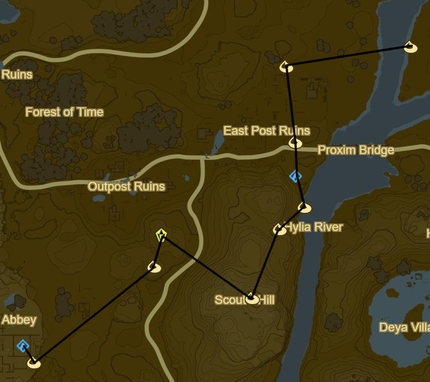
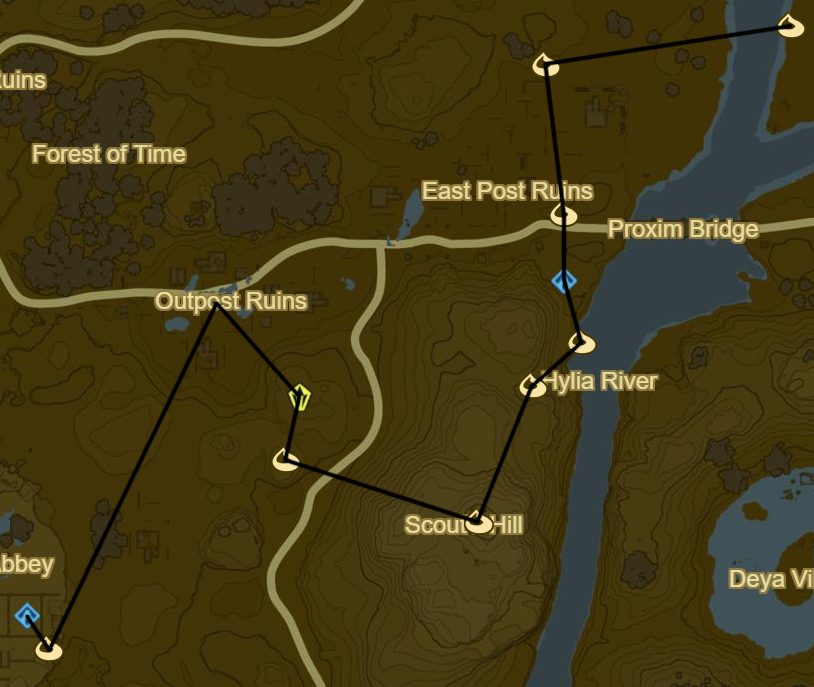
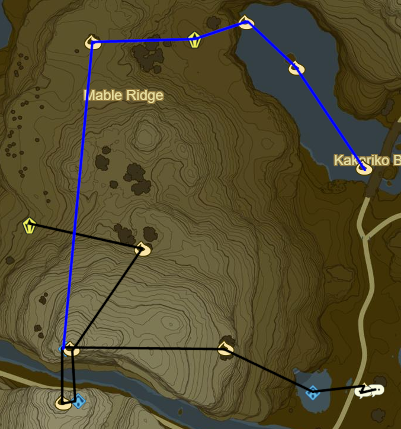
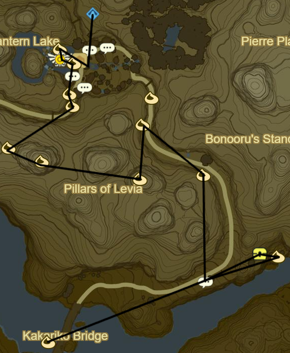
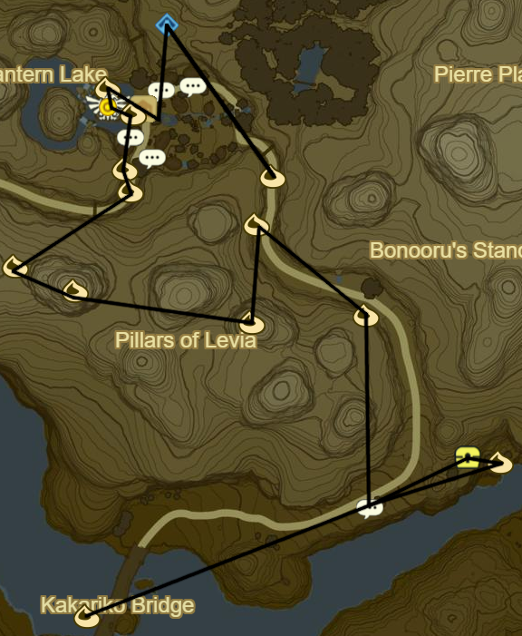

# Dueling Peaks 1

* Korok 016: Fairylights to NW
* Korok 017: Pinwheel shooting to E
* Korok 018: Rock beneath leaves to NE
* Side Quest: EX Treasure: Ancient Mask
  * Chest outside ruins
  * Can make Master Mode safer and easier
* Warp to Ja Baji Shrine

* Korok 019: Rock Beneath Metal Door at ground level
* Head to Outpost Ruins to NE
* Talus to SE (2/40)
* Korok 020: Flower order in Cave to SW
* Korok 021: Rock atop Scout's Hill to E
* Korok 022: Roll Boulder into hole just N
* Korok 023: Rock circle to NE
* Bosh Kala Shrine to N (5/120)
* Korok 024: Fairylights atop flagpole N of Bosh Kala
* Korok 025: Pinwheel shooting to N
* Moblin Club from Moblins in the area
* Korok 026: Rock under boulder to E

* Korok 027: Acorn under Owlan bridge to N
* Korok 028: Rock atop tree to NE
* Korok 029: Magnesis Rock in stump to SE
* Korok 030: Jump 3 fences in a row to SE
* West Nabi Lake Stone Talus to W (3/40)
* Korok 031: Roll Boulder into hole to W
* Korok 032: Pinwheel shooting to W
* Korok 033: Fairylights atop flagpole to SE
* Korok 034: Rock in South Nabi Lake centre to E
* Dueling Peaks Tower to E
* Stone Talus (Senior): E hillside (4/40)

* Korok 035: Apple offering to E
* Korok 036: Rock atop peak to SW
* Glide across and climb to Shee Vaneer Shrine(6/120)
  * <table><tr><th>Row 1</th><th>Row 2</th><th>Row 3</th><th>Row 4</th><th>Row 5</th></tr><tr><td></td><td></td><td></td><td></td><td>X</td></tr><tr><td>X</td><td></td><td></td><td></td><td></td></tr><tr><td></td><td>X</td><td></td><td></td><td></td></tr><tr><td></td><td></td><td></td><td>X</td><td></td></tr><tr><td></td><td>X</td><td></td><td></td><td></td></tr></table>
* Korok 037: Apple offering to W
* Glide back across to Shee Venath Shrine(7/120)
  * <table><tr><th>Row 1</th><th>Row 2</th><th>Row 3</th><th>Row 4</th><th>Row 5</th></tr><tr><td></td><td>X</td><td></td><td></td><td></td></tr><tr><td></td><td></td><td></td><td>X</td><td></td></tr><tr><td>X</td><td></td><td></td><td></td><td></td></tr><tr><td></td><td></td><td>X</td><td></td><td></td></tr><tr><td></td><td></td><td></td><td></td><td>X</td></tr></table>
* Korok 038: Roll Boulder to E
* Ha Dahamar Shrine to E (8/120)
* Dueling Peaks Stable
* Korok 039: Atop Dueling Peaks Stable
* Side Quest: Wild Horses
  * If stuck tame a horse in advance and bring it near, then start the challenge and bring it back
* Side Quest: Misko, the Great Bandit
  * Pay the 100 rupees, will complete later
* Warp back to Shee Venath Shrine
* Korok 040: Rock atop tree on Marble Ridge near Guardian Stalker
* North Marble Ridge Stone Talus: Valley to E (5/40)
* Korok 041: Lilies E of Talus
* Korok 042: Rock Circle in centre of lake to SE
* Korok 043: Rock Circle at Kakariko Bridge to SE

* Follow path to Hestu
  * Side Quest: The Priceless Maracas
* Get Maracas from camp
* Korok 044: Fairylights atop tree E of Maracas camp
* Return Maracas to Hestu
* Korok 045: Magnesis Puzzle along path to Kakariko Village
* Korok 046: Rock atop overhanging ledge along path
* Korok 047: Rock atop pillar directly to S
* Korok 048: Rock atop pillar to West
* Korok 049: Apple Trees to W
* Korok 050: Shoot emblem to NE
* Korok 051: Rock on ledge to N
* Korok 052: Offer apple outside Impa's
* Talk to Impa
  * Main Quest: Free the Divine Beasts
  * Main Quest: Locked Mementos
* Korok 053: Lilies outside Impa's
* Side Quest: Arrows of Burning Heat
  * Inside Arrow Shop
* Side Quest: Koko's Kitchen
  * Swift Carrot
* Side Quest: Cooking with Koko
  * Goat Butter
* Side Quest: Koko Cuisine
  * Raw Meat
* Side Quest: Koko's Specialty
  * Courser Bee Honey
* Side Quest: Playtime with Cottla
* Side Quest: Flown the Coop
  * Mellie's Plum Garden(at night)
  * Shed to S of Village
  * In front of goddess statue
  * In front of shed by fire
  * Atop shed near E entrance
  * Up by Shrine
  * Atop clothes store
* Ta'loh Naeg Shrine Overlooking Village (9/120)
* Korok 054: Shoot Emblem at E exit
* Warp back to Ha Dahamar Shrine
* Take N then E path around Ash Swamp towards Fort Hateno
