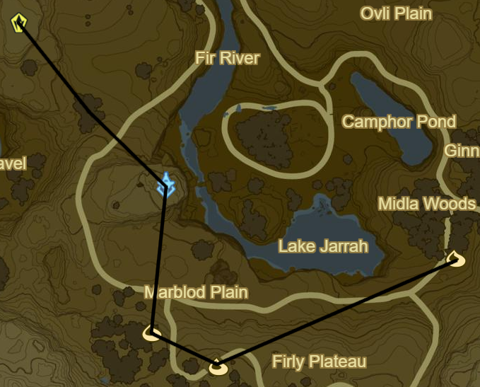

# Hateno 1

* Korok 056: Pinwheel shooting atop wall
* Shrine Quest: The Cursed Statue
  * Inside Cabin
* Korok 057: Rock beneath metal door to NW near wall
* Korok 058: Rock beneath cracked boulder to N
* Korok 059: Roll boulder to N
* Head to statue filled valley to E
* Kam Urog Shrine (10/120)
  * Shoot glowing statue eyes at night
* Korok 060: Apple offering S of Kam Urog
* Follow Path East
* Korok 061: Acorn in tree East of Thin Bridge
* Head over thin bridge then head West up the Cliffs of Quince
* Korok 062: Magnesis Puzzle atop cliffs
* Cliffs of Quince Stone Talus to S (6/40)

* Hateno Tower to SE
* Follow Path South towards Marblod Plain
* Korok 063: Acorn in tree south of path split
* Korok 064: Apple Trees to E
* Follow Path NE to Midla Woods
* Korok 065: Acorn in tree just NE of path split

* Follow path NE into Hateno Village
* Side Quest: The Weapon Connoisseur
  1. Traveler's Sword
  2. Fire Rod
  3. Moblin Club
  4. Duplex Bow
  5. Windcleaver
  6. Ancient Battle Axe+
  7. Frostspear
  8. Ancient Short Sword
* Side Quest: The Statue's Bargain
* Myahm Agana Shrine (11/120)
* Side Quest: Hylian Homeowner
  * 3,000 rupees
  * 30 bundles of wood
  * 1,400 Rupees for interior
  * Side Quest: From the Ground Up
* Korok 066: Rock below bridge to house
* Shrine Quest: Secret of the Cedars
* Shrine Quest: The Spring of Wisdom
* Side Quest: A Gift for My Beloved
  * 10 Restless Crickets
* Korok 067: Rock atop tree N of Zelkoa Pond
* Collect Blue Flame to S
* Side Quest: The Sheep Rustlers
  * Farmhouse up towards Hateno Ancient Tech Lab
* Deliver Flame to Hateno Ancient Tech Lab
* Korok 068: Tree in centre of Lake Sumac to NW
* Warp back to Lab
* Repair Sheikah Slate
* Side Quest: Slated for Upgrades
  * Sensor: 3 Ancient Screws
    * Side Quest: Sunshroom Sensing
  * Bombs: 3 Ancient Shafts
  * Stasis: 3 Ancient Cores
* Side Quest: Robbie's Research
* Korok 069: Fairylights atop Hateno Ancient Tech Lab
* Korok 070: Lilies to E of Hateno Ancient Tech Lab
* Take out enemy encampment SE on Hateno beach for Side Quest
* Korok 071: Flower trail to S
* Korok 072: Palm Fruit Offering to NE

* Head E across Deepback Bay
* Korok 073: Rock Pattern on Central Shore
* Luminous Stone Talus: Bay Centre (7/40)
* Korok 074: Lilies N of Talus
* Korok 075: Flower trail to SE up Mapla Point
* Korok 076: Pinwheel Shooting to NW
* Warp Back to Myahm Agana Shrine

* Korok 077: Flower Trail E of House
* Korok 078: Magnesis Puzzle to W
* Korok 079: Rock pattern over Ebon Mountain to SE
* Korok 080: Rock circle to NE
* Side Quest: The Hero's Cache to SE
  * Reef to South
* Warp to Ta'loh Naeg Shrine

Next: [Dueling Peaks 2](04 - DP2.md)
