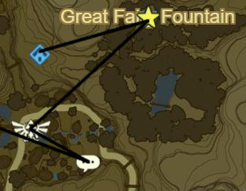
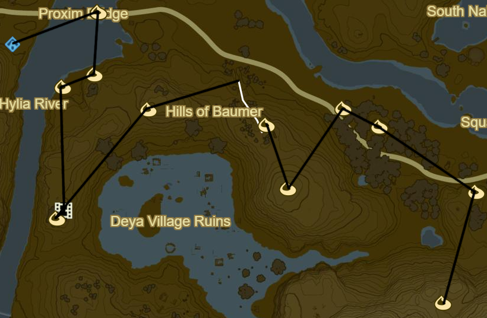

# Dueling Peaks 2

* Head E to Fairy Fountain and take a picture
* Return to Kakariko Village
* Main Quest: Find the Fairy Fountain
* Side Quest: By Firefly's Light
  * 5 Sunset Fireflies
* Speak to Impa
* Main Quest: Captured Memories
* Warp to Bosh Kala Shrine

* Korok 081: Rock under Proxim Bridge to E
* Korok 082: Rock on Hylia Rivershore to S
* Korok 083: Magnesis Puzzle to W
* Recovered Memory 11: Shelter from the Storm
  * Beneath Tree to South (1/12)
* Korok 084: Behind statues
* Korok 085: Pinwheel shooting to NE
* Korok 086: Flower Trail to E
* Korok 087: Apple Trees to SE
* Korok 088: Push boulder to NE
* Korok 089: Rock in cave behind cracked boulder to SE
* Korok 090: Pinwheel shooting to SE
* Korok 091: Rock beneath slab to S

* Korok 092: Flower trail to NE
* Korok 093: Rock atop ledge at Dueling Peaks entrance to SE
* Ree Dahee Shrine within Dueling Peaks (12/120)
  * Don't forget Climber's Bandana
* Continue through Dueling Peaks

* Korok 094: Ledge S of Little Twin Bridge
* Stalnox: Hickaly Woods to SE (1/40)
* Korok 095: Rock in hollow stump to W
* Toto Sah Shrine across River to SW (13/120)
* Korok 096: Rock in middle of river upstream
* Side Quest: Misko, the Great Bandit
  * Cave blocked by cracked boulder atop waterfall
* Warp to Ta-loh Naeg Shrine
* Talk to Impa
  * Champion's Tunic
* Shrine Quest: Stolen Heirloom
  * Lakna Rokee Shrine (14/120)

Next: [Hateno 2](05 - Hateno2.md)
