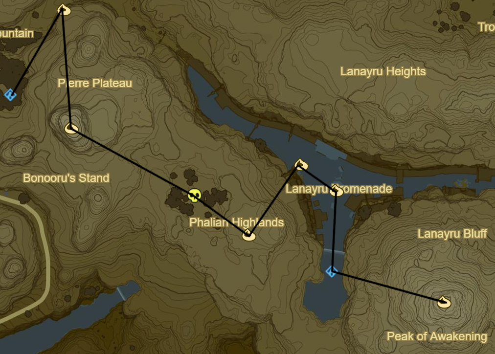
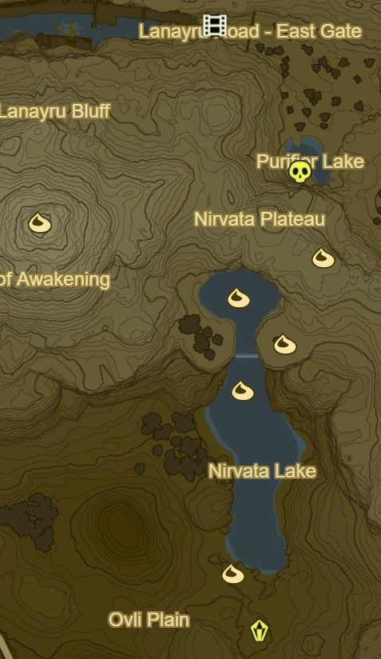
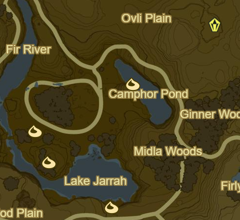

# Hateno 2

* Korok 097: Magnesis Puzzle to NE
* Korok 098: Rock atop peak of Pierre Plateau to S
* Hinox to SE (2/40)
* Korok 099: Rock Pattern to SE
* Korok 100: Lilies to NE
* Korok 101: Rock in centre of Lanaryu Promenade
* Dow Na'eh Shrine - Behind Waterfall to S (15/120)
* Korok 102: Atop Lanaryu Bluff at the Peak of Awakening

* Recovered Memory 15 - Return of Calamity Ganon NE at Lanaryu Road - East Gate (2/12)
* Hinox in Purifier Lake to SE (3/40)
* Korok 103: Magnesis Puzzle atop Nirvata Plateau to SE
* Korok 104: Lilies to SW
* Korok 105: Apple Trees to SE
* Korok 106: Lilies to SW
* Korok 107: Pinwheel shooting to S
* Stone Talus to S (8/40)

* Korok 108: Lilies to SW in Camphor Pond
* Korok 109: Shoot 10 signs on track, then balloon above cabin
* Korok 110: Rock under metal door to S
* Korok 111: Rock on shore to SE
* Warp to Dueling Peaks Tower

Next: [Lanaryu 1](06 - Lanaryu1.md)
