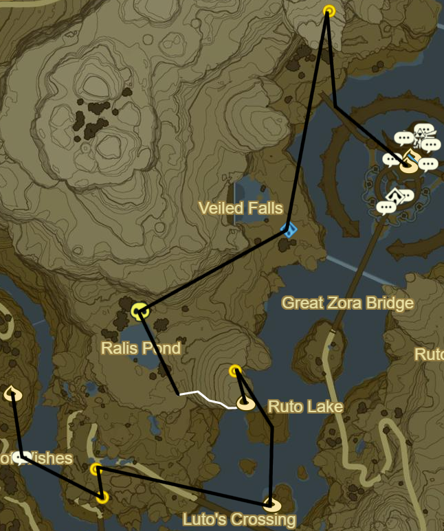
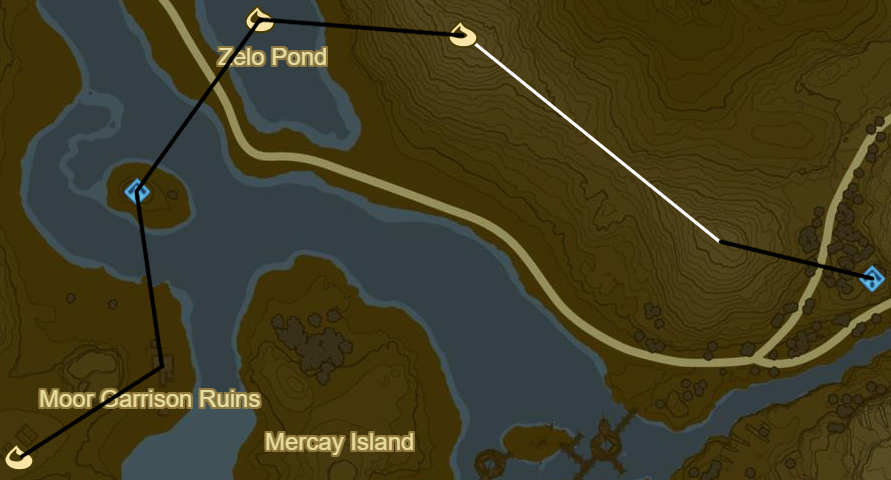

# Lanaryu 1

* Korok 112: Rock on small island on Nabi Lake to N
* Korok 113: Rock beneath Eagus Bridge to N

* Shrine Quest: Watch Out for the Flowers to NW
  * Hila Rao Shrine (16/120)
* Korok 114: Rock under boulder to NE
* Korok 115: Fairylights to E around Millenio Sandbar
* Korok 116: Apple Trees to E
* Daka Tuss Shrine to NE (17/120)

* Korok 117: Fairylights to S atop Ledge
* Korok 118: Apple offering in cave to SW
* Warp back to Daka Tuss
* Korok 119: Magnesis well to NW on Zauz Island
* Korok 120: Fairylights to E
* Korok 121: Hanging acorn to E
* Korok 122: Rock on tree atop cliff to SE
* Hinox to N (4/40)
* Korok 123: Rock pattern to SE

* Lanaryu Tower to NE
* Soh Kofi Shrine to N (18/120)
* Main Quest: Reach Zora's Domain to E
* Follow path to Zora's Domain
* Ne'ez Yohma Shrine (19/120)
* Main Quest: Divine Beast Vah Ruta
* Side Quest: Diving is Beauty!
* Side Quest: Lynel Safari
  * Lynel Picture
* Complete Divine Beast Vah Ruta
  * Recovered Memory 10 - Mipha's Touch

* Korok 124: Zora's Domain Fish Tail Fin
* Korok 125: Zora's Domain Fish Spout
* Side Quest: Zora Stone Monuments
* Side Quest: The Giant of Ralis Pond
* Side Quest: A Wife Washed Away
* Side Quest: Frog Catching
* Side Quest: Luminous Stone Gathering
* Shrine Quest: The Ceremonial Song
  * Speak to Trello
  * Find ceremonial trident under bridge
* Head across bridge
* Head NE to Stone monument
  * Memoir of a Gifted Stonemason
* Korok 126: Magnesis puzzle far SW over mountain
* Shrine Quest: The Ceremonial Song to E
  * Attack from Paraglider into Pedestal with Ceremonial Trident
  * Daha Keek Shrine (20/120)
* Blue Hinox to SW at Ralis Pond (5/40)
* Korok 127: Follow Flower to SE
* Stone Monument below to N
  * History of the Zora, Part Three
* Korok 128: Rock Pattern to SE on island near Luto's Crossing
* Stone Monument to W
  * History of the Zora, Part One
* Stone Monument to S
  * History of the Zora, Part Two
* Side Quest: Special Delivery to NW
  * Start Quest
* Korok 129: Magnesis Stump to N
* Follow Special Delivery letter
* Warp to Lanaryu Tower

* Black Hinox to E (6/40)
* Korok 130: Under Rock to NE
* Korok 131: Rock Circle to SE
* Stone Monument to SE
  * History of the Zora, Part Five
* Korok 132: Shoot Balloon over river to SW
  * Drown to deathwarp back up cliff
* Korok 133: Magnesis Puzzle to E of previous Korok
* Korok 134: Fairylights to E
* Stone Monument to N near Luto's Crossing
  * History of the Zora, Part Four
* Korok 135: Fairylights to E

* Stone Monument to E
  * History of the Zora, Addendum 1
* Korok 136: Rock atop hill to E
* Stone Monument to E
  * History of the Zora, Part Six
* Stone Monument to NW
  * History of the Zora, Part Seven
* Korok 137: Rock atop cliff to NE
* Korok 138: Rock atop cliff to E
* Korok 139: Magnesis Puzzle to N
* Stone Monument to NE near Lulu Lake
  * History of the Zora, Addendum 2
* Warp back to Ne'ez Yohma Shrine

* Complete Side Quest: Stone Monuments
* Complete Side Quest: The Giant of Ralis Pond
* Complete Side Quest: Special Delivery
* Head N towards Toto Lake to retrieve Zora Helm
* Korok 140: Fairylight to NE
* Warp back to Soh Kofi

* Korok 141: Race to W
* Korok 142: Lilies to W on Zelo Pond
* Sheh Rata Shrine to SW (21/120)
* Korok 143: Rock pattern in ruins to SW

* Korok 144: Rock pattern to W
* Korok 145: Rock surrounded by brambles in woods to SW
* Kaya Wan Shrine (22/120)
* Wetland Stable to NW
* Side Quest: Riverbed Reward
* Korok 146: Rock pattern to NE
* Korok 147: Balloon in tree to N

* Korok 148: Rock circle below Thims Bridge to NE
* Korok 149: Magnesis Puzzle to E over hill
* Korok 150: Race to SW
* Korok 151: Fairylights in pond

Next: [Woodland 1](07 - Lanaryu1.md)
