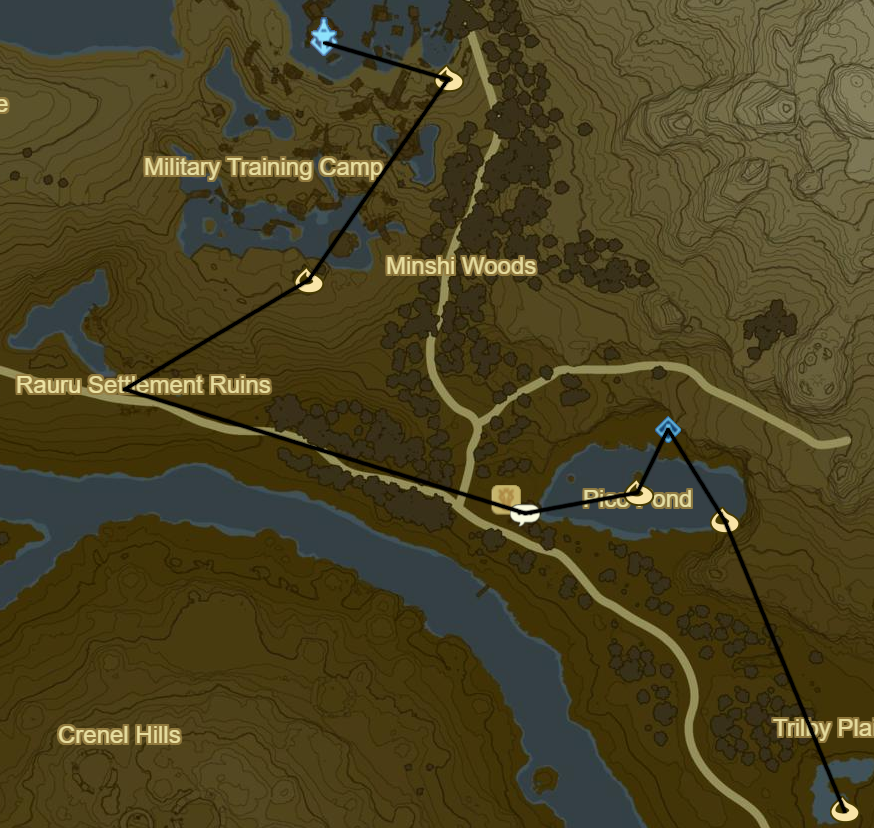
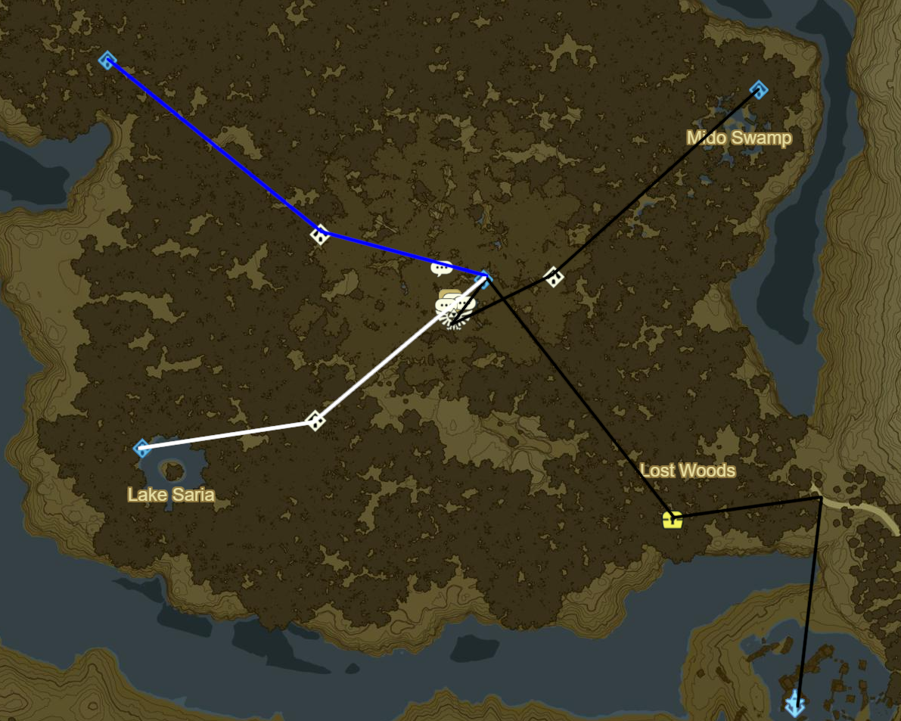
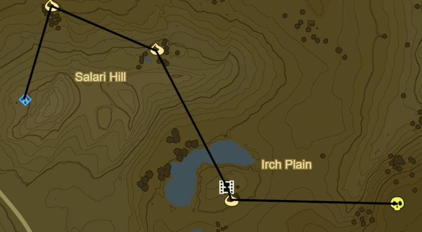
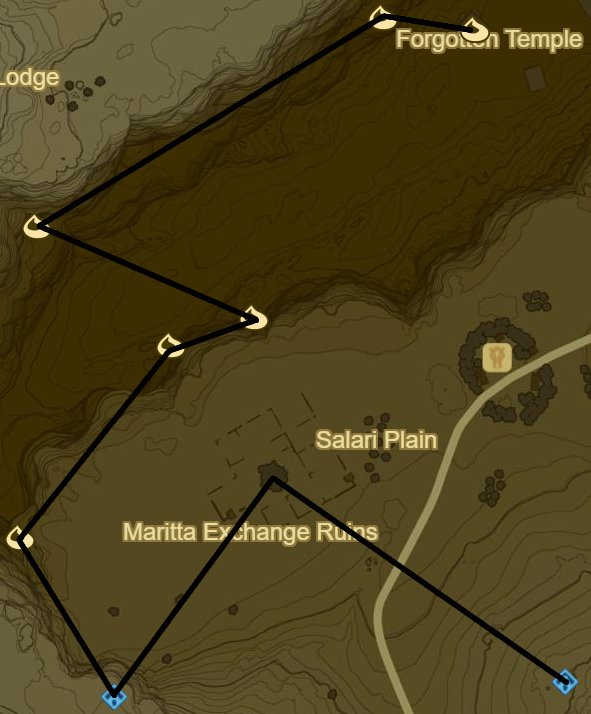
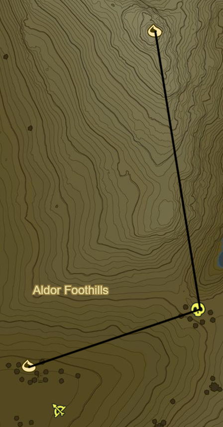
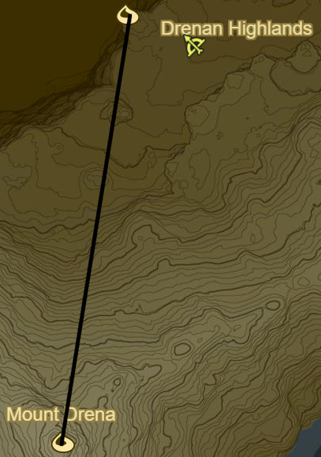

# Woodland

* Korok 149: Water lilies to NW on Pico Pond
* Mirro Shaz Shrine to NW (23/120)
* Korok 150: Magnesis Puzzle in centre of Pico Pond
* Woodland Stable
* Side Quest: Balloon Flight
* Rauru Settlement Ruins to SW
* Korok 151: Acorn in Tree to NE S of Military Training Camp
* Korok 152: Rock on scaffolding uphill to NE
* Woodland Tower

* Lost Woods to N
* Side Quest: EX Strange Mask Rumors
  * Korok Mask towards W near coast
* Keo Ruug Shrine (24/120)
  * 5, 3, 1, 2
  * 4, 2, 2, 1
* Main Quest: The Hero's Sword
* Side Quest: Legendary Rabbit Trial
  * Blupee Picture
* Side Quest: A Freezing Rod
  * Frost/Blizzard Rod
* Side Quest: Riddles of Hyrule
  1. Apple
  2. Fortified Pumpkin
  3. Sunshroom
  4. Voltfin Trout
  5. Lynel Hoof
* Side Quest: The Korok Trials
  * Shrine Quest: The Test of Wood
    * Maag Halan Shrine (25/120)
  * Shrine Quest: The Lost Pilgrimage
    * Daag Chokah Shrine (26/120)
  * Shrine Quest: The Trial of Second Sight
    * Khun Sidajj Shrine (27/120)
* Warp back to Woodland Tower

* Korok 153: Rock next to pillar far to W near Hyrule Castle
* Korok 154: Rock to NW
* Korok 155: Pinwheel shooting to W
* Korok 156: Acorn in log to SW
* Blue Hinox to SW (7/40)

* Korok 157: Rock atop tree to W
* Memory 9 - Silent Princess (3/12)
* Korok 158: Fairylights to NW
* Korok 159: Acorn in log to NW
* Monya Toma Shrine to S (28/120)

* Maritta Exchange Ruins to NE
* Maag No'rah Shrine: within cliff to SW (29/120)
* Korok 160: Rock beneath cracked boulder in gorge to NW
* Korok 161: Rock within gorge to NE
* Korok 162: Rock below cracked boulder to NE
* Korok 163: Rock atop cliff to NW
* Korok 164: Rock atop cliff to NE
* Korok 165: Rock atop pillar to E

* Korok 166: Rock beneath metal door to NE
* Korok 167: Rock beneath cracked boulder atop temple entrance
* Korok 168: Rock below cracked boulder to E atop Temple
* Korok 169: Magnesis puzzle atop temple to NE
* Rona Kachta Shrine within temple (30/120)
* Korok 170: Rock behind goddess statue behind Shrine
* Warp back to Monya Toma Shrine

* Serenne Stable
  * Side Quest: Leviathan Bones
* Korok 171: Jump 3 fences to NE
* Stalnox to N (8/40)
* Korok 172: Acorn in log to E
* Korok 173: Fairylights atop ruin to S
* Korok 174: Rock pattern to S
* Korok 175: Pinwheel shooting to SE
* Korok 176: Acorn in log to N

* Blue Hinox to E (9/40)
* Korok 177: Rock atop mountain to N

* Korok 178: Acorn Shooting to N

* Korok 179: Rock atop pillar to NE
* Korok 180: Magnesis Puzzle to E
* Korok 181: Pinwheel Shooting to SE
* Korok 182: Pinwheel Shooting atop pillar to SW
* Korok 183: Pinwheel Shooting to NW
* Korok 184: Acorn in Log to W
* Entrance to Thyphlo Ruins to NE
  * Fire Rod Chests in the ruins
* Shrine Quest: Shrouded Shrine to N in Forest
  * Ketow Wawai Shrine (31/120)
  * Hinox (10/40)
* Warp to Monya Toma Shrine
