# Ridgeland

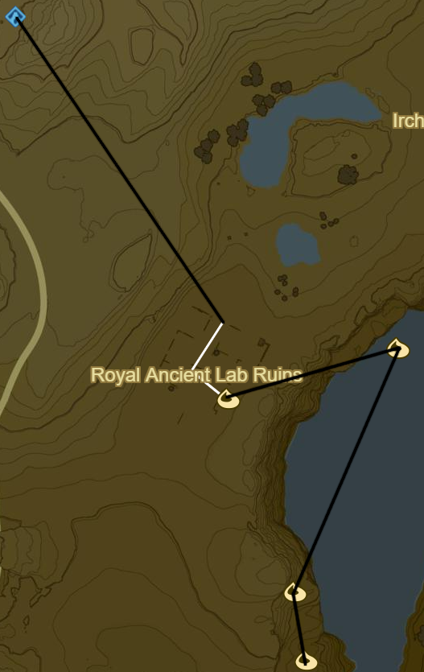

* Korok 185: Flower Trail to SE in Royal Ancient Lab Ruins
* Korok 186: Rock circle to E
* Korok 187: Magnesis Puzzle to SW
* Korok 188: Roll boulder to S

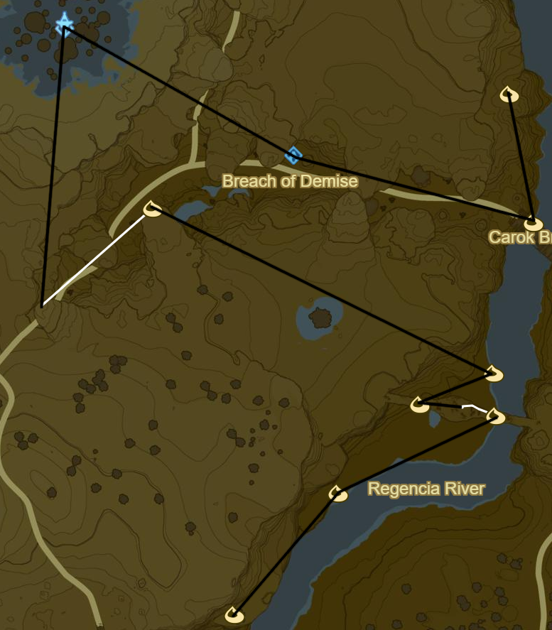

* Korok 189: Acorn below Carok Bridge to S
* Zalta Wa Shrine to W (32/120)
* Ridgeland Tower to W
* Korok 190: Race to SW
* Korok 191: Rock Circle far to E on Regencia River
* Korok 192: Balloon beneath bridge to SW
* Korok 193: Flower Trail to E below bridge
* Korok 194: Rock on shore to SW
* Korok 195: Acorn in tree to SW

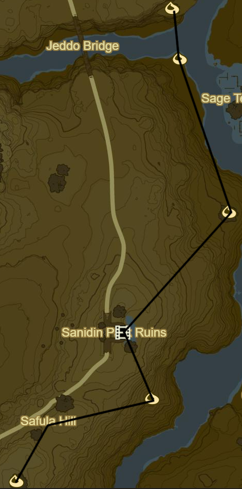

* Korok 196: Magnesis Puzzle to S
* Korok 197: Rock in tree to SE
* Memory 14 - To Mount Lanaryu: Ruins to SW (4/12)
* Korok 198: Rock to SE
* Side Quest: The Royal White Stallion
  * Tame White Horse to W
* Korok 199: Apple offering to SW
* Head to stable to SE over Manhala Bridge to complete quest
  * Register White Stallion
  * Speak to Old Man
  * Follow path back over Manhala Bridge into Ridgeland

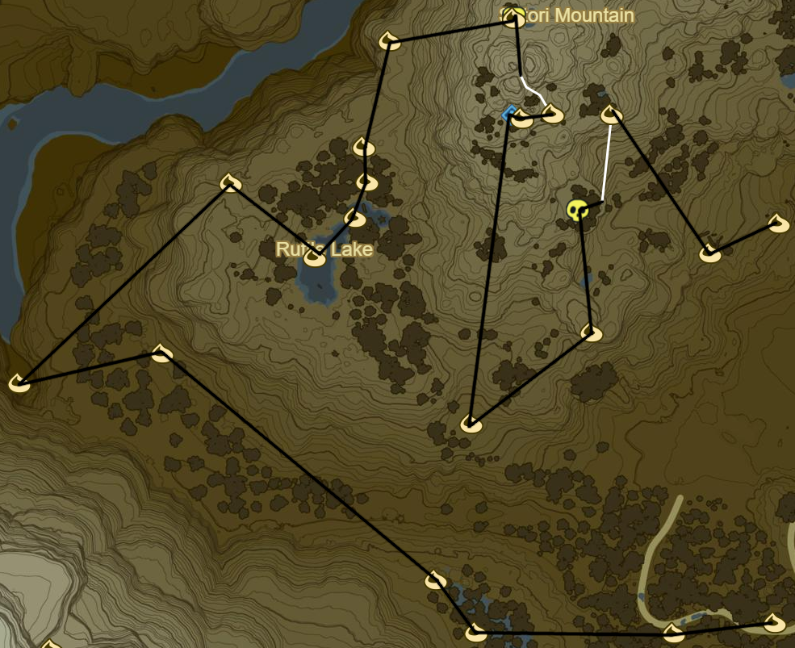

* Korok 200: Apple offering to W in Dalite Forest
* Korok 201: Hanging acorn to W
* Korok 202: Rock atop tree to W
* Korok 203: Hanging acorn to NW
* Korok 204: Rock beneath leaves to NW through Valley
* Korok 205: Rock beneath leaves to NE back up towards Rutile Lake
* Korok 206: Rock circle in Rutile Lake to SE
* Korok 207: Magnesis rocks in stumps to NE
* Korok 208: Flower patches to NE
* Korok 209: Rock beneath cracked boulder to N
* Korok 210: Rock Pattern to N
* Korok 211: Rock atop tree at peak to E
* Side Quest: EX Ancient Horse Rumors
  * Ancient Bridle
* Korok 212: Flower Trail to S
* Korok 213: Rock beneath leaves to W
* Magg Latan Shrine to W (33/120)
* Korok 214: Roll Boulder to S
* Korok 215: Rock beneath boulder to NE
* Stalnox to N (11/40)
* Korok 216: Race to E of Stalnox
* Korok 217: Acorn in log to SE
* Korok 218: Pinwheel shooting to ENE

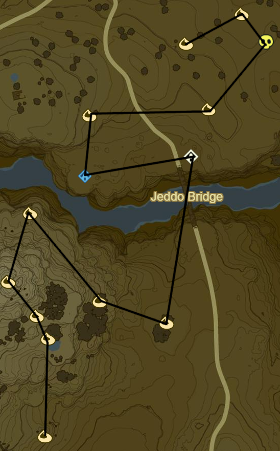

* Korok 219: Rock in stump to N
* Korok 220: Fairylights atop bare tree to N
* Korok 221: Rock beneath cracked boulder to NW
* Korok 222: Pinwheel shooting to NE
* Korok 223: Acorn in tree to SE
* Korok 224: Acorn in tree to E
* Shrine Quest: The Two Rings to N across bridge
  * Sheem Dagoze Shrine (34/120)
* Korok 225: Apple Trees to N
* Korok 226: Flower patches to E
* Blue Hinox to NE (12/40)
* Korok 227: Rock beneath slab to NW
* Korok 228: Fairylights to SW

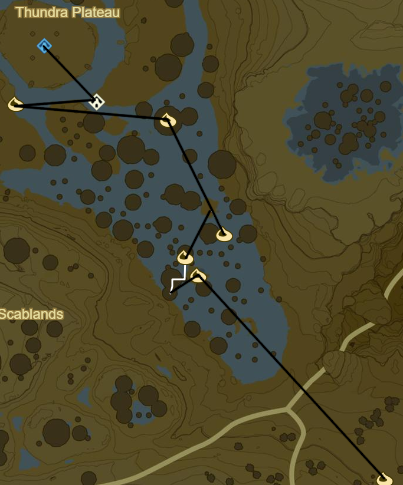

* Korok 229: Lilies to NW
* Korok 230: Flower Trail atop mushroom trees to W
* Korok 231: Race to NE
* Korok 232: Fairylights to NW
* Shrine Quest: Trial of Thunder on Thundra Plateau
  * Toh Yahsa Shrine (35/120)
    * Don't forget Rubber armor
* Korok 233: Rock circle atop mushroom to SE

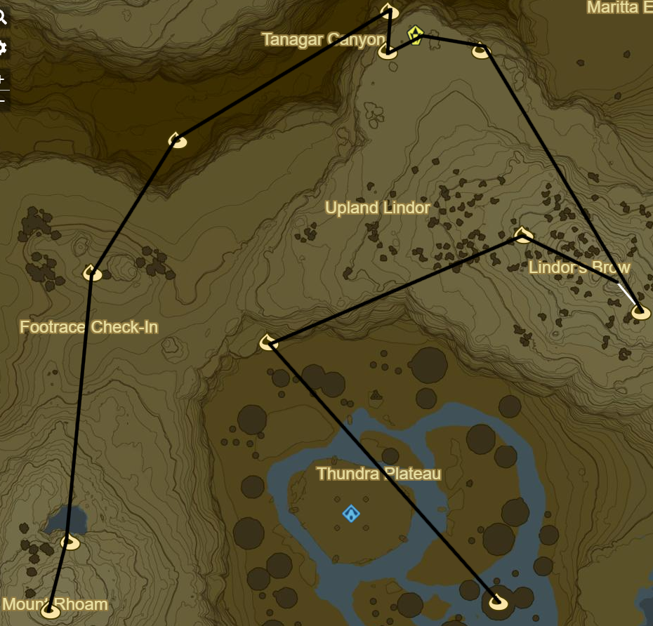

* Korok 234: Rock beneath cracked boulder to NW
* Korok 235: Fairylights atop bare tree to NE
* Korok 236: Race atop mountain to SE
* Korok 237: Rock beneath cracked boulder to NW
* Stone Talus to W (9/40)
* Korok 238: Rock to W
* Korok 239: Magnesis Puzzle down to N
* Korok 240: Rock pattern in Canyon to SW
* Korok 241: Acorn in tree to SW near Footrace Check-In
* Korok 242: Rock to S
* Korok 243: Rock to S atop Mount Rhoam

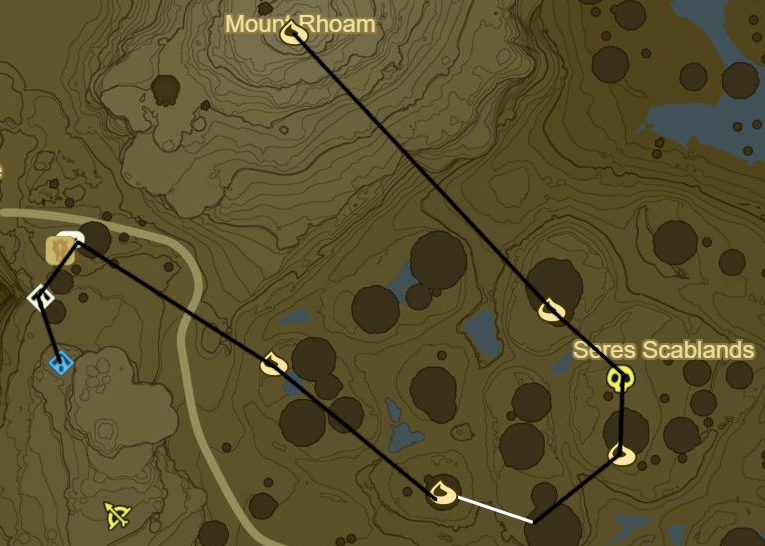

* Korok 244: Balloon under mushroom to SE
* Blue Hinox to SE (13/40)
* Korok 245: Balloon under mushroom to S
* Korok 246: Race atop Mushroom to SW
* Korok 247: Fairylights to NW
* Tabantha Bridge Stable to W
* Side Quest: A Gift for the Great Fairy
* Shrine Quest: Cliffside Etchings
* Shae Loya Shrine to S (36/120)
  * This should be the 36th Shrine so it should be possible to retrieve Master Sword
    * Complete Side Quest: The Korok Trials

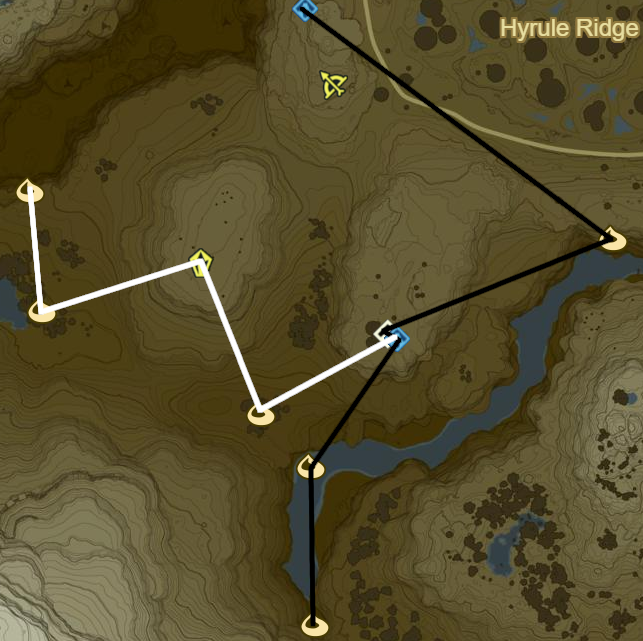

* Korok 248: Rock to SE, W of Sheem Dagoze
* Shrine Quest: Under a Red Moon to SW
  * Blood moons only happen every 3 hours or so of play
  * Mijah Rokee Shrine (37/120)
* Korok 249: Rock in river to SW
* Korok 250: Rock in Gorge to S
* Warp Back to Mijah Rokee
* Korok 251: Balloon in tree to SW
* Stone Talus atop Illumeni Plateau to NW (10/40)
* Korok 252: Flower patches to W
* Korok 253: Rock to N

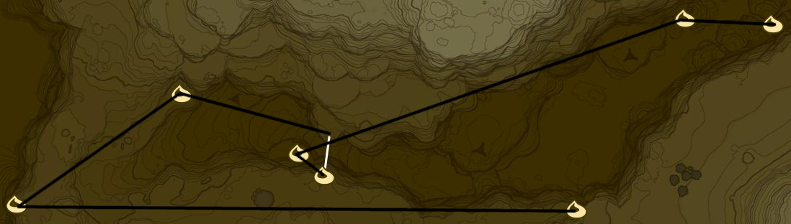

* Korok 254: Pinwheel shooting to W at map edge
* Korok 255: Rock pattern to NE
* Korok 256: Race to E
* Korok 257: Hanging acorn to NW
* Korok 258: Rock beneath slab to NE in gorge
* Korok 259: Rock between pillars to E

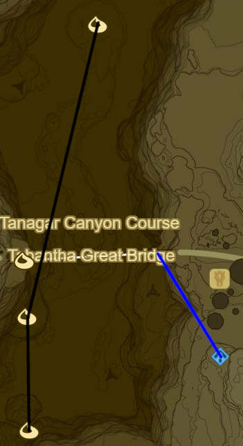

* Korok 260: Magnesis puzzle to N
* Korok 261: Fairylights atop flagpole to N
* Warp to Shae Loya Shrine
* Korok 262: Race under Tabantha Great Bridge to NW
