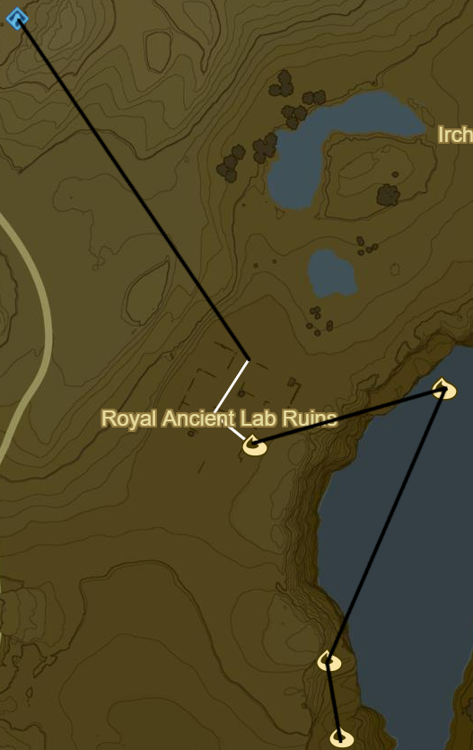
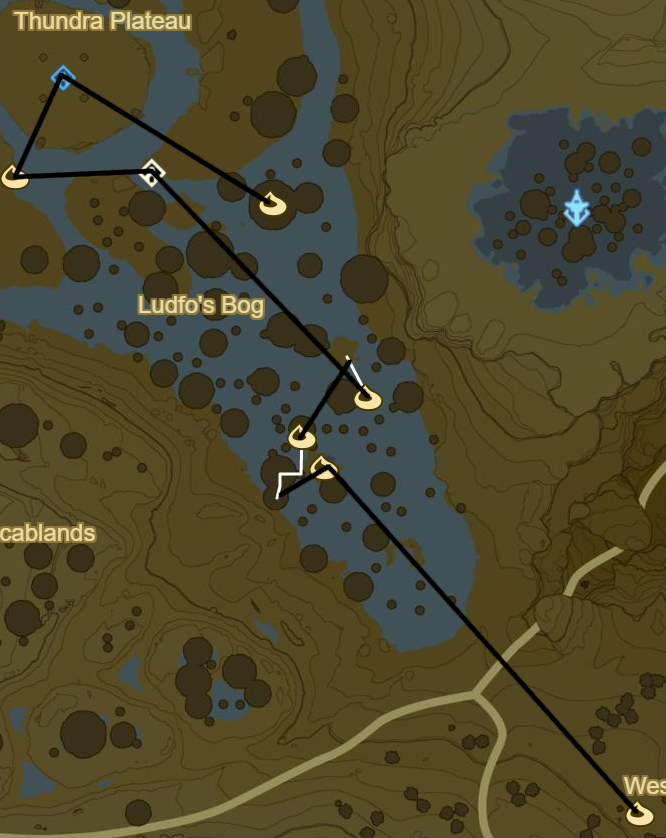
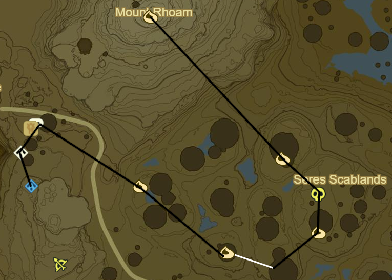

# Ridgeland 1

* Korok 184: Follow Flower to SE in Royal Ancient Lab Ruins
* Korok 185: Rock circle to E
* Korok 186: Magnesis Puzzle to SW
* Korok 187: Roll boulder to S

* Korok 188: Acorn below Carok Bridge to S
* Zalta Wa Shrine to W (32/120)
* Ridgeland Tower to W
* Korok 189: Race to SW
* Korok 190: Rock Circle far to E on Regencia River
* Korok 191: Balloon beneath bridge to SW
* Korok 192: Flower path to E below bridge
* Korok 193: Rock on shore to SW
* Korok 194: Acorn in tree to SW

* Korok 195: Magnesis Puzzle to S
* Korok 196: Rock in tree to SE
* Memory 14: Ruins to SW (4/12)
* Korok 197: Rock to SE
* Side Quest: The Royal White Stallion
  * Tame White Horse to W
* Korok 198: Apple offering to SW
* Head to stable to SE over Manhala Bridge to complete quest
  * Register White Stallion
  * Speak to Old Man
  * Follow path back over Manhala Bridge into Ridgeland

 -- CHANGE

* Korok 199: Apple offering to W in Dalite Forest
* Korok 200: Hanging acorn to W
* Korok 201: Rock atop tree to W
* Korok 202: Hanging acorn to NW
* Korok 203: Rock beneath leaves to NW through Valley
* Korok 204: Rock to W in gorge
* Korok 205: Rock beneath leaves to NE back up towards Rutile Lake
* Korok 206: Rock circle in Rutile Lake to SE
* Korok 207: Magnesis rocks in stumps to NE
* Korok 208: Flower patches to NE
* Korok 209: Rock beneath cracked rock to N
* Korok 210: Rock Pattern to N
* Korok 211: Rock atop tree at peak to E
* Side Quest: EX Ancient Horse Rumors
  * Ancient Bridle
* Korok 212: Follow Flower to S
* Korok 213: Rock beneath leaves to W
* Magg Latan Shrine to W (33/120)
* Korok 214: Roll Boulder to S
* Korok 215: Rock beneath boulder to NE
* Stalnox to N (11/40)
* Korok 216: Race to E of Stalnox
* Korok 217: Acorn in log to SE
* Korok 218: Pinwheel shooting to ENE

* Korok 219: Rock in stump to N
* Korok 220: Fairylights atop bare tree to N
* Korok 221: Rock beneath cracked rock to NW
* Korok 222: Pinwheel shooting to NE
* Korok 223: Acorn in tree to SE
* Korok 224: Acorn in tree to E
* Shrine Quest: The Two Rings to N across bridge
  * Sheem Dagoze Shrine (34/120)
* Korok 225: Apple Trees to N
* Korok 226: Flower patches to E
* Blue Hinox to NE (12/40)
* Korok 227: Rock beneath slab to NW
* Korok 228: Fairylights to SW

* Korok 229: Lilies to NW
* Korok 230: Flower Trail atop mushroom trees to W
* Korok 231: Race to NE
* Korok 232: Rock circle atop mushroom to NW
* Korok 233: Fairylights to W
* Shrine Quest: Trial of Thunder on Thundra Plateau
  * Toh Yahsa Shrine (35/120)
    * Don't forget Rubber armor

* Korok 234: Rock beneath cracked boulder to NW
* Korok 235: Fairylights atop bare tree to NE
* Korok 236: Race atop mountain to SE
* Korok 237: Rock beneath cracked boulder to NW
* Stone Talus(Lumionus) to W (9/40)
* Korok 238: Under Rock to W
* Korok 239: Magnesis Puzzle down to N
* Korok 240: Rock pattern in Canyon to SW
* Korok 241: Acorn in tree to SW near Footrace Check-In
* Korok 242: Under Rock to S
* Korok 243: Under rock to S atop Mount Rhoam

* Korok 244: Balloon under mushroom to SE
* Blue Hinox to SE (13/40)
* Korok 245: Ballon under mushroom to S
* Korok 246: Race atop Mushroom to SW
* Korok 247: Fairylights to NW
* Tabantha Bridge Stable to W
  * Side Quest: A Gift for the Great Fairy
    * Return to Complete
  * Shrine Quest: Cliffside Etchings
  * Shae Loya Shrine to S (36/120)
    * This should be the 36th Shrine so it should be possible to retrieve Master Sword
      * Complete Side Quest: The Korok Trials
      * 1 weapon, 2 shield, 2 bow

* Korok 248: Rock to SE, W of Sheem Dagoze
* Shrine Quest: Under a Red Moon to SW
  * Blood moons only happen when there are monsters to be respawned
  * Mijah Rokee Shrine (37/120)
* Korok 249: Rock in river to SW
* Korok 250: Balloon in tree to NW
* Stone Talus(Rare): atop Illumeni Plateau to NW (10/40)
* Korok 251: Flower patches to W
* Korok 252: Rock to N

* Korok 253: Pinwheel shooting to W at map edge
* Korok 254: Rock pattern to NE
* Korok 255: Race to E
* Korok 256: Hanging acorn to NW
* Korok 257: Rock beneath slab to NE in gorge
* Korok 258: Rock between pillars to E

* Korok 259: Magnesis puzzle to N
* Korok 260: Fairylights atop flagpole to N
* Warp to Shae Loya Shrine
* Korok 261: Race under Tabantha Great Bridge to NW

Next: [Tabantha 1](09 - Tabantha1.md)
