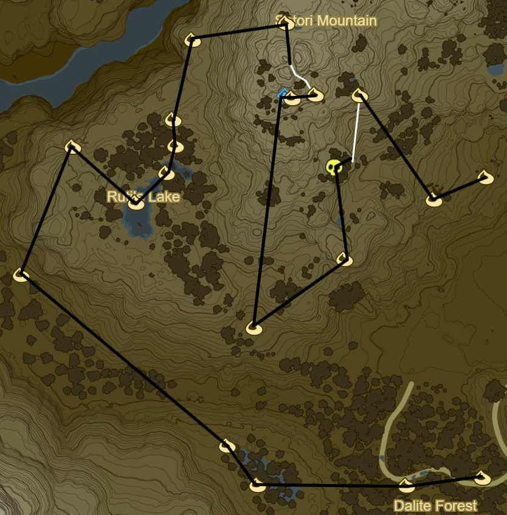
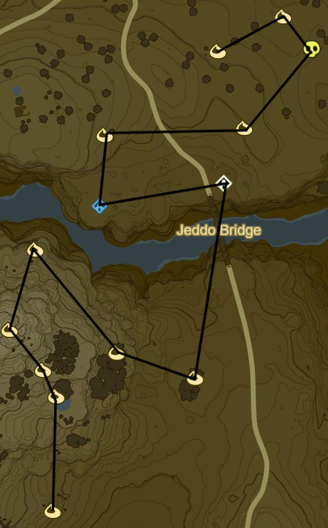
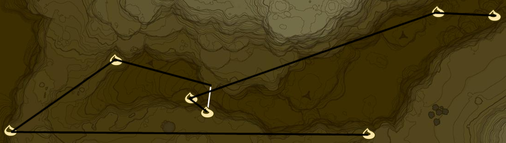
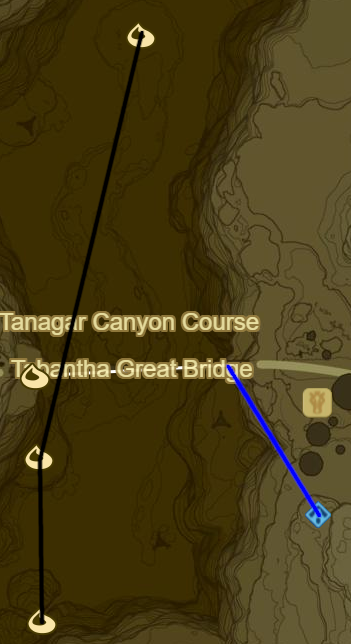

# Ridgeland 1

* Korok 187: Flower Trail to SE in Royal Ancient Lab Ruins
* Korok 188: Rock circle to E
* Korok 189: Magnesis Puzzle to SW
* Korok 190: Roll boulder to S

* Korok 191: Acorn below Carok Bridge to S
* Zalta Wa Shrine to W (32/120)
* Ridgeland Tower to W
* Korok 192: Race to SW
* Korok 193: Rock Circle far to E on Regencia River
* Korok 194: Balloon beneath bridge to SW
* Korok 195: Flower Trail to E below bridge
* Korok 196: Rock on shore to SW
* Korok 197: Acorn in tree to SW

* Korok 198: Magnesis Puzzle to S
* Korok 199: Rock in tree to SE
* Memory 14 - To Mount Lanaryu: Ruins to SW (4/12)
* Korok 200: Rock to SE
* Side Quest: The Royal White Stallion
  * Tame White Horse to W
* Korok 201: Apple offering to SW
* Head to stable to SE over Manhala Bridge to complete quest
  * Register White Stallion
  * Speak to Old Man
  * Follow path back over Manhala Bridge into Ridgeland

* Korok 202: Apple offering to W in Dalite Forest
* Korok 203: Hanging acorn to W
* Korok 204: Rock atop tree to W
* Korok 205: Hanging acorn to NW
* Korok 206: Rock beneath leaves to NW through Valley
* Korok 207: Rock to W in gorge
* Korok 208: Rock beneath leaves to NE back up towards Rutile Lake
* Korok 209: Rock circle in Rutile Lake to SE
* Korok 210: Magnesis rocks in stumps to NE
* Korok 211: Flower patches to NE
* Korok 212: Rock beneath cracked boulder to N
* Korok 213: Rock Pattern to N
* Korok 214: Rock atop tree at peak to E
* Side Quest: EX Ancient Horse Rumors
  * Ancient Bridle
* Korok 215: Flower Trail to S
* Korok 216: Rock beneath leaves to W
* Magg Latan Shrine to W (33/120)
* Korok 217: Roll Boulder to S
* Korok 218: Rock beneath boulder to NE
* Stalnox to N (11/40)
* Korok 219: Race to E of Stalnox
* Korok 220: Acorn in log to SE
* Korok 221: Pinwheel shooting to ENE

* Korok 222: Rock in stump to N
* Korok 223: Fairylights atop bare tree to N
* Korok 224: Rock beneath cracked boulder to NW
* Korok 225: Pinwheel shooting to NE
* Korok 226: Acorn in tree to SE
* Korok 227: Acorn in tree to E
* Shrine Quest: The Two Rings to N across bridge
  * Sheem Dagoze Shrine (34/120)
* Korok 228: Apple Trees to N
* Korok 229: Flower patches to E
* Blue Hinox to NE (12/40)
* Korok 230: Rock beneath slab to NW
* Korok 231: Fairylights to SW

* Korok 232: Lilies to NW
* Korok 233: Flower Trail atop mushroom trees to W
* Korok 234: Race to NE
* Korok 235: Rock circle atop mushroom to NW
* Korok 236: Fairylights to W
* Shrine Quest: Trial of Thunder on Thundra Plateau
  * Toh Yahsa Shrine (35/120)
    * Don't forget Rubber armor

* Korok 237: Rock beneath cracked boulder to NW
* Korok 238: Fairylights atop bare tree to NE
* Korok 239: Race atop mountain to SE
* Korok 240: Rock beneath cracked boulder to NW
* Stone Talus(Lumionus) to W (9/40)
* Korok 241: Rock to W
* Korok 242: Magnesis Puzzle down to N
* Korok 243: Rock pattern in Canyon to SW
* Korok 244: Acorn in tree to SW near Footrace Check-In
* Korok 245: Rock to S
* Korok 246: Rock to S atop Mount Rhoam

* Korok 247: Balloon under mushroom to SE
* Blue Hinox to SE (13/40)
* Korok 248: Balloon under mushroom to S
* Korok 249: Race atop Mushroom to SW
* Korok 250: Fairylights to NW
* Tabantha Bridge Stable to W
* Side Quest: A Gift for the Great Fairy
* Shrine Quest: Cliffside Etchings
* Shae Loya Shrine to S (36/120)
  * This should be the 36th Shrine so it should be possible to retrieve Master Sword
    * Complete Side Quest: The Korok Trials

* Korok 251: Rock to SE, W of Sheem Dagoze
* Shrine Quest: Under a Red Moon to SW
  * Blood moons only happen when there are monsters to be respawned
  * Mijah Rokee Shrine (37/120)
* Korok 252: Rock in river to SW
* Korok 253: Balloon in tree to NW
* Stone Talus(Rare): atop Illumeni Plateau to NW (10/40)
* Korok 254: Flower patches to W
* Korok 255: Rock to N

* Korok 256: Pinwheel shooting to W at map edge
* Korok 257: Rock pattern to NE
* Korok 258: Race to E
* Korok 259: Hanging acorn to NW
* Korok 260: Rock beneath slab to NE in gorge
* Korok 261: Rock between pillars to E

* Korok 262: Magnesis puzzle to N
* Korok 263: Fairylights atop flagpole to N
* Warp to Shae Loya Shrine
* Korok 264: Race under Tabantha Great Bridge to NW

Next: [Tabantha 1](09 - Tabantha1.md)
