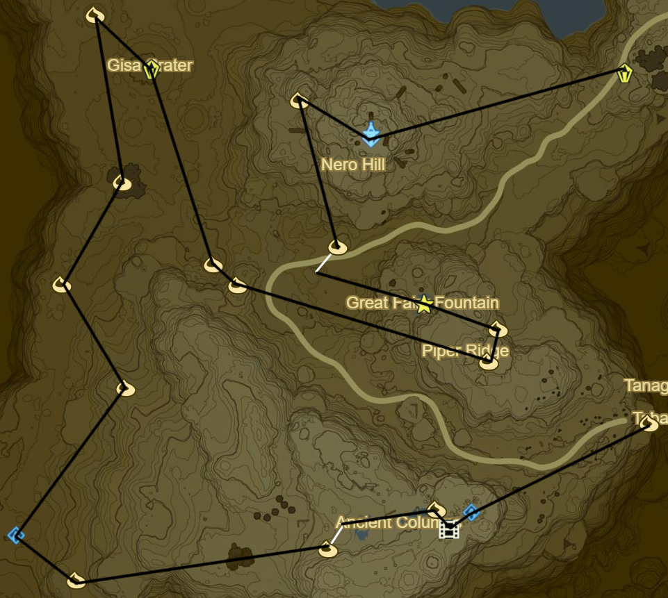
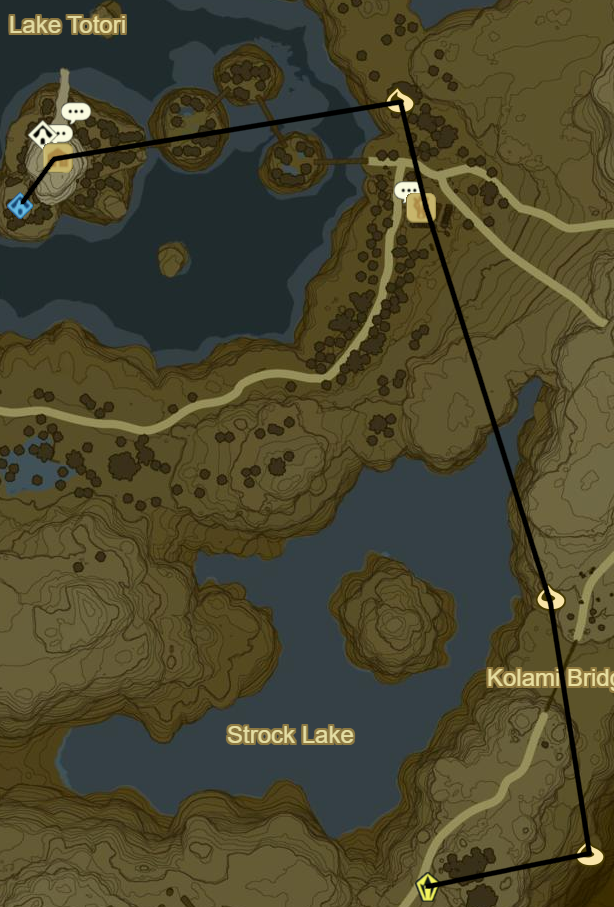
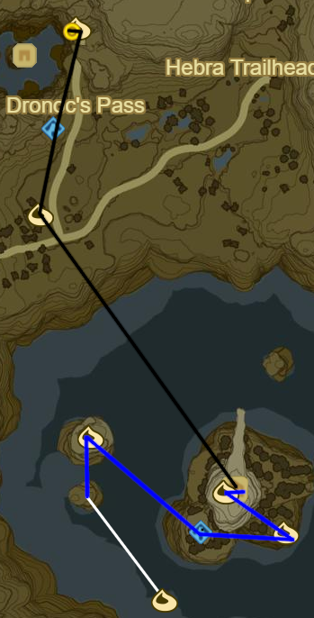
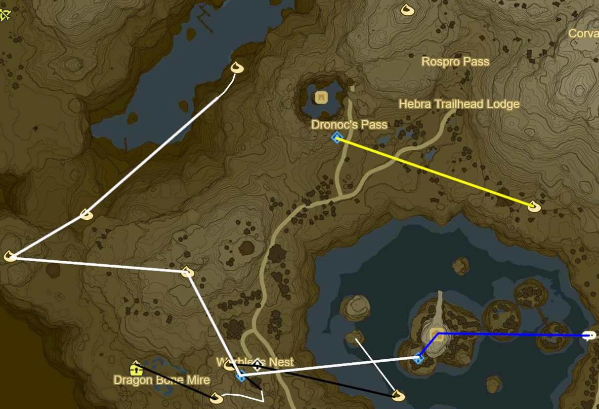
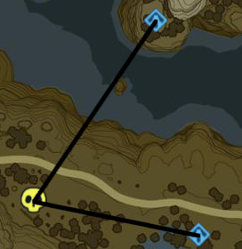

# Tabantha 1

* Tena Ko'sah Shrine to SW (38/120)
* Memory 5 to SW (5/12)
* Korok 262: Lilies to NW
* Korok 263: Race to W
* Korok 264: Flower patches to W
* Kah Okeo Shrine to NW (39/120)
* Korok 265: Rock atop Stone Pillar to NE
* Korok 266: Apple offering to NW
* Korok 267: Magnesis stump to NE
* Korok 268: Rock pattern to N in smaller Crater
* Stone Talus(Rare) to SE in Gisa Crater (11/40)
* Korok 269: Roll boulder to SE
* Korok 270: Rock to SE
* Korok 271: Pinwheel shooting to SE on Piper Ridge
* Korok 272: Apple offering to N
* Great Fairy Fountain to NW (2/4)
  * Side Quest: A Gift for the Great Fairy
* Korok 273: Race to W
* Korok 274: Rock behind corruption to NW
* Tabantha Tower to E
* Stone Talus(Rare) to E (12/40)

 -- Add Side Quests

* Korok 275: Rock down on ledge to E
* Korok 276: Rock behind cracked boulders to N
* Korok 277: Lilies to NW
* Rito Stable
  * Side Quest: Curry for what Ails You
    * Backtrack Complete
* Korok 278: Rock atop tree to N
* Rito Village
  * Shrine Quest: The Bird in the Mountains
  * Akh Va'quot Shrine (40/120)
  * Side Quest: Apple of My Eye
    * Baked Apple
  * Side Quest: The Spark of Romance
    * Flint
  * Main Quest: Divine Beast Vah Medoh
    * Recovered Memory 2 - Revali's Flap

* Korok 279: Magnesis ball to NW towards Vah Medoh objective
* Sha Warvo Shrine to N (41/120)
* Korok 280: Fairylights atop Flight Range Hut
* Complete Divine Beast Vah Medoh
* Warp to Divine Beast Vah Medoh
* Korok 281: Balloon below Vah Medoh
* Korok 282: Under rock to SE
* Side Quest: Find Kheel near Akh Va'quot Shrine
  * Backtrack Complete
* Korok 283: Apple offering to NW
* Korok 284: Race to S

* Find Kheel in Warbler's Nest to W
* Complete Side Quest: Find Kheel
  * Shrine Quest: Recital at Warbler's Nest
* Korok 285: Rock circle to W
* Korok 286: Flower trail to SE
* Korok 287: Rock beneath leaves to W through Dragon Bone Mire
* Warp back to Va'quot Shrine
* Shrine Quest: The Ancient Rito Song
* Make Hearty Salmon Meuniere
  * Hearty Salmon
  * Tabantha Wheat
  * Goat butter
* Give to Genli
* Speak to Cree in Store
* Speak to Notts on cliff above armor shop
* Speak to Kotts at Village Entrance
* Side Quest: Face The Frost Talus to E at Bridge near Stable
  * Backtrack Complete
* Warp back to Va'quot Shrine and Glide back to Warbler's Nest
* Complete: Recital at Warbler's Nest
  * Talk to Kheel for Korok leaf
  * 4, 5, 3, 1, 2
  * Voo Lata Shrine (42/120)
* Korok 288: Spicy Pepper offering to NW
* Korok 289: Rock to W past Enemy Camp
* Korok 290: Rock patterns to NE
* Korok 291: Flower path to NE
* Warp to Sha Warvo Shrine
* Korok 292: Rock to SE around Lake Totori just past enemy tree camp
* Warp to Akh Va'quot Shrine

* Black Hinox on S Shore (14/40)
* Complete: The Ancient Rito Song to E
  * 12.30PM
  * Bareed Naag Shrine (43/120)
* Korok 293: Fairylights atop tree to E towards E region

Koroks 293

Next: [Hebra 1](10 - Hebra1.md)
