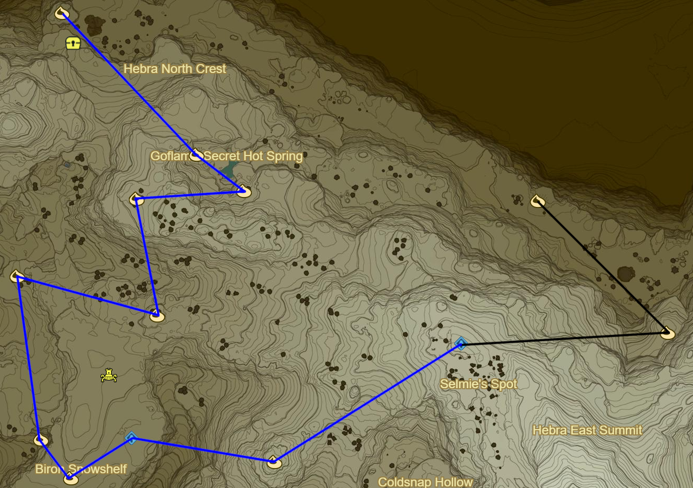

# Hebra 1

* Korok 294: Fairylights atop windmill to E
* Korok 295: Race to SE
* Dunda Taag Shrine below (44/120)
* Korok 296: Acorn in log to NE
* Korok 297: Flower Trail to E
* Korok 298: Rock beneath cracked boulders down cliff to E
* Korok 299: Magnesis Well to NW
* Hebra Tower to NE
* Korok 300: Rock in gorge to SE

* Korok 301: Pinwheel shooting to NE
* Korok 302: Rock beneath leaves to N
* Korok 303: Acorn in log to NW
* Korok 304: Fairylights to NE
* Rin Oyaa Shrine to SE (45/120)
* Snowfield Stable
  * Side Quest: Stalhorse: Pictured!
* Korok 305: Roll Boulder in gorge to SE
* Korok 306: Rock beneath cracked boulders to N

* Korok 307: Roll boulder to NE
* Korok 308: Magnesis Puzzle to N
* Korok 309: Balloon in tree to SE
* Shrine Quest: Trial on the Cliff
  * Qaza Tokki Shrine (46/120)
* Korok 310: Rock patterns to WNW
* Korok 311: Acorn in log to SW

* Sha Gehma Shrine to NW (47/120)
* Korok 312: Pinwheel shooting to W
* Korok 313: Fairylights within Ice to SW
* Rok Uwog Shrine to SW (48/120)
* Korok 314: Fairylights within Ice to SW
* Korok 315: Pinwheel shooting to E
* Frost Talus to E (13/40)
* Korok 316: Fairylights in ice to SW

* Korok 317: Roll Snowball far to S over Kopeeki Drifts
* Gee Ha'rah Shrine to W (49/120)
* Korok 318: Rock to S atop peak
* Korok 319: Rock behind Shrine to W
* Lanno Kooh Shrine (50/120)

* Korok 320: Fairylights atop dead tree to SW
* Stone Talus (Rare) to SW (14/40)
* Korok 321: Lilies to W
* Korok 322: Lilies to N
* Korok 323: Flower trail along stone crossing to E
* Korok 324: Rock to NE  -- MOVE TO UPPER SECTION WITH GEE Ha'rah
* Korok 325: Balloon near water to NW
* Korok 326: Race to NW
* Korok 327: Rock to W
* Korok 328: Balloon near water to NE
* Korok 329: Fairylights in Ice to NE

* Korok 330: Rock beneath stone hills to NW
* Goma Asaagh Shrine behind Ice (51/120)
* Korok 331: Rock atop Hebra Peak
* Side Quest: Xenoblade Chronicles 2
  * The Southeastern sky from the peak of the tall, pierced snowy mountain
  * Mark for safety
* Korok 332: Rock pattern to SE
* Salvager's Trousers to SW
* Korok 333: Balloon under cliff across gorge to W
* Korok 334: Fairylights within ice to SW on cliff edge
* Korok 335: Pinwheel shooting to SW

* Frost Talus to W over Rospro Pass (15/40)
* Korok 336: Rock to N
* Korok 337: Acorn in log to NE towards Talonto Peak
* Korok 338: Fairylights within ice to NE
* Korok 339: Fairylights within ice to W on upper level
* Frost Talus to N (16/40)
  * Side Quest: Face the Frost Talus
* Korok 340: Leaves atop cabin to NE
* Shada Naw Shrine to NW (52/120)

* Korok 341: Fairylights atop tree to E
* Korok 342: Rock pattern to NW
* Warp back to Shada Naw
* Korok 343: Pinwheel shooting to SW
* Mozo Shenno Shrine within cliffside to W (53/120)
  * Shrine Quest: The Bird in the Mountains
* Korok 344: Rock atop Biron Snowshelf to SW
* Korok 345: Rock to NW
* Korok 346: Fairylights atop dead tree to N
* Korok 347: Pinwheel shooting to E
* Korok 348: Acorn in log to NW
* Korok 349: Fairylights atop dead tree to E
* Korok 350: Rock beneath leaves in hot spring to NW
* Korok 351: Rock pattern to NW

* Head south to To Quomo entrance, hint: small water source
* Open entrance
* To Quomo Shrine (54/120)
  * Take Picture of Skeleton
* Korok 352: Flower trailer from back to front of skeleton
* Korok 353: Fairylights within left ice outside of Cave to NW
  * N of Shrine on Map
* Stalnox to W
* Korok 354: Magnesis Puzzle to W
* Hia Miu Shrine (55/120)
* Korok 355: Race to SE
* Korok 356: Pinwheel shooting to E atop Hebra North Summit
* Korok 357: Rock pattern to SW
* Korok 358: Flower Trail to SW
* Korok 359: Rock to NW atop Herba West Summit

* Korok 360: Fairylights to S
* Black Hinox to SW (15/40)
* Korok 361: Rock to SE
* Korok 362: Flower trail to NE
* Korok 363: Rock pattern to SE
* Korok 364: Rock beneath cracked boulders to SE
* Maka Rah Shrine via Cave Entrance to E (56/120)
* Korok 365: Rock to SW
* Korok 366: Race to NW
* Korok 367: Pinwheel shooting to NW
* Warp to Soh Kofi Shrine

Koroks: 367

Next: [Eldin 1](11 - Eldin1.md)
