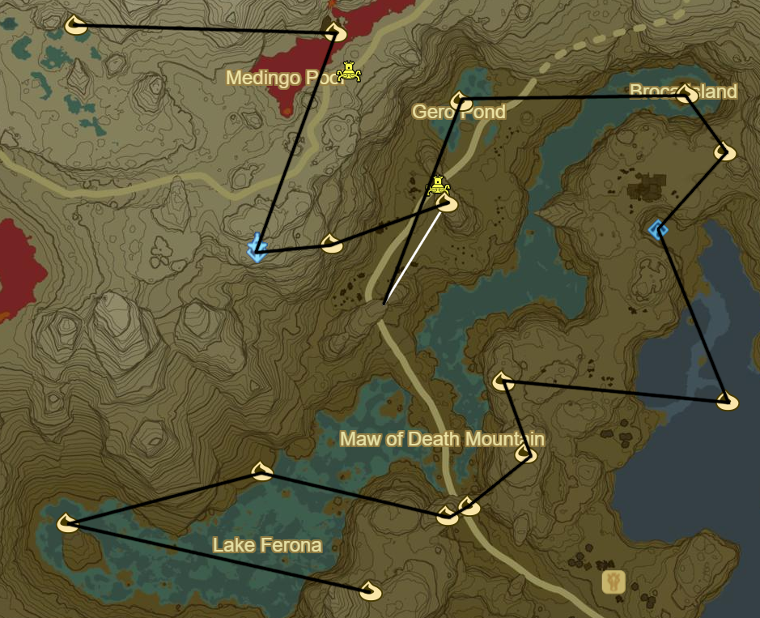
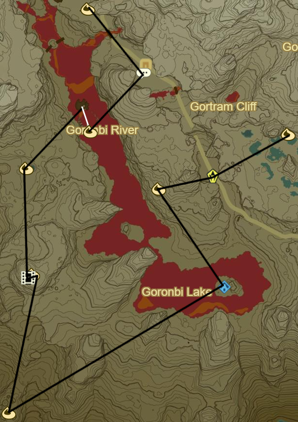
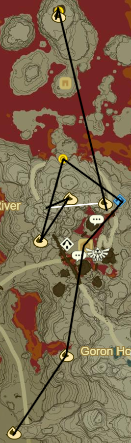
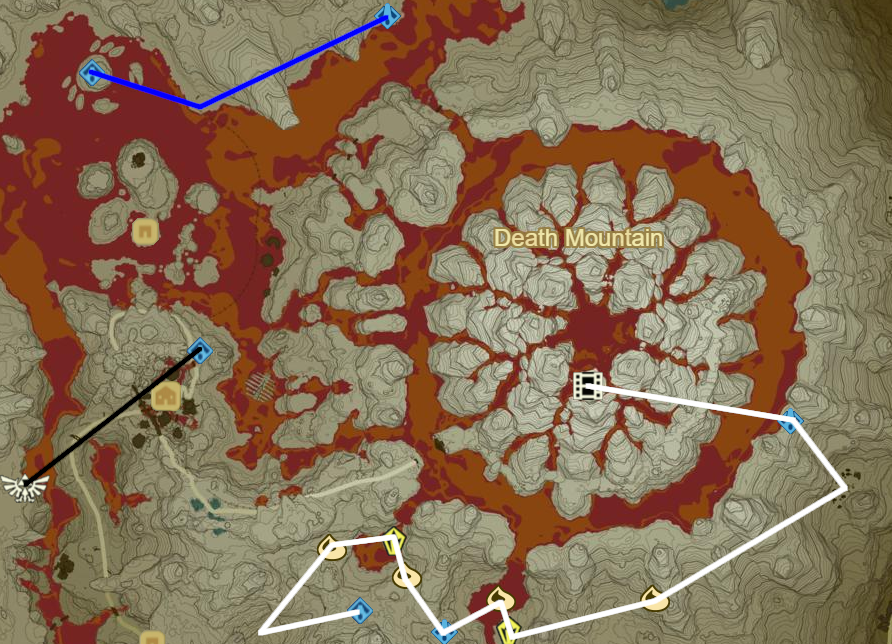

# Eldin 1

* Korok 371: Fairylights atop tree to NE
* Korok 372: Race to N
* Tah Muhl Shrine to N (57/120)
* Korok 373: Beneath Rock to E near path
* Foothill Stable to N
  * Buy fireproof potion if necessary
* Shrine Quest: A Landscape of a Stable
  * Should autocomplete
* Mo'a Keet Shrine to E (58/120)
* Korok 374: Rock behind cracked boulder to W

* Korok 375: Lilies to W
* Korok 376: Stone Pattern to E
* Korok 377: Balloon beneath bridge to SE
* Korok 378: Rock on ledge below bridge to E
* Korok 379: Rock beneath cracked boulder to NE
* Korok 380: Magnesis Puzzle to N
* Korok 381: Rock circle to E
* Sah Dahaj Shrine to NW (59/120)
* Korok 382: Stone circle to NE
* Korok 383: Magnesis puzzle to NW
* Korok 384: Stone circle to W
* Korok 385: Race to SW
* Korok 386: Rock beneath cracked boulders to SW
* Eldin Tower to W
  * Equip/drink flame res at this point
* Korok 387: Pinwheel shooting to NE across lava
* Korok 388: Rock behind cracked boulders to W

* Igneo Talus to SW (17/40)
* Korok 389: Roll Boulder to W
* Qua Raym Shrine to SE (60/120)
* Korok 390: Rock pattern to SW near Pico Pond
  * Might need revali's gale to clear lava
* Korok 391: Rock pattern to N
* Recovered Memory 8: A Premonition (5/12)
* Korok 392: Roll boulder to N
* Korok 393: Race to NE
* Side Quest: Fireproof Lizard Roundup to NE in Southern Mine
  * Under rocks and sneaking in the area can make easy
* Korok 394: Balloon beneath rock formation to NW
  * use updrafts

* Korok 395: Rock pattern to NE
* Goron City
  * Buy fire resistant gear
  * Shrine Quest: A Brother's Roast
  * Side Quest: The Road to Respect
  * Main Quest: Divine Beast Vah Rudania
  * Buy Goron spice for Side Quest: Curry for What Ails You
* Shae Mo'sah Shrine (61/120)
* Follow path around sculptures
* Korok 396: Fairylights in sculpture mouth
* Korok 397: Rock underneath sculpture armpit to NE
* Korok 398: Race from atop sculpture head
* Save Yunobo
* Korok 399: Rock atop cave with Yunobo

* Korok 400: Rock atop Isle of Rabac to NW
* Shora Hah Shrine within Isle of Rabac (62/120)
* Take minecart to E lava shore
* Igneo Talus: Circle around to W (18/40)
  * Side Quest: The Road to Respect
* Korok 401: Stone pattern to N in East Deplian Badlands
* Korok 402: Rock beneath leaves in skeleton's N eye socket to E
* Take picture of skeleton
* Dinraal farm in morning
* Korok 403: Magnesis Puzzle to E

* Korok 404: Rock behind cracked boulders to NE
* Korok 405: Rock behind cracked boulders to E
* Korok 406: Rock atop tree to NE
* Black Hinox to SW (17/40)
* Korok 407: Match Rock atop N pillar
* Shrine Quest: The Gut Check Challenge
  * Gorae Torr Shrine (63/120)
* Korok 408: Rock behind cracked boulders to SW
* Korok 409: Rock to SW
* Igneo Talus to W (19/40)

* Korok 410: Rock pattern to SW
* Korok 411: Pinwheel shooting to W
* Korok 412: Fairylights atop ribcage to S
* Korok 413: Race to SE
* Return to Bludo
* Remember to discover Stolock Bridge Location
* Complete Side Quest: The Road to Respect
* Side Quest: Death Mountain's Secret to SE in Goron Hot Springs
  * Drillshaft behind cracked boulders to SE
* Korok 414: Roll boulder into lava to SE of Drillshaft

* Shrine Quest: Brother's Roast to SW at Gorko Tunnel
  * Kayra Mah Shrine (64/120)
* Igneo Talus: Across Darb Pond to SE (20/40)
* Korok 415: Rock in middle of Darb Pond to N
* Korok 416: Magnesis Puzzle to W
* Igneo Talus: Center of Gorko Lake to N (21/40)
* Daqa Koh Shrine to NW (65/120)
* Cross Bridge of Eldin and Complete Divine Beast Vah Rudania
* Side Quest: The Jewel Trade
* Warp back to Mo'a Keet Shrine
* Follow path S and go E into Akkala

Next: [Akkala 1](12 - Akkala1.md)
