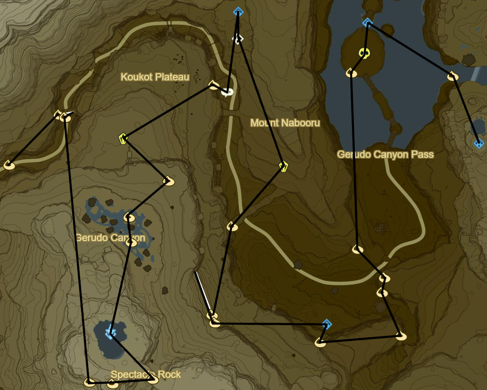
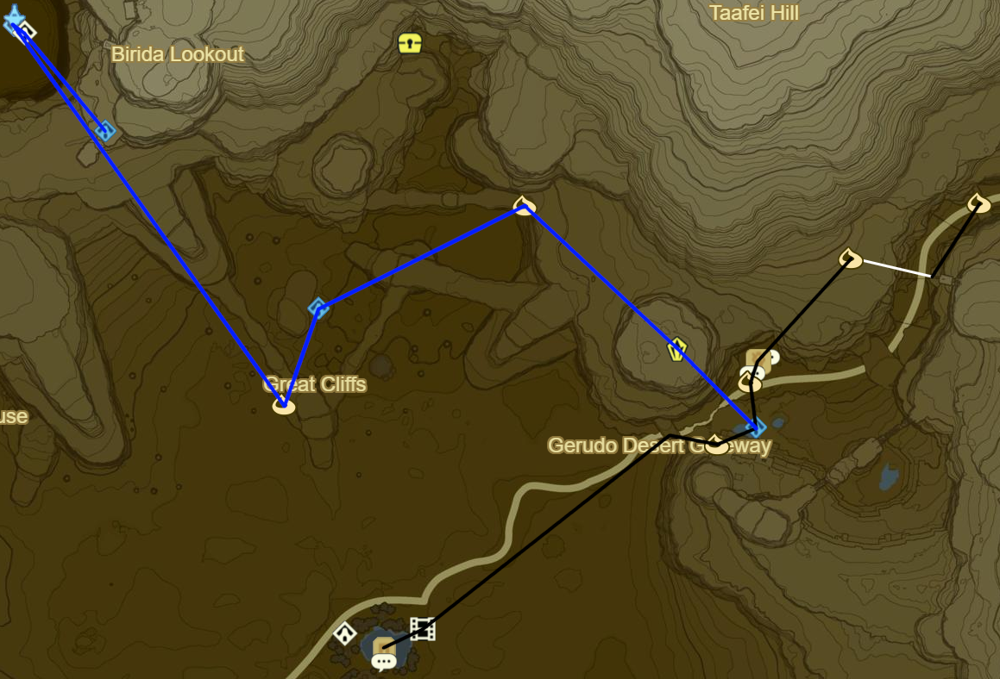
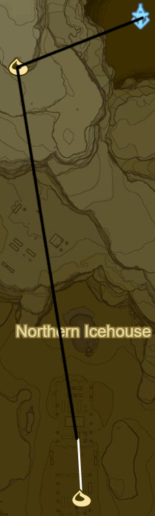
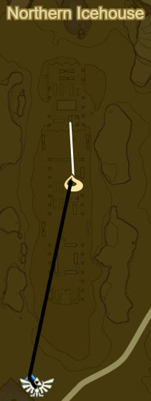

# Wasteland 1

* Korok 334: Rock Circle to NW
* Dah Keso Shrine to NW (52/120)
* Hinox to S (16/40)
* Korok 335: Lilies to SW
* Korok 336: Magnesis ball to SW
* Korok 337: Fairylights atop tree to SE
* Korok 338: Magnesis Puzzle to S
* Korok 339: Pinwheel shooting to SE
* Korok 340: Magnesis Puzzle to W
* Jee Noh Shrine to N (53/120)
* Korok 341: Rock on scaffolding to W
* Korok 342: Race to NW
* Korok 343: Rock atop arch to NE
* Stone Talus to NE (16/40)
* Shrine Quest: Test of Will to NW
  * Joloo Nah Shrine (54/120)
  * If stuck use Fire Elixirs from Goron City
* Korok 344: Magnesis Puzzle to SW
* Stone Talus to SW (17/40)
* Korok 345: Rock atop tree to SE
* Korok 346: Hanging acorn to SW
* Korok 347: Roll boulder to S
* Wasteland Tower to S
* Korok 348: Balloon beneath bridge to SE
* Korok 349: Magnesis Puzzle to W
* Korok 350: Rock on high ledge to W
* Korok 351: Fairylights in rock bridge cleft to N, NW of Talus
* Korok 352: Race to NE
* Korok 353: Balloon within rock bridge to SW

* Korok 354: Race to S
* Stone Talus to SW (18/40)
* Gerudo Canyon Stable to E
  * Side Quest: Rushroom Rush!
    * 55 Rushrooms
  * Side Quest: Missing in Action
* Korok 355: Rock atop pillar S of stable
* Kay Noh Shrine to S (55/120)
* Korok 356: Rock atop cliff to SW
* Recovered Memory 7 - Blades of the Yiga at Kara Kara Bazaar to SW (8/12)
* Shrine Quest: The Eye of the Sandstorm
* Side Quest: An Ice Guy
  * Make Chilly Elixir
    * Monster part
    * Winterwing Butterfly/Cold Darner
* Warp back to Kay Noh Shrine
* Korok 357: Magnesis Puzzle to NW
* Dako Tah Shrine in Sandstorm to SW (56/120)
  * Shrine Quest: The Eye of the Sandstorm
* Korok 358: Magnesis Puzzle to SW
* Gerudo Tower to NW
* Shrine Quest: Sign of the Shadow
  * 3PM
  * Sasa Kai Shrine to SE (57/120)
* Warp back to Gerudo Tower

* Korok 359: Pinhweel shooting to W
* Korok 360: Race to S

* Daqo Chisay Shrine to S outside Gerudo Town (58/120)
* Main Quest: Forbidden City Entrance
* Return to Kara Kara Bazaar and buy Gerudo Disguise
  * 600 Rupees
* Return to Gerudo Town
  * Main Quest: Forbidden City Entry

* Shrine Quest: The Silent Swordswomen
* Shrine Quest: The Seven Heroines
* Side Quest: Tools of the Trade
  * 10 Flint
  * Sapphire is most Cost Effective Reward
* Side Quest: The Secret Club's Secret
  * GSC♦
* Side Quest: The Eighth Heroine
* Korok 361: Fairylights atop palace
* Main Quest: Divine Beast Vah Naboris
* Korok 362: Rock pattern on E side of Karusa Valley Entrance
* Korok 363: Flower path to NW
* Korok 364: Banana offering to NE
* Korok 365: Banana offering to S
* Korok 366: Banana offering to E
* Korok 367: Banana offering to E
* Korok 368: Banana offering to E
* Korok 369: Rock on ledge in ring to NE
* Sho Dantu Shrine to SW (59/120)
* Korok 370: Rock pattern to W
* Return to valley and complete Yiga hideout
  * Duplex Bow at Entrance
* Warp back to Sho Dantu Shrine
