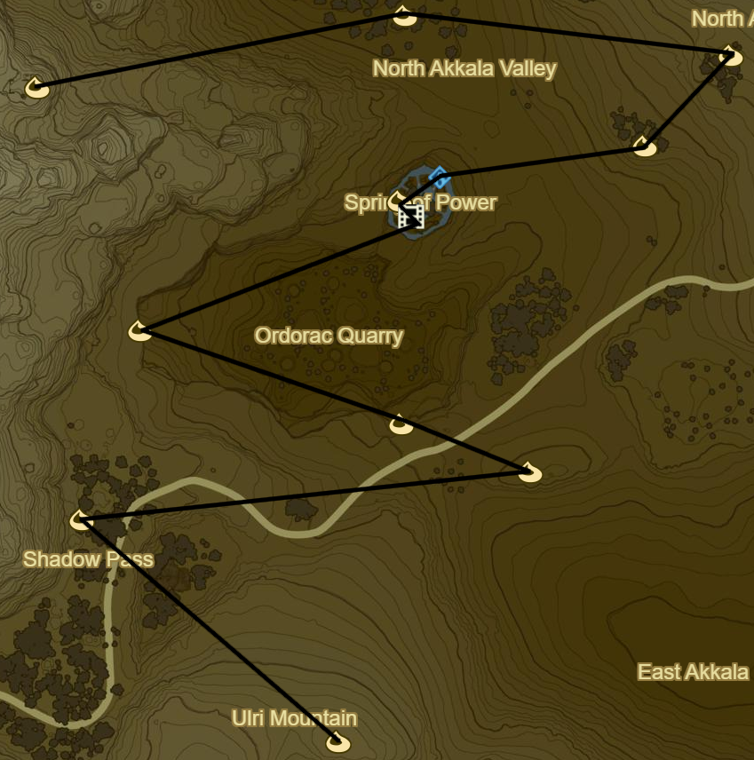
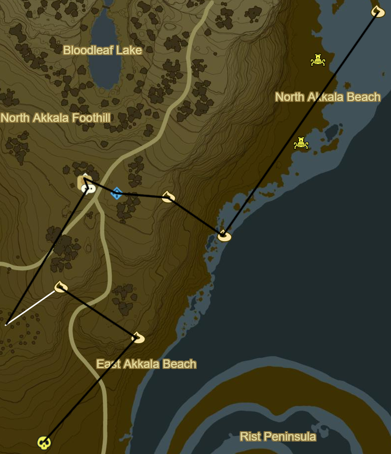
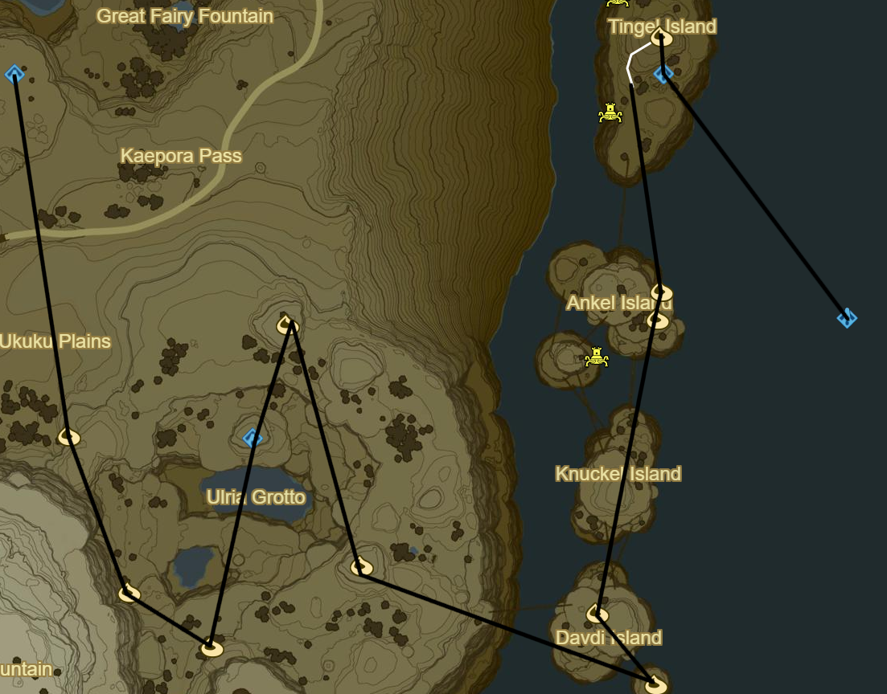

# Akkala 1

* Korok 415: Rock under slab below Akkala Span
* Korok 416: Rock pattern to NE
* Korok 417: Rock beneath leaves on S edge of ruins
* Korok 418: Rock by cannons on S edge of ruins
* Akkala Tower
* Korok 419: Rock beneath leaves to W
* Korok 420: Rock beneath leaves to NE
* Korok 421: Rock beneath Magnesis door to NE
* Ze Kasho Shrine to NW
* South Akkala Stable to E
  * Side Quest: Little Sister's Big Request
    * 1 Armoranth
    * 1 Warm Darner
    * 1 Cold Darner
    * 1 Electric Darner
* Korok 422: Rock atop ruins to E
* Korok 423: Apple Trees to N
* Korok 424: Rock beneath leaves to W
* Korok 425: Fairylights to SW

* Korok 426: Fairylights atop tree to NE
* Korok 427: Fairylights to E
* Korok 428: Magnesis Puzzle to W
* Korok 429: Magnesis Puzzle to NW
* Recovered Memory 13 to NE (6/12)
* Tutsuwa Nim Shrine (66/120)
* Korok 430: Rock above Spring of Power
* Korok 431: Rock beneath leaves to E
* Korok 432: Flower order to NE
* Korok 433: Acorn in log to W
* Korok 434: Magnesis Puzzle to W on mountainside ruins

* Korok 435: Balloon beneath cliff to NE
* Korok 436: Rock atop tree in middle of Rok Woods to W
* Korok 437: Rock beneath slab to W
* Korok 438: Race to N
* Take picture of Kilton at night in left Skull Eye
* Zuna Kai Shrine in right Skull Eye (67/120)
* Side Quest: Xenoblade Chronicles 2
  * The Eastern Sky From the Skull's Left Eye
  * Mark
* Korok 439: Rock circle to N
* Korok 440: Rock under boulder to E
  * Should be able to max out inventory
* Salvage Vest to SE
* Korok 441: Rock beneath slab to SW
* Black Hinox to S (17/40)
* Korok 442: Flower order to E
* Korok 443: Roll boulders to SE to hole S of previous Korok
* Korok 444: Rock beneath leaves to SE

* Korok 445: Race to E
* Return W to transport Flame to Akkala Ancient Tech Lab
* Shrine Quest: The Skull's Eye
  * Should autocomplete
* Korok 446: Fairylights atop Tech Lab
* Korok 447: Rock in guardian pile to W
* Korok 448: Rock behind cracked boulders to N
* Shrine Quest: Trial of the Labyrinth to NE
  * Tu Ka'loh Shrine (68/120)
* Side Quest: EX Teleportion Rumors
  * Diamond Circlet in center
  * Beneath labyrinth to S
  * Useful when force spawning Stalnox
* Korok 449: Rock beneath slab on island to SE
* Korok 450: Flower order to S

* Korok 451: Magnesis Puzzle to SW
* Korok 452: Rock circle up cliff to NW
* Katosa Aug Shrine to W (69/120)
* East Akkala Stable
  * Shrine Quest: The Spring of Power
    * Should autocomplete
  * Side Quest: A Shady Customer
    * Warp to Zuna Kai at night to find Kilton in other eye
    * Take picture of Kilton for Side Quest and return to Katosa Aug Shrine to finish
* Korok 453: Race to SW
* Korok 454: Pinwheel shooting to SE
* Stalnox to SW (18/40)

* Korok 455: Rock Circle to S
* Korok 456: Flower path around bridge to S
* Side Quest: From the Ground Up
  * Place Travel Medallion in Town for future convenience
  * Speak to Hudson
  * 10 Wood Bundles
  * Warp to Qua Raym Shrine and go to Southern Mine
  * Talk to Greyson and Warp back
  * 20 Wood Bundles
* Great Fairy Fountain to SE of Tarrey Town
* Korok 457: Flower order to S
* Korok 458: Apple offering to W
* Dah Hesho Shrine to S (70/120)

* Korok 459: Apple trees to SE
* Korok 460: Race to NE
* Korok 461: Follow flower to NE
* Korok 462: Magnesis Puzzle to SE
* Shrine Quest: Into the Vortex
* Ritaag Zumo Shrine to NW (71/120)
  * Shrine Quest: Into the Vortex
* Korok 463: Rock beneath leaves S of Shrine
* Warp back to Dah Hesho Shrine

* Korok 464: Pinwheel shooting to S
* Korok 465: Rock beneath boulder to SE
* Korok 466: Fairylights atop tree to SE
* Ke'nai Shrine to N (72/120)
* Korok 467: Apple Trees to N
* Korok 468: Fairylights to SE
* Korok 469: Rock beneath cracked boulders to SE of Davdi Island
* Korok 470: Lilies NW on Davdi Island
* Korok 471: Rock on pillar N on Ankel Island
* Korok 472: Rock on scaffold below to N
* Korok 473: Flower path N on Tingel Island
* Kah Mael Shrine to S
* Warp back to Dah Hesho Shrine (73/120)

* Korok 474: Rock circle to SW
* Korok 475: Rock beneath bridge to SW
* Korok 476: Rock beneath magnesis door to NW
* Blue Hinox to W (19/40)
* Warp to Oman Au Shrine

Next: [Central Hyrule 1](13 - Central1.md)
