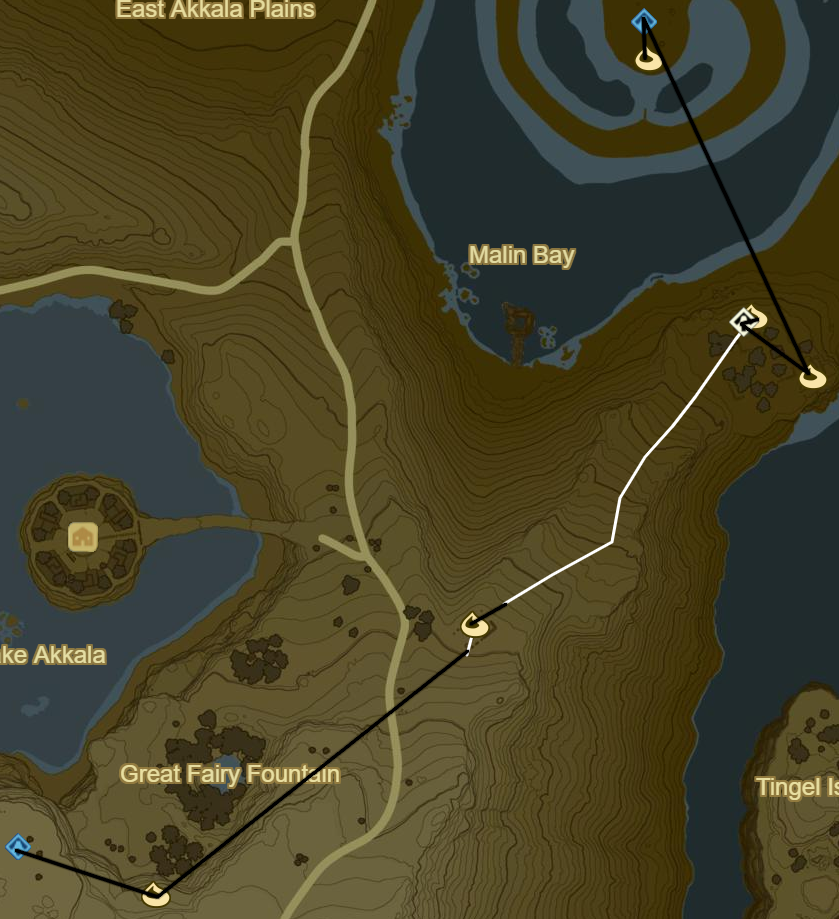

# Akkala 1

* Korok 417: Rock under slab below Akkala Span
* Korok 418: Rock pattern to NE
* Korok 419: Rock beneath leaves on S edge of ruins
* Korok 420: Rock by cannons on S edge of ruins
* Akkala Tower
* Korok 421: Rock beneath leaves to W
* Korok 422: Rock beneath leaves to NE
* Korok 423: Rock beneath Magnesis door to NE
* Ze Kasho Shrine to NW (66/120)
* South Akkala Stable to E
  * Side Quest: Little Sister's Big Request
    * 1 Armoranth
    * 1 Warm Darner
    * 1 Cold Darner
    * 1 Electric Darner
* Korok 424: Rock atop ruins to E
* Korok 425: Apple Trees to N
* Korok 426: Rock beneath leaves to W
* Korok 427: Fairylights to SW

* Korok 428: Fairylights atop tree to NE
* Korok 429: Fairylights to E
* Korok 430: Magnesis Puzzle to W
* Korok 431: Magnesis Puzzle to NW
* Recovered Memory 13 - Slumbering Power to NE (6/12)
* Tutsuwa Nim Shrine (67/120)
* Korok 432: Rock above Spring of Power
* Korok 433: Rock beneath leaves to E
* Korok 434: Flower order to NE
* Korok 435: Acorn in log to W
* Korok 436: Magnesis Puzzle to W on mountainside ruins

* Korok 437: Balloon beneath cliff to NE
* Korok 438: Rock atop tree in middle of Rok Woods to W
* Korok 439: Rock beneath slab to W
* Korok 440: Race to N
* Take picture of Kilton at night in left Skull Eye
* Zuna Kai Shrine in right Skull Eye (68/120)
* Side Quest: Xenoblade Chronicles 2
  * The Eastern Sky From the Skull's Left Eye
* Korok 441: Rock circle to N
  * Should be able to max out inventory
* Korok 442: Rock under boulder to E
* Salvager's Vest to SE
* Korok 443: Rock beneath slab to SW
* Black Hinox to S (18/40)
* Korok 444: Flower order to E
* Korok 445: Roll boulders to SE to hole S of previous Korok
* Korok 446: Rock beneath leaves to SE

* Korok 447: Race to E
* Return W to transport Flame to Akkala Ancient Tech Lab
* Shrine Quest: The Skull's Eye
  * Should autocomplete
* Korok 448: Fairylights atop Tech Lab
* Korok 449: Rock in guardian pile to W
* Korok 450: Rock behind cracked boulders to N
* Shrine Quest: Trial of the Labyrinth to NE
  * Tu Ka'loh Shrine (69/120)
* Side Quest: EX Teleportion Rumors
  * Useful when force spawning Stalnox
* Diamond Circlet in centre
  * Beneath labyrinth to S
* Korok 451: Rock beneath slab on island to SE
* Korok 452: Flower order to S

* Korok 453: Magnesis Puzzle to SW
* Korok 454: Rock circle up cliff to NW
* Katosa Aug Shrine to W (70/120)
* East Akkala Stable
  * Shrine Quest: The Spring of Power
    * Should autocomplete
  * Side Quest: A Shady Customer
    * Warp to Zuna Kai at night to find Kilton in other eye
    * Take picture of Kilton for Side Quest and return to Katosa Aug Shrine to finish
* Korok 455: Race to SW
* Korok 456: Pinwheel shooting to SE
* Stalnox to SW (19/40)

* Korok 457: Rock Pattern to S
* Korok 458: Flower trial around bridge to S
* Side Quest: From the Ground Up
  * Place Travel Medallion in Town for future convenience
  * Speak to Hudson
  * 10 Wood Bundles
  * Warp to Qua Raym Shrine and go to Southern Mine
  * Talk to Greyson and Warp back
  * 20 Wood Bundles
* Great Fairy Fountain to SE of Tarrey Town
* Korok 459: Flower order to S
* Korok 460: Apple offering to W
* Dah Hesho Shrine to S (71/120)

* Korok 461: Apple trees to SE
* Korok 462: Race to NE
* Korok 463: Flower Trail to NE
* Korok 464: Magnesis Puzzle to SE
* Shrine Quest: Into the Vortex
  * Ritaag Zumo Shrine to NW (72/120)
* Korok 465: Rock beneath leaves S of Shrine
* Warp back to Dah Hesho Shrine

* Korok 466: Pinwheel shooting to S
* Korok 467: Rock beneath boulder to SE
* Korok 468: Fairylights atop tree to SE
* Ke'nai Shrine to N (73/120)
  * Ancient Battleaxe+
* Korok 469: Apple Trees to N
* Korok 470: Fairylights to SE
* Korok 471: Rock beneath cracked boulders to SE of Davdi Island
* Korok 472: Lilies NW on Davdi Island
* Korok 473: Rock on pillar N on Ankel Island
* Korok 474: Rock on scaffold below to N
* Korok 475: Flower Trail to N on Tingel Island
* Kah Mael Shrine to S (74/120)
* Warp back to Dah Hesho Shrine

* Korok 476: Rock circle to SW
* Korok 477: Rock beneath bridge to SW
* Korok 478: Rock beneath metal door to NW
* Blue Hinox to W (20/40)
* Warp to Oman Au Shrine

Next: [Central Hyrule 1](13 - Central1.md)
