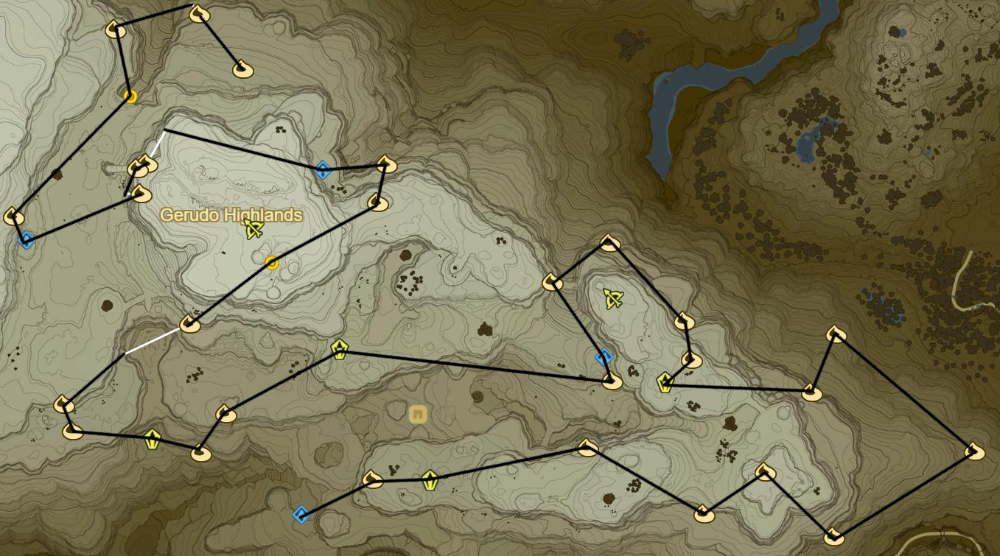

# Gerudo Highlands

* Korok 371: Carry snowball to NE
* Frost Talus to E (19/40)
* Korok 372: Rock Pattern to E
* Korok 373: Rock pattern to SE
* Korok 374: Rock to NE
* Korok 375: Magnesis Puzzle to SE
* Korok 376: Rock pattern to NE
* Korok 377: Pinwheel shooting to NW
* Korok 378: Rock pattern to SW
* Frost Talus to W (20/40)
* Korok 379: Fairylights in ice to NE
* Korok 380: Fairylights atop tree to N
* Korok 381: Rock pattern to NW
* Korok 382: Magnesis Puzzle to SW
* Kuh Takkar Shrine to SE (60/120)
* Korok 383: Fairylights in ice to SE
* Stone Talus to W across Vatorsa Snowfield (21/40)
* Korok 384: Fairylights atop pillar to SW
* Korok 385: Magnesis puzzle to SW
* Stone Talus to WNW (22/40)
* Korok 386: Rock pattern to W
* Korok 387: Rock to N
* Korok 388: Race to NE
* Take picture of sword to NE
* Korok 389: Rock pattern to NE
* Korok 390: Rock on scaffolding to N
* Shrine Quest: Cliffside Etchings to W
  * Keeha Yoog Shrine (61/120)
* Korok 391: Race to WNW
* Korok 392: Magnesis puzzle to SW
* Korok 393: Flower trail up cliff to S
* Kema Kosassa Shrine to SW (62/120)
* Korok 394: Fairylights in ice to NW
* Take picture of Statue of Eighth Heroine to NE
  * Ensure you discover location
* Korok 395: Roll boulders to NW
* Korok 396: Race to NE
* Korok 397: Rock pattern to SE
* Warp back to Daqo Chisay Shrine
* Side Quest: The Eighth Heroine
* Side Quest: The Forgotten Sword
* Warp to Daqo Chisay Shrine

* Side Quest: Medicinal Molduga
  * Molduga Guts
* Main Quest: Divine Beast Vah Naboris
  * Recovered Memory 6 - Urbosa's Hand (14/18)
* Korok 398: Flower trail to E of Gerudo Town and N of Lookout Tower
* Complete Main Quest: Divine Beast Vah Naboris
