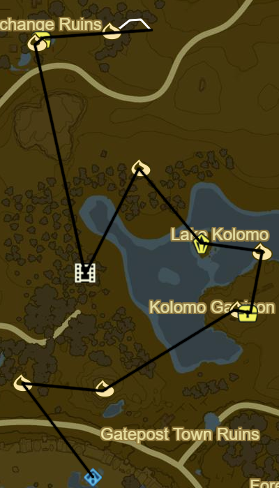
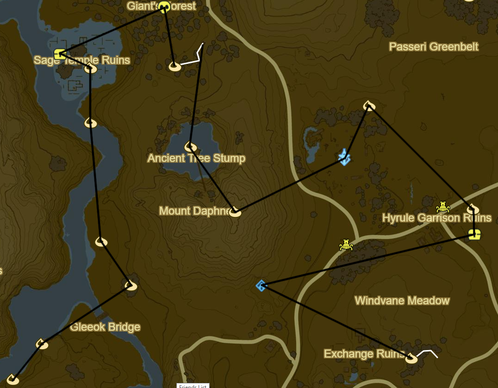

# Central Hyrule 1

* Korok 477: Fairylights to NW
* Korok 478: Pinwheel shooting to E
* Korok 479: Rock beneath leaves to NE
* Side Quest: EX Treasure: Ancient Mask
  * Chest outside ruins
* Korok 480: Lilies to NE
* Stone Talus (Luminous): Centre of Lake (22/40)
* Korok 481: Hanging acorn to NW
* Recovered Memory 3 to SW (7/12)
* Korok 482: Fairylights to N
* Side Quest: EX Treasure: Fairy Clothes to NE
  * Tingle Hood
* Korok 483: Flower trail to E

* Kaam Ya'tak Shrine to NW (74/120)
* Side Quest: EX Treasure: Phantasma to E in Hyrule Garrison Ruins
  * Phantom Greaves
* Korok 484: Fairylights atop flagpole to N
* Korok 485: Rock to NW past Tower
* Central Tower to SW
* Korok 486: Apple offering to SW atop Mount Daphne
* Korok 487: Lilies to NW
* Korok 488: Flower Trail to NE
* Black Hinox to N (20/40)
* Side Quest: EX Treausre: Twilight Relic to W
* Korok 489: Rock on wall to E of treasure
* Korok 490: Magnesis puzzle to S
* Korok 491: Rock in well to S
* Korok 492: Acorn in tree to S
* Korok 493: Magnesis stump to SW
* Korok 494: Rock circle to SW

* Korok 495: Rock pattern to SE
* Korok 496: Pinwheel acorns to S
* Korok 497: Rock to SE
* Outskirt Stable to W
  * Side Quest: My Hero
    * Should autocomplete
  * Side Quest: A Rare Find
    * 1 Gourmet Meat
* Rota Ooh Shrine to W (75/120)
* Korok 498: Rock on tree to SW
* Korok 499: Rock to SW
* Korok 500: Rock up cliff to SW
* Korok 501: Magnesis Puzzle to S
* Korok 502: Rock circle to E
* Dah Kaso Shrine to SW (76/120)
* Blue Hinox to S (21/40)
* Korok 503: Lilies to SW
* Korok 504: Rock circle to E

Next: [Wasteland 1](14 - Wasteland1.md)
