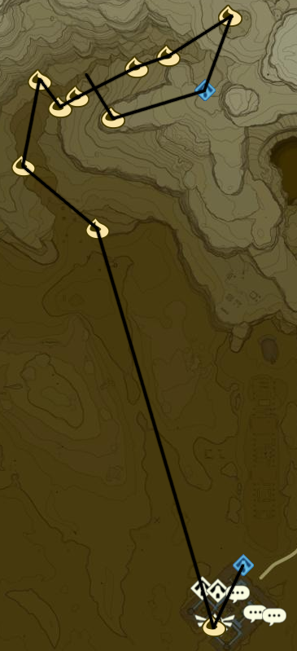

# Wasteland 1

* Korok 504: Magnesis ball to SW
* Korok 505: Fairylights atop tree to SE
* Korok 506: Magnesis Puzzle to S
* Korok 507: Pinwheel shooting to SE
* Korok 508: Magnesis Puzzle to W
* Jee Noh Shrine to N (78/120)
* Korok 509: Race to W
* Korok 510: Rock on scaffolding to S
* Korok 511: Rock atop arch to NE
* Stone Talus (Luminous) to NE (23/40)
* Shrine Quest: Test of Will to NW
  * Joloo Nah Shrine (79/120)
  * If stuck use Fire Elixirs from Goron City
* Side Quest: Good-Sized Horse to SW
* Korok 512: Magnesis Puzzle to W
* Stone Talus (Luminous) to SW (24/40)
* Korok 513: Rock atop tree to SE
* Korok 514: Hanging acorn to SW
* Korok 515: Roll boulder to S
* Wasteland Tower to S
* Korok 516: Balloon beneath bridge to SE
* Korok 517: Magnesis Puzzle to W
* Korok 518: Rock on high ledge to W
* Korok 519: Fairylights in rock bridge cleft to N, NW of Talus
* Korok 520: Race to NE
* Korok 521: Balloon within rock bridge to SW

* Korok 522: Race to S
* Stone Talus (Luminous) to SW (25/40)
* Gerudo Canyon Stable to E
  * Side Quest: Rushroom Rush!
    * 55 Rushrooms
  * Side Quest: Missing in Action
* Korok 523: Rock atop pillar S of stable
* Kay Noh Shrine to S (80/120)
* Korok 524: Rock atop cliff to SW
* Recovered Memory 7 at Kara Kara Bazaar to SW (8/12)
* Shrine Quest: The Eye of the Sandstorm
  * Dako Tah Shrine
* Side Quest: An Ice Guy
  * Make chilly elixir
    * Monster part
    * Winterwing Butterfly/Cold Darner
* Side Quest: From the Ground up
  * Talk to Rhondson
  * Warp back to Tarrey Town
  * 30 Wood Bundles
  * Warp to Akh Va'quot Shrine
  * Speak to Fyson
    * Complete Side Quest: Face the Frost Talus
    * Complete Side Quest: Curry for What Ails You
  * Warp back to Tarrey Town
  * 50 Wood Bundles
  * Side Quest: Hobbies of the Rich
    * Hunt Guardians to W
  * Warp to Ne'ez Yohma Shrine
  * Speak to Kapson
  * Warp back to Tarrey Town
  * Complete Side Quest: Hobbies of the Rich
  * Side Quest: A Parent's Love
    * Eavesdrop Southernmost House at Night
    * Monster Cake
      * Monster Extract
      * Tabantha Wheat
      * Goat Butter
      * Cane Sugar
  * Warp to Myahm Agana Shrine
  * Talk to Bolson
  * Warp back to Tarrey Town
  * Enjoy :]
* Warp back to Kay Noh Shrine
* Korok 525: Magnesis Puzzle to NW
* Dako Tah Shrine in Sandstorm to SW (81/120)
  * Shrine Quest: The Eye of the Sandstorm
* Korok 526: Magnesis Puzzle to SW
  * Drop Traveller's Medallion for later
* Gerudo Tower to NW
* Shrine Quest: Sign of the Shadow
  * 3PM
  * Sasa Kai Shrine to SE (82/120)
* Warp back to Gerudo Tower

* Korok 527: Pinhweel shooting to W
* Korok 528: Race to S

* Daqo Chisay Shrine to S outside Gerudo Town (83/120)
* Main Quest: Forbidden City Entrance
* Return to Kara Kara Bazaar and buy Gerudo Disguise
  * 600 Rupees
* Return to Gerudo Town
  * Main Quest: Forbidden City Entry

* Shrine Quest: The Silent Swordswomen
* Shrine Quest: The Seven Heroines
* Side Quest: Tools of the Trade
  * 10 Flint
  * Sapphire is most Cost Effective Reward
* Side Quest: The Secret Club's Secret
  * GSC♦
* Side Quest: The Eighth Heroine
* Korok 529: Fairylights atop palace
* Main Quest: Divine Beast Vah Naboris
* Korok 530: Rock pattern on E side of Karusa Valley Entrance
* Korok 531: Flower path to NW
* Korok 532: Banana offering to NE
* Korok 533: Banana offering to S
* Korok 534: Banana offering to E
* Korok 535: Banana offering to E
* Korok 536: Banana offering to E
* Korok 537: Rock on ledge in ring to NE
* Sho Dantu Shrine to SW (84/120)
* Korok 538: Rock pattern to W
* Return to valley and complete Yiga hideout
* Warp back to Sho Dantu Shrine

Next: [Gerudo 1](15 - Gerudo1.md)
