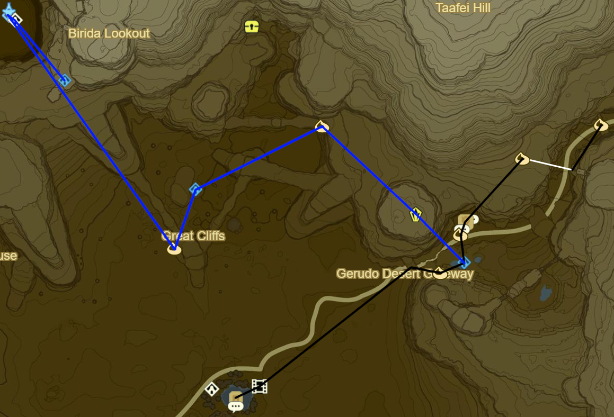
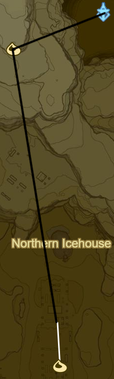
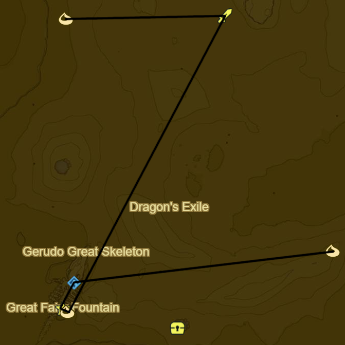
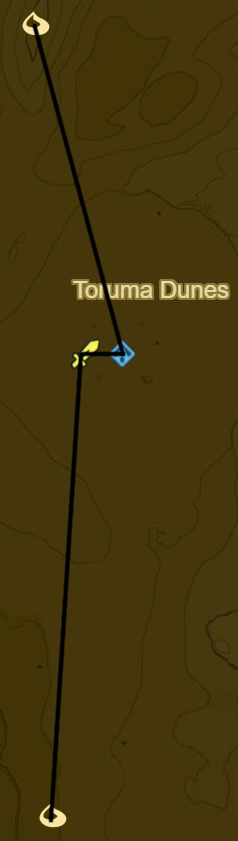
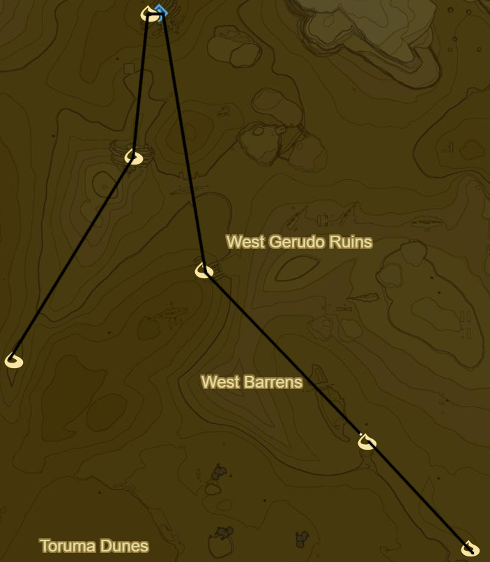

# Wasteland 1

* Korok 505: Magnesis ball to SW
* Korok 506: Fairylights atop tree to SE
* Korok 507: Magnesis Puzzle to S
* Korok 508: Pinwheel shooting to SE
* Korok 509: Magnesis Puzzle to W
* Jee Noh Shrine to N (77/120)
* Korok 510: Rock on scaffolding up two cliffs to W
* Korok 511: Race to N
* Korok 512: Rock atop arch to NE
* Stone Talus (Luminous) to NE (23/40)
* Shrine Quest: Test of Will to NW
  * Joloo Nah Shrine (78/120)
  * If stuck use Fire Elixirs from Goron City
* Side Quest: Good-Sized Horse to SW
* Korok 513: Magnesis Puzzle to W
* Stone Talus (Luminous) to SW (24/40)
* Korok 514: Rock atop tree to SE
* Korok 515: Hanging acorn to SW
* Korok 516: Roll boulder to S
* Wasteland Tower to S
* Korok 517: Balloon beneath bridge to SE
* Korok 518: Magnesis Puzzle to W
* Korok 519: Rock on high ledge to W
* Korok 520: Fairylights in rock bridge cleft to N, NW of Talus
* Korok 521: Race to NE
* Korok 522: Balloon within rock bridge to SW

* Korok 523: Race to S
* Stone Talus (Luminous) to SW (25/40)
* Gerudo Canyon Stable to E
  * Side Quest: Rushroom Rush!
    * 55 Rushrooms
  * Side Quest: Missing in Action
* Korok 524: Rock atop pillar S of stable
* Kay Noh Shrine to S (79/120)
* Korok 525: Rock atop cliff to SW
* Recovered Memory 7 at Kara Kara Bazaar to SW (8/12)
* Shrine Quest: The Eye of the Sandstorm
  * Dako Tah Shrine (80/120)
* Side Quest: An Ice Guy
  * Make chilly elixir
    * Monster part
    * Winterwing Butterfly/Cold Darner
* Side Quest: From the Ground up
  * Talk to Rhondson
  * Warp back to Tarrey Town
  * 30 Wood Bundles
  * Warp to Akh Va'quot Shrine
  * Speak to Fyson
    * Complete Side Quest: Face the Frost Talus
    * Complete Side Quest: Curry for What Ails You
  * Warp back to Tarrey Town
  * 50 Wood Bundles
  * Side Quest: Hobbies of the Rich
    * Hunt Guardians to W
  * Warp to Ne'ez Yohma Shrine
  * Speak to Kapson
  * Warp back to Tarrey Town
  * Complete Side Quest: Hobbies of the Rich
  * Side Quest: A Parent's Love
    * Eavesdrop Southernmost House at Night
    * Monster Cake
      * Monster Extract
      * Tabantha Wheat
      * Goat Butter
      * Cane Sugar
  * Warp to Myahm Agana Shrine
  * Talk to Bolson
  * Warp back to Tarrey Town
  * Enjoy :]
* Warp back to Kay Noh Shrine
* Korok 526: Magnesis Puzzle to NW
* Dako Tah Shrine in Sandstorm to SW (81/120)
  * Shrine Quest: The Eye of the Sandstorm
* Korok 527: Magnesis Puzzle to SW
  * Drop Traveller's Medallion for later
* Gerudo Tower to NW
* Shrine Quest: Sign of the Shadow
  * Sasa Kai Shrine to SE (82/120)
* Warp back to Gerudo Tower

* Korok 528: Pinhweel shooting to W
* Korok 529: Race to S

* Daqo Chisay Shrine to S outside Gerudo Town (83/120)
* Main Quest: Forbidden City Entrance
* Return to Kara Kara Bazaar and buy Gerudo Disguise
  * 600 Rupees
* Warp back to Wasteland Tower

* Korok 530: Magnesis Puzzle to W
* Korok 531: Balloon between statue wrists to S
* Shrine Quest: The Seven Heroines
  * Korsh O'hu Shrine (84/120)
  * Clockwise starting from 9 o' clock
    1. Red Apostrophe
    2. Orange ^ Symbol
    3. Yellow O
    4. Grey :
    5. Green Scroll
    6. Blue Flame
    7. Purple Pause Button (already done for you)
* Korok 532: Rock atop S-most statue
* Korok 533: Flower trail across bones to W
* Korok 534: Magnesis Puzzle to SE
* Korok 535: Magnesis Puzzle inside Skull to SE
* Korok 536: Magnesis Puzzle to E

* Korok 537: Rock pattern to E
* Korok 538: Rock behind cracked boulders to NE
* Shrine Quest: The Desert Labyrinth to SW
  * Dila Maag Shrine (85/120)
* Korok 539: Rock atop pillar to NW
* Korok 540: Magnesis Puzzle to N
* Korok 541: Race from arch to SW
* Korok 542: Race to NW

* Korok 543: Rock atop pillar to SW
* Shrine Quest: The Perfect Drink to NW
* Korok 544: Rock Circle to W
* Korok 545: Cacti to W

* Korok 546: Balloon atop tree to NW
* Molduga (1/5)
* Korok 547: Rock to N
* Korok 548: Flower trail on skeleton to NW
* Korok 549: Rock to SW
* Molduga to SE (2/5)
* Korok 550: Rock to SE
* Korok 551: Cacti to NW

* Hawa Koth Shrine to W (86/120)
* Take Picture of Gerudo Great Skeleton
* Great Fairy Fountain
* Korok 552: Fairylights atop Skeleton
* Molduga to NE (3/5)
* Korok 553: Cacti to W

* Molduga to NE (4/5)
* Tho Kayu Shrine (87/120)
  * Light area's 4 torches
* Korok 554: Cacti to NW

* Korok 555: Fairylights atop skeleton to NE
* Korok 556: Fairylights atop skeleton to N
* Kema Zoos Shrine (88/120)
  * Shrine Quest: The Silent Swordswomen
* Korok 557: Fairylights near pinwheel atop skeleton to SE
* Korok 558: Race to SE
* Korok 559: Cacti to SE
* Korok 560: Flower trail on skeleton to SE

* Return to Gerudo Town
  * Shrine Quest: The Silent Swordswomen
    * Should autocomplete
  * Shrine Quest: The Seven Heroines
    * Should autocomplete
  * Side Quest: Medicinal Molduga
    * Molduga Guts
  * Side Quest: Tools of the Trade
    * 10 Flint
  * Side Quest: The Secret Club's Secret
    * GSC♦
  * Side Quest: The Eighth Heroine
  * Shrine Quest: The Perfect Drink
    * Talk to bartender
    * Retrieve Ice
* Korok 561: Fairylights atop palace
* Main Quest: Divine Beast Vah Naboris
* Korok 562: Rock pattern on E side of Karusa Valley Entrance
* Korok 563: Flower path to NW
* Korok 564: Banana offering to NE
* Korok 565: Banana offering to S
* Korok 566: Banana offering to E
* Korok 567: Banana offering to E
* Korok 568: Banana offering to E
* Korok 569: Rock on ledge in ring to NE
* Sho Dantu Shrine to SW (89/120)
* Korok 570: Rock pattern to W
* Return to valley and complete Yiga hideout
* Warp back to Sho Dantu Shrine

Next: [Gerudo 1](15 - Gerudo1.md)
