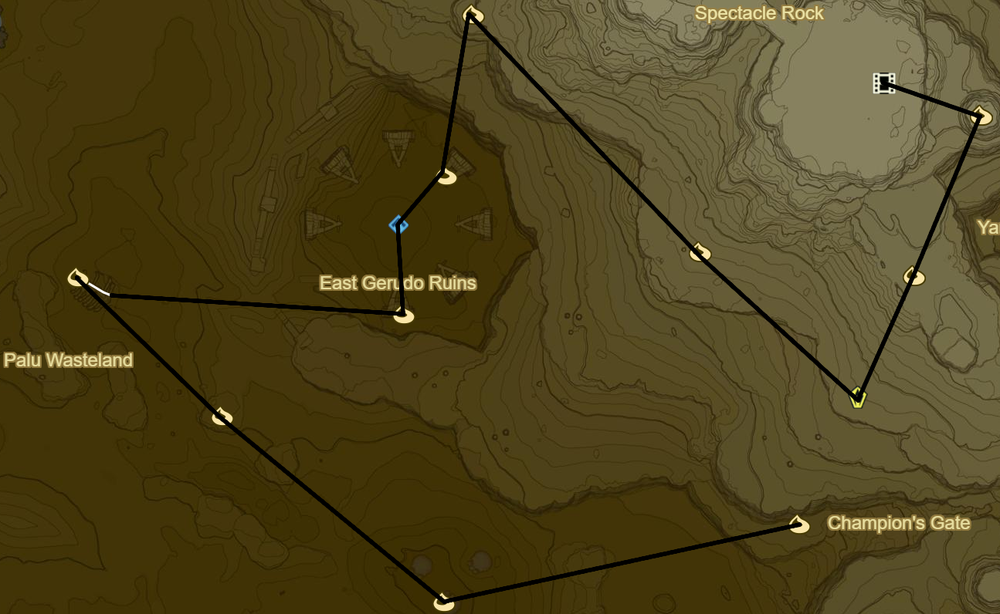

# Wasteland 2

* Korok 407: Rock Pattern E of Vah Naboris
* Korok 408: Magnesis Puzzle to SW
* Stone Talus to SW (25/40)
* Korok 409: Rock atop pillar to NW
* Korok 410: Magnesis Puzzle to NW
* Korok 411: Balloon between statue wrists to S
* Shrine Quest: The Seven Heroines
  * Korsh O'hu Shrine (64/120)
  * Clockwise starting from 9 o' clock
    1. Red Apostrophe
    2. Orange ^ Symbol
    3. Yellow O
    4. Grey :
    5. Green Scroll
    6. Blue Flame
    7. Purple Lines (already done)
* Korok 412: Rock atop Southernmost statue
* Korok 413: Flower trail across bones to W
* Korok 414: Magnesis Puzzle to SE
* Korok 415: Magnesis Puzzle inside Skull to SE
* Korok 416: Magnesis Puzzle to E

* Korok 417: Rock behind cracked boulders to NE
* Korok 418: Rock pattern to SE
* Main Quest: EX Champion Urbosa's Song to N
* Korok 419: Rock to E
* Korok 420: Rock atop Mount Granajh to SW
* Shrine Quest: Secret of the Snowy Peaks to SW
  * 4-6pm
  * Suma Sahma Shrine to NW (65/120)
* Korok 421: Fairylights in ice to SE
* Korok 422: Rock Pattern to S
* Korok 423: Fairylights in Ice to W
* Korok 424: Rock to NE
* Shrine Quest: The Desert Labyrinth to W
  * Dila Maag Shrine (66/120)
* Korok 425: Magnesis Puzzle to NW
* Korok 426: Rock atop pillar to S
* Korok 427: Race to SW
* Korok 428: Race on arch to NW

* Molduking to SE
  * Royal Guard Equipment is possible
* Keive Tala Shrine
* Korok 429: Rock atop pillar to SW
* Shrine Quest: The Perfect Drink to NW
* Korok 430: Rock Circle to W
* Korok 431: Cacti to W

* Korok 432: Balloon atop tree to NW
* Molduga (1/4)
* Korok 433: Rock to N
* Shrine Quest: The Undefeated Champ to N
  * Raqa Zunzo Shrine (67/120)
* Korok 434: Flower trail on skeleton to W
* Korok 435: Rock to SW
* Molduga to SE (2/4)
* Korok 436: Rock to SE
* Korok 437: Cacti to NW

* Hawa Koth Shrine to W (68/120)
* Take Picture of Gerudo Great Skeleton
* Great Fairy Fountain
* Korok 438: Fairylights atop Skeleton
* Molduga to NE (3/4)
* Korok 439: Cacti to W

* Molduga to NE (4/4)
* Tho Kayu Shrine (69/120)
  * Light area's 4 torches
* Korok 440: Cacti to NW

* Korok 441: Fairylights atop skeleton to NE
  * Can now Max out Inventory
* Korok 442: Fairylights atop skeleton to N
* Kema Zoos Shrine (70/120)
  * Shrine Quest: The Silent Swordswomen
* Korok 443: Fairylights near pinwheel atop skeleton to SE
* Korok 444: Race to SE
* Korok 445: Cacti to SE

* Shrine Quest: The Perfect Drink
  * Retrieve the Ice
  * Misae Suma Shrine (71/120)
* Side Quest: The Thunder Helm
  * Side Quest: The Mystery Polluter
    * 10 Wildberries
  * Side Quest: The Search for Barta
    * Warp to Hawa Koth Shrine
    * Hearty Durian
* Rent Seal from Northern Entrance for Takama Shiri Shrine
* Warp to Kay Noh Shrine

* Side Quest: Missing in Action to N on Koukot Plateau
  * Return to Kay Noh Shrine
* Bring Horse and Complete Side Quest: Good-Sized Horse
* Warp back to Kuh Takkar Shrine
* Retrieve Orb in hideout
* Kihiro Moh Shrine
  * Red 1
  * Green 2
  * Yellow 2
  * Purple 4
* Warp to Divine Beast Vah Naboris
* Complete Main Quest: EX Champion Urbosa's Song
* Warp to Bareeda Naag Shrine
