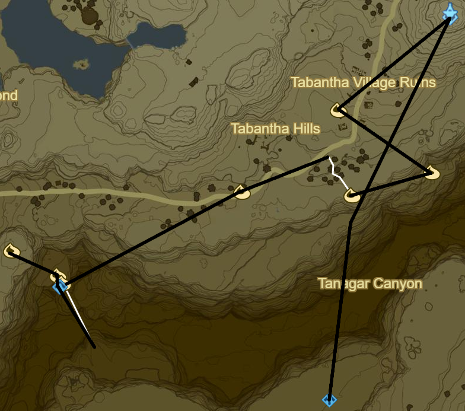
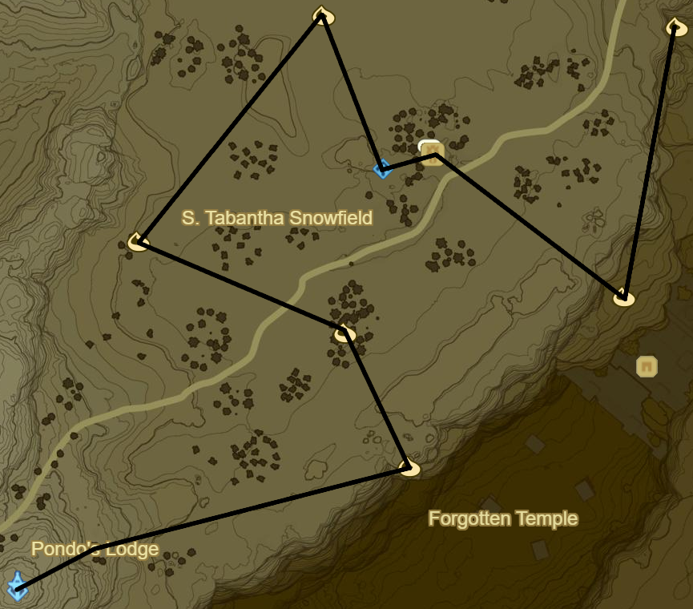
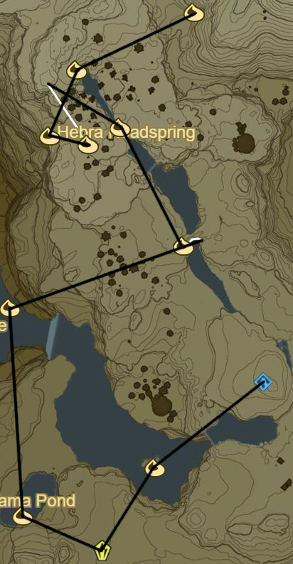

# Hebra

* Main Quest: EX Champion Revali's Song to S
* Korok 446: Magnesis Puzzle to E
* Korok 447: Rock behind cracked boulder to E
* Korok 448: Lilies to NE
* Korok 449: Fairylights atop tree to E

* Korok 450: Fairylights atop windmill to E
* Korok 451: Race to SE
* Dunda Taag Shrine below (72/120)
* Korok 452: Acorn in log to NE
* Korok 453: Flower Trail to E
* Korok 454: Rock beneath cracked boulder down cliff to E
* Korok 455: Magnesis Well to NW
* Hebra Tower to NE
* Rito Guard to SW
* Shira Gomar Shrine
* Warp back to Hebra Tower
* Korok 456: Rock in gorge to SE

* Korok 457: Pinwheel shooting to NE
* Korok 458: Rock beneath leaves to N
* Korok 459: Acorn in log to NW
* Korok 460: Fairylights to NE
* Rin Oyaa Shrine to SE (73/120)
* Snowfield Stable
  * Side Quest: Stalhorse: Pictured!
* Korok 461: Roll Boulder in gorge to SE
* Korok 462: Rock beneath cracked boulder to N

* Korok 463: Roll boulder to NE
* Korok 464: Magnesis Puzzle to N
* Korok 465: Balloon in tree to SE
* Shrine Quest: Trial on the Cliff
  * Qaza Tokki Shrine (74/120)
* Korok 466: Rock patterns to WNW
* Korok 467: Acorn in log to SW

* Sha Gehma Shrine to NW (75/120)
* Korok 468: Pinwheel shooting to W
* Korok 469: Fairylights within Ice to SW
* Rok Uwog Shrine to SW (76/120)
* Korok 470: Fairylights within Ice to SW
* Korok 471: Pinwheel shooting to E
* Frost Talus to E (26/40)
* Korok 472: Fairylights in ice to SW

* Korok 473: Roll Snowball far to S over Kopeeki Drifts
* Go NE and Unlock Shrine
* Korok 474: Rock to W
* Gee Ha'rah Shrine to SE (77/120)
* Korok 475: Rock to S atop peak
* Lanno Kooh Shrine (78/120)
* Korok 476: Rock behind Shrine to W

* Korok 477: Fairylights atop dead tree to SW
* Stone Talus to SW (27/40)
* Korok 478: Lilies to W
* Korok 479: Lilies to N
* Korok 480: Flower trail along stone crossing to E
* Korok 481: Balloon near water to NW
* Korok 482: Race to NW
* Korok 483: Rock to W
* Korok 484: Balloon near water to NE
* Korok 485: Fairylights in Ice to NE

* Korok 486: Rock beneath stone hills to NW
* Goma Asaagh Shrine behind Ice (79/120)
  * Melt Ice completely to prevent respawning
* Follow rings to SE
  * Kizah Toza Shrine
* Warp back to Goma Asaagh Shrine
* Korok 487: Rock atop Hebra Peak
* Side Quest: Xenoblade Chronicles 2
  * The Southeastern sky from the peak of the tall, pierced snowy mountain
* Korok 488: Rock pattern to SE
* Salvager's Trousers to SW
* Korok 489: Balloon under cliff across gorge to W
* Korok 490: Fairylights within ice to SW on cliff edge
* Korok 491: Pinwheel shooting to SW

* Frost Talus to W over Rospro Pass (28/40)
* Korok 492: Rock to N
* Korok 493: Acorn in log to NE towards Talonto Peak
* Korok 494: Fairylights within ice to NE
* Korok 495: Fairylights within ice to W on upper level
* Frost Talus to N (29/40)
  * Side Quest: Face the Frost Talus
* Korok 496: Leaves atop cabin to NE
* Shada Naw Shrine to NW (80/120)

* Korok 497: Fairylights atop tree to E
* Korok 498: Rock pattern to NW
* Warp back to Shada Naw
* Korok 499: Pinwheel shooting to SW
* Mozo Shenno Shrine within cliffside to W (81/120)
  * Shrine Quest: The Bird in the Mountains
* Korok 500: Rock atop Biron Snowshelf to SW
* Korok 501: Rock to NW
* Korok 502: Fairylights atop dead tree to N
* Korok 503: Pinwheel shooting to E
* Korok 504: Acorn in log to NW
* Korok 505: Fairylights atop dead tree to E
* Korok 506: Rock beneath leaves in hot spring to NW
* Korok 507: Rock pattern to NW

* Head south to To Quomo entrance, hint: small water source
* Open entrance
* To Quomo Shrine (82/120)
  * Take Picture of Skeleton
* Korok 508: Flower trail from back to front of skeleton
* Korok 509: Fairylights within left ice outside of Cave to NW
  * N of Shrine on Map
* Stalnox to W (17/40)
* Korok 510: Magnesis Puzzle to W
* Hia Miu Shrine (83/120)
* Korok 511: Race to SE
* Korok 512: Pinwheel shooting to E atop Hebra North Summit
* Shefin's Secret Hot Spring to SW
* Korok 513: Rock pattern to SE
* Frostspear in Skull Lair to SE
* Korok 514: Flower Trail to W
* Korok 515: Rock to NW atop Herba West Summit

* Korok 516: Fairylights to S
* Hinox to SW (18/40)
* Korok 517: Rock to SE
* Sturnida Secret Hot Spring to E

* Korok 518: Flower trail to NW
* Korok 519: Rock pattern to SE
* Korok 520: Rock beneath cracked boulders to SE
* Maka Rah Shrine via Cave Entrance to E (84/120)
* Korok 521: Rock to SW
* Korok 522: Race to NW
* Korok 523: Pinwheel shooting to NW
* Warp to Sha Warvo Shrine

* Noe Rajee Shrine to N
* Hebra Trailhead Lodge to NE
* Korok 524: Rock to SE around Lake Totori just past enemy tree camp
* Warp to Divine Beast Vah Rudania
  * Main Quest: EX Champion Mipha's Song to NE across East Resevoir Lake
* Warp to Mo'a Keet Shrine
