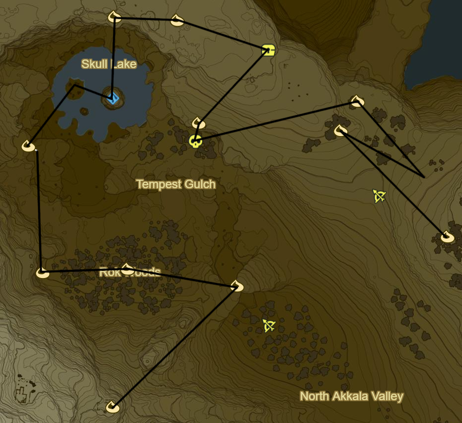
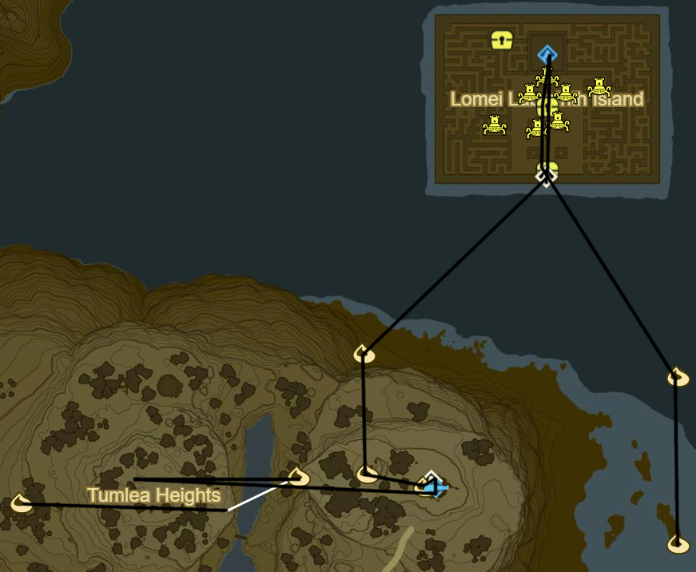

# Akkala

 -- UPDATE

* Korok 524: Rock under slab below Akkala Span
* Korok 525: Rock pattern to NE
* Akkala Bridge Ruins to NE
* Hinox to SE (19/40)
* Korok 526: Rock beneath Metal Door on cliff to E
* Korok 527: Rock beneath leaves on S edge of ruins to NW
* Korok 528: Rock by cannons on S edge of ruins
* Akkala Tower
* Korok 529: Rock beneath leaves to W
* Korok 530: Rock beneath leaves to NE
* Korok 531: Rock beneath Magnesis door to NE
* Ze Kasho Shrine to NW (85/120)
* South Akkala Stable to E
  * Side Quest: Little Sister's Big Request
    * 1 Armoranth
    * 1 Warm Darner
    * 1 Cold Darner
    * 1 Electric Darner
* Korok 532: Fairylights to N
* Korok 533: Rock beneath leaves to E
* Korok 534: Apple Trees to E

* Korok 535: Fairylights atop tree to NW
* Korok 536: Fairylights to E
* Korok 537: Magnesis Puzzle to W
* Korok 538: Magnesis Puzzle to NW
* Recovered Memory 13 - Slumbering Power to NE (6/12)
* Tutsuwa Nim Shrine (86/120)
* Korok 539: Rock above Spring of Power
* Korok 540: Rock beneath leaves to E
* Korok 541: Flower order to NE
* Korok 542: Acorn in log to W
* Korok 543: Magnesis Puzzle to W on mountainside ruins

* Korok 544: Balloon beneath cliff to NE
* Korok 545: Rock atop tree in middle of Rok Woods to W
* Korok 546: Rock beneath slab to W
* Korok 547: Race to N
* Take picture of Kilton at night in left Skull Eye
* Zuna Kai Shrine in right Skull Eye (87/120)
* Side Quest: Xenoblade Chronicles 2
  * The Eastern Sky From the Skull's Left Eye
* Korok 548: Rock pattern to N
* Korok 549: Rock under boulder to E
* Salvager's Vest to SE
* Korok 550: Rock beneath slab to SW
* Hinox to S (20/40)
* Korok 551: Flower order to E
* Korok 552: Roll boulders to SE to hole S of previous Korok
* Korok 553: Rock beneath leaves to SE

* Korok 554: Race to E
* Return W to transport Flame to Akkala Ancient Tech Lab
* Shrine Quest: The Skull's Eye
  * Should autocomplete
* Korok 555: Fairylights atop Tech Lab
* Korok 556: Rock in guardian pile to W
* Korok 557: Rock behind cracked boulders to N
* Shrine Quest: Trial of the Labyrinth to NE
  * Tu Ka'loh Shrine (88/120)
* Side Quest: EX Teleportion Rumors
  * Useful when force spawning Stalnox
* Diamond Circlet in centre
  * Beneath labyrinth to S
* Korok 558: Rock beneath slab on island to SE
* Korok 559: Flower order to S

* Korok 560: Magnesis Puzzle to SW
* Korok 561: Rock circle up cliff to NW
* Katosa Aug Shrine to W (89/120)
* East Akkala Stable
  * Shrine Quest: The Spring of Power
    * Should autocomplete
  * Side Quest: A Shady Customer
    * Warp to Zuna Kai at night to find Kilton in other eye
    * Take picture of Kilton for Side Quest and return to Katosa Aug Shrine to finish
* Korok 562: Race to SW
* Korok 563: Pinwheel shooting to SE
* Stalnox to SW (21/40)

* Korok 564: Rock Pattern to S
* Korok 565: Flower trial around bridge to S
* Side Quest: From the Ground Up
  * Place Travel Medallion in Town for future convenience
  * Speak to Hudson
  * 10 Wood Bundles
  * Warp to Qua Raym Shrine and go to Southern Mine
  * Talk to Greyson and Warp back
  * 20 Wood Bundles
  * Warp to Desert Bazaar
  * Talk to Rhondson
  * Warp back to Tarrey Town
  * 30 Wood Bundles
  * Warp to Akh Va'quot Shrine
  * Speak to Fyson
    * Complete Side Quest: Face the Frost Talus
    * Complete Side Quest: Curry for What Ails You
  * Warp back to Tarrey Town
  * 50 Wood Bundles
  * Side Quest: Hobbies of the Rich
    * Hunt Guardians to W
    * Korok 566: Atop Rock atop ruins
  * Warp to Ne'ez Yohma Shrine
  * Speak to Kapson
  * Warp back to Tarrey Town
  * Complete Side Quest: Hobbies of the Rich
  * Side Quest: A Parent's Love
    * Eavesdrop Southernmost House at Night
    * Monster Cake
      * Monster Extract
      * Tabantha Wheat
      * Goat Butter
      * Cane Sugar
  * Warp to Myahm Agana Shrine
  * Talk to Bolson
  * Warp back to Tarrey Town
  * Enjoy :]
* Great Fairy Fountain to SE of Tarrey Town
* Korok 567: Flower order to S
* Korok 568: Apple offering to W
* Dah Hesho Shrine to S (90/120)

* Korok 569: Apple trees to SE
* Korok 570: Race to NE
* Korok 571: Flower Trail to NE
* Korok 572: Magnesis Puzzle to SE
* Shrine Quest: Into the Vortex
  * Ritaag Zumo Shrine to NW (91/120)
* Korok 573: Rock beneath leaves S of Shrine
* Warp back to Dah Hesho Shrine

* Korok 574: Pinwheel shooting to S
* Korok 575: Rock beneath boulder to SE
* Korok 576: Fairylights atop tree to SE
* Ke'nai Shrine to N (92/120)
  * Ancient Battleaxe+
* Korok 577: Apple Trees to N
* Korok 578: Fairylights to SE
* Korok 579: Rock beneath cracked boulders to SE of Davdi Island
* Korok 580: Lilies NW on Davdi Island
* Korok 581: Rock on pillar N on Ankel Island
* Korok 582: Rock on scaffold below to N
* Korok 583: Flower Trail to N on Tingel Island
* Kah Mael Shrine to S (93/120)
* Kee Dafunia Shrine to SE at 5-6 am
* Warp back to Dah Hesho Shrine

-- UPDATE

* East Sokkala Bridge
* Korok 584: Rock circle to SW
* Korok 585: Rock beneath bridge to SW
* Warp to Ne'ez Yohma Shrine
