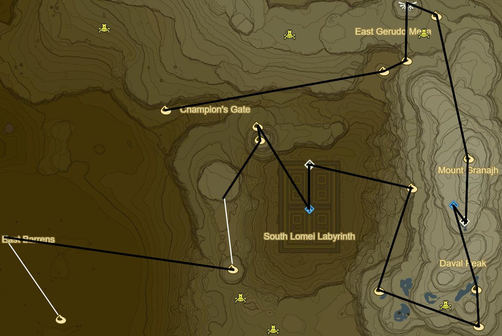
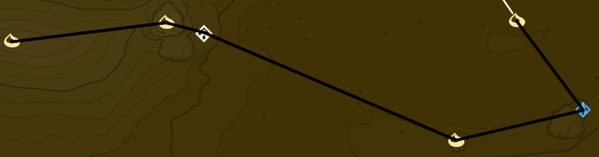

# Wasteland 2

* Korok 567: Magnesis Puzzle to W
* Korok 568: Balloon between statue wrists to S
* Shrine Quest: The Seven Heroines
  * Korsh O'hu Shrine (88/120)
  * Clockwise starting from 9 o' clock
    1. Red Apostrophe
    2. Orange ^ Symbol
    3. Yellow O
    4. Grey :
    5. Green Scroll
    6. Blue Flame
    7. Purple Pause Button (already done for you)
* Korok 569: Rock atop S-most statue
* Korok 570: Flower trail across bones to W
* Korok 571: Magnesis Puzzle to SE
* Korok 572: Magnesis Puzzle inside Skull to SE
* Korok 573: Magnesis Puzzle to E

* Korok 574: Rock pattern to E
* Korok 575: Rock behind cracked boulders to NE
* Shrine Quest: The Desert Labyrinth to SW
  * Dila Maag Shrine (89/120)
* Korok 576: Rock atop pillar to NW
* Korok 577: Magnesis Puzzle to N
* Korok 578: Race to SW
* Korok 579: Race on arch to NW

* Korok 580: Rock atop pillar to SW
* Shrine Quest: The Perfect Drink to NW
  * Drop Travel Medallion
* Korok 581: Rock Circle to W
* Korok 582: Cacti to W

* Korok 583: Balloon atop tree to NW
* Molduga (1/5)
* Korok 584: Rock to N
* Korok 585: Flower trail on skeleton to NW
* Korok 586: Rock to SW
* Molduga to SE (2/5)
* Korok 587: Rock to SE
* Korok 588: Cacti to NW

* Hawa Koth Shrine to W (90/120)
* Take Picture of Gerudo Great Skeleton
* Great Fairy Fountain
* Korok 589: Fairylights atop Skeleton
* Molduga to NE (3/5)
* Korok 590: Cacti to W

* Molduga to NE (4/5)
* Tho Kayu Shrine (91/120)
  * Light area's 4 torches
* Korok 591: Cacti to NW

* Korok 592: Fairylights atop skeleton to NE
* Korok 593: Fairylights atop skeleton to N
* Kema Zoos Shrine (92/120)
  * Shrine Quest: The Silent Swordswomen
* Korok 594: Fairylights near pinwheel atop skeleton to SE
* Korok 595: Race to SE
* Korok 596: Cacti to SE

 -- REDO

* Side Quest: Medicinal Molduga
  * Molduga Guts
* Shrine Quest: The Perfect Drink
  * Get Ice
* Main Quest: Divine Beast Vah Naboris
  * Recovered Memory 6 (14/18)
* Korok 597: Flower trail to E of Gerudo Town and N of Lookout Tower
* Complete Main Quest: Divine Beast Vah Naboris
* Side Quest: The Thunder Helm
  * Side Quest: The Mystery Polluter
    * 10 Wildberries
  * Side Quest: The Search for Barta
    * Warp to Hawa Koth Shrine
    * Hearty Durian
* Shrine Quest: The Undefeated Champ to S outside Gerudo Town
  * Raqa Zunzo Shrine (93/120)
* Warp to Shrine of Resurrection

Next: [Great Plateau 1](17 - Plateau2.md)
