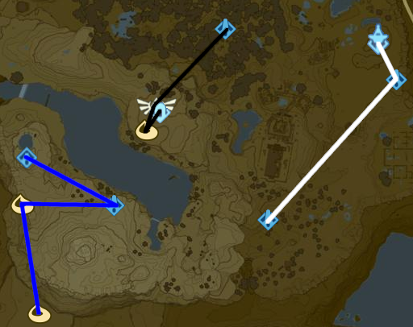
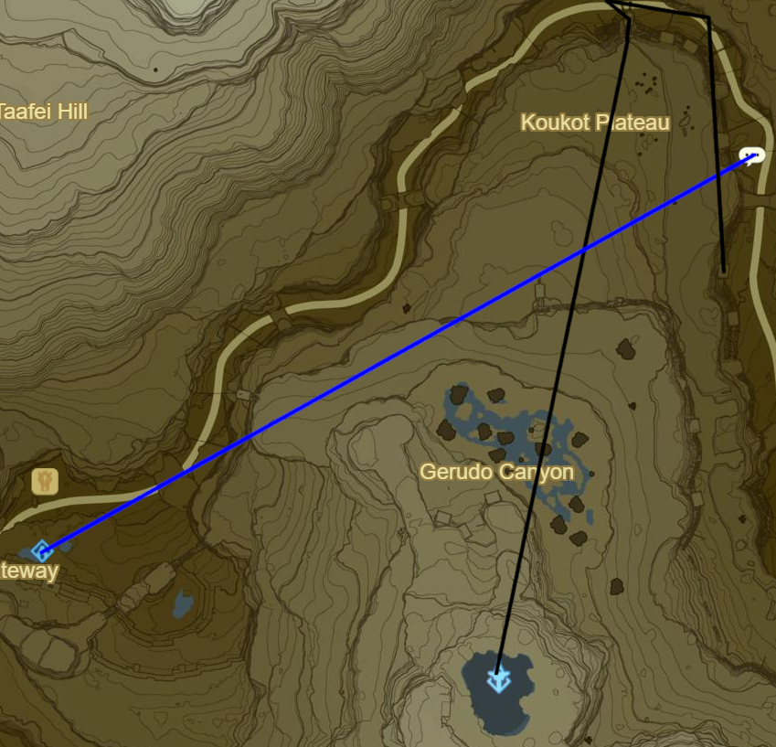
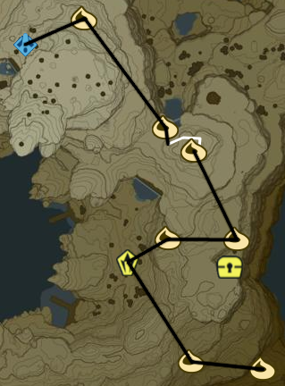

# Champion's Ballad

## Great Plateau

* Korok 597: Fairylights in Shrine
* Main Quest: EX Champions' Ballad
* Yowaka Ita Shrine to NE in Forest of Spirits
* Rohta Chigah Shrine to E just S of Plateau Tower
* Rivo Korbah Shrine to SW near cabin
* Warp to Keh Namut Shrine
* Etsu Korima Shrine to SE
* Warp to Divine Beast Vah Naboris

## Wasteland

* Korok 598: Rock pattern to E
* Korok 599: Magnesis Puzzle to SW
* Korok 600: Rock atop pillar to W
* Stone Talus (Luminous) to SE (30/40)
* Main Quest: EX Champion Urbosa's Song to E
* Korok 601: Magnesis Puzzle to NE
* Korok 602: Rock to S
* Korok 603: Rock behind cracked boulder to SE
* Korok 604: Rock atop peak of Mount Granajh to SW
* Shrine Quest: Secret of the Snowy Peaks to S
  * Around 4.20 ish
  * Suma Sahma Shrine (94/120)
* Korok 605: Rock to NW

* Korok 606: Fairylights within ice to SW
* Korok 607: Fairylights within ice to E
* Korok 608: Rock pattern to S
* Warp to Raqa Zunzo Shrine

* Complete Shrine Quest: The Perfect Drink to SE
  * Misae Suma Shrine (95/120)
* Molduking trigger to SE
  * Keive Tala Shrine

* Warp to Daqo Chisay Shrine
* Rent Sand Seal from N entrance
* Takama Shiri Shrine

* Warp to Wasteland Tower
* Side Quest: Missing in Action to N on Koukot Plateau
  * Return to Kay Noh Shrine
* Bring Horse and Complete Side Quest: Good-Sized Horse
* Warp back to Kuh Takkar Shrine
* Retrieve Orb in hideout
* Kihiro Moh Shrine
  * Red 1
  * Green 2
  * Yellow 2
  * Purple 4
* Warp to Divine Beast Vah Naboris
* Complete Main Quest: EX Champion Urbosa's Song
* Warp to Bareeda Naag Shrine

## Tabantha

* Main Quest: EX Champion Revali's Song to S
* Korok 609: Magnesis Puzzle to E
* Korok 610: Rock behind cracked boulder to E
* Warp to Hebra Tower
* Head to campfire to SW
  * Await Dragon at 1AM
* Shira Gomar Shrine
* Warp to Rok Uwog Shrine
* Kiah Toza Shrine
* Warp to Sha Warvo
* Noe Rajee Shrine
* Warp to Vah Medoh and Complete Main Quest: EX Champion Revali's Song
* Warp to Shae Mo'sah Shrine

## Eldin

* Main Quest: EX Champion Daruk's Song to SW
* Warp to Shora Hah Shrine
* Take Cart to E shore and circle E
* Igneo Talus Titan
* Kamia Omuna Shrine
* Warp to Divine Beast Vah Rudania
* Follow rings to E
* Sharo Lun Shrine
* Shadow Hamlet Ruins to SE
* Korok 611: Rock behind cracked boulder to SW
* Go West to Darb Lake
* Rinu Honika Shrine
* Warp to Divine Beast Vah Rudania and complete Main Quest: EX Champion Daruk's Song
* Warp to Divine Beast Vah Ruta
* Main Quest: EX Champion Mipha's Song to NE across East Resevoir Lake
* Warp to Kah Mael Shrine

## Lanaryu

* Kee Dafunia Shrine to E at 5-6 am
* Warp to Ne'ez Yohma Shrine
* Take NE Waterfalls
* Korok 612: Rock to NW
* Sato Koda Shrine to SW
* Warp to Ne'ez Yohma Shrine
* Take E exit up waterfalls
* Mah Eliya Shrine
* Warp to Vah Ruta and complete Main Quest: EX Champion Mipha's Song
* Return to Shrine of Resurrection and Complete Main Quest: EX Ballad of the Champions
* Warp back to Mah Eliya Shrine

Next [18 - Lanaryu 2](18 - Lanaryu2.md)
