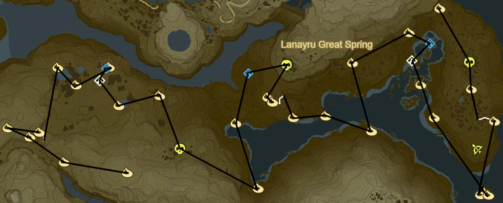
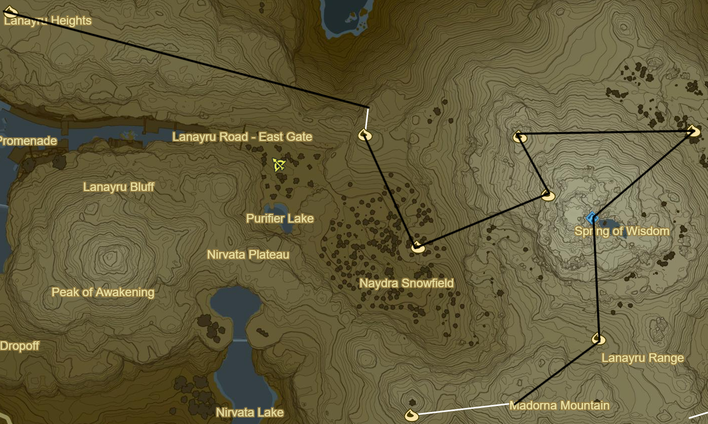

# Lanaryu 2

* Korok 613: Rock beneath cracked boulder to NE
* Korok 614: Magnesis Boulder to SE
* Korok 615: Flower Trail to SE
* Korok 616: Rock behind cracked boulders to SE
* Korok 617: Magnesis puzzle to W
* Stone Talus Luminous to SW (31/40)
* Korok 618: Rock beneath cracked boulder to SE
* Korok 619: Rock beneath cracked boulders to E

* Blue Hinox to SE (22/40)
* Korok 620: Balloon beneath stone arch to S
* Korok 621: Flower Trail to SE
* Korok 622: Rock pattern on island to S
* Korok 623: Flower trail on island
* Korok 624: Rock beneath slab to NW
* Korok 625: Rock circle to NW
* Shrine Quest: Master of the Wind to NW
  * Shai Yota Shrine (96/120)
* Korok 626: Magnesis Puzzle to NW of Shrine
* Korok 627: Fairylights to SW
* Korok 628: Rock pattern across river to SE
* Korok 629: Rock to NW
* Korok 630: Rock beneath cracked boulders to W
* Korok 631: Flower Trail to N
* Korok 632: Rock beneath leaves to NW
* Blue Hinox to NE (23/40)
* Rucco Maag Shrine to W (97/120)
* Korok 633: Rock pattern to SW
* Korok 634: Rock pattern across river to SE
* Blue Hinox to NW (24/40)
* Korok 635: Fairylight top tallest tree to NW
* Korok 636: Fairylights to W
* Shrine Quest: The Crowned Beast
  * Mezza Lo Shrine (98/120)
* Korok 637: Rock atop tree to E of Shrine
* Korok 638: Pinwheel shooting to W
* Korok 639: Rock on tree to NW
* Korok 640: Flower Trail to S
* Korok 641: Apple trees to W
* Korok 642: Apple offering to SE
* Korok 643: Roll boulder to SE
* Korok 644: Roll boulder to E

* Korok 645: Race to E past East Gate
* Korok 646: Fairylights to SE
* Korok 647: Fairylights in ice to E
* Korok 648: Fairylights to NW
* Korok 649: Rock pattern to E
* Shrine Quest: Spring of Wisdom to SW
  * Jitan Sa'mi Shrine (99/120)
* Korok 650: Fairylights in ice to S
* Drop Travel Medallion
* Korok 651: Race to SW
* Naydra farm to NW at Lanaryu East Gate at morning
  * 0/5 scale
    * 1/1 for Shrine
    * 0/1 in castle
    * 0/6 for upgrades
  * 0/3 claw
    * 0/3 for upgrades
  * 0/6 horn
    * 0/5 for upgrades
  * 0/2 fang
    * 3 for upgrades
    * 1 in castle
* Return to Travel Medallion

* Korok 652: Race to SE
* Tahno O'ah Shrine to W (100/120)
  * Shrine Quest: Secret of the Cedars
* Korok 653: Roll boulder to NE
* Korok 654: Rock beneath slab to SE
* Return to Travel Medallion
* Korok 655: Flower Trail to SE

Next: [Hateno 3](19 - Hateno2.md)
