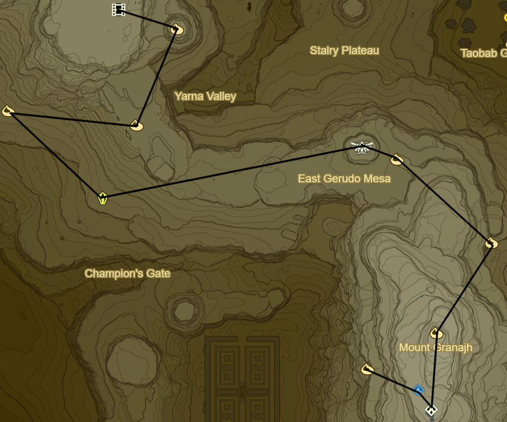
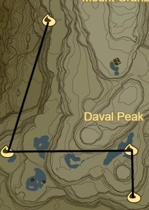
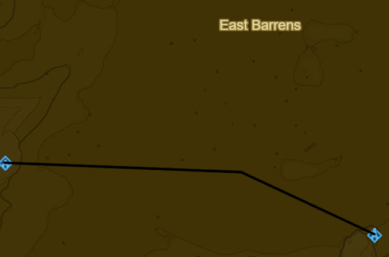
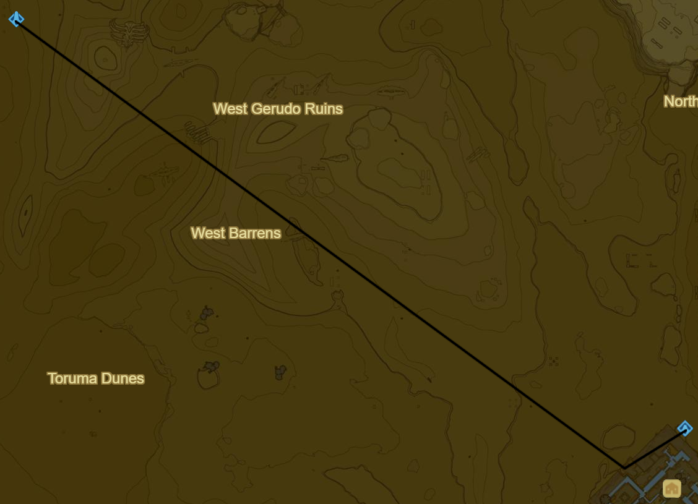
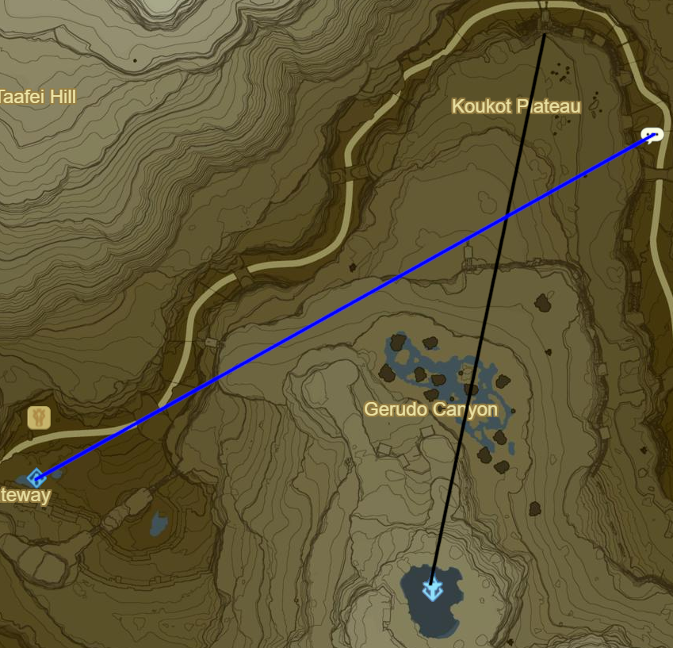

# Wasteland 3

* Korok 600: Rock pattern to E
* Korok 601: Rock pattern to SW
* Korok 602: Rock atop pillar to W
* Stone Talus (Luminous) to SE (30/40)
* Main Quest: EX Champion Urbosa's Song to E
* Korok 603: Rock to E
* Korok 604: Rock behind cracked boulder to SE
* Korok 605: Rock atop peak of Mount Granajh to SW
* Shrine Quest: Secret of the Snowy Peaks to S
  * Around 4.20 ish
  * Suma Sahma Shrine (94/120)
* Korok 606: Rock to NW

* Korok 607: Fairylights within ice to SW
* Korok 608: Fairylights within ice to E
* Korok 609: Rock pattern to S
* Warp to Raqa Zunzo Shrine

* Complete Shrine Quest: The Perfect Drink to SE
  * Misae Suma Shrine (95/120)
* Molduking trigger to SE
  * Keive Tala Shrine

* Warp to Daqo Chisay Shrine
* Rent Sand Seal from N entrance
* Takama Shiri Shrine

* Warp to Wasteland Tower
* Side Quest: Missing in Action to N on Koukot Plateau
  * Return to Kay Noh Shrine
* Bring Horse and Complete Side Quest: Good-Sized Horse
* Warp back to Kuh Takkar Shrine
* Retrieve Orb in hideout
* Kihiro Moh Shrine
  * Red 1
  * Green 2
  * Yellow 2
  * Purple 4
* Warp to Divine Beast Vah Naboris
* Complete Main Quest: EX Champion Urbosa's Song
* Warp to Bareeda Naag Shrine

Next: [Wasteland3](18 - Wasteland3.md)
