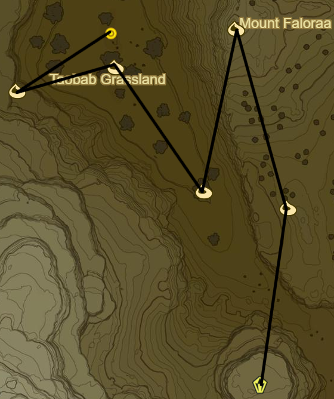
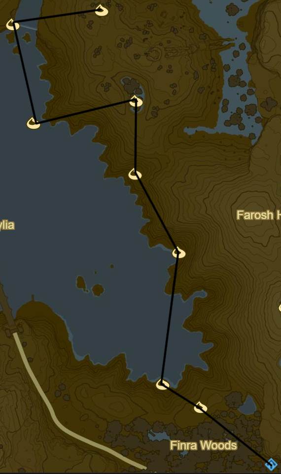
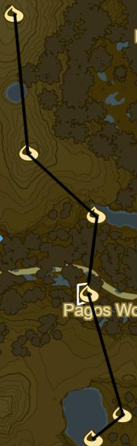

# Hylia

Traveller's Medallion can be useful between bridge levels

* Korok 637: Light torches atop bridge entrance to SE
* Korok 638: Rock circle to S
* Korok 639: Tree branch below bridge to S
* Korok 640: Fairylights atop fountain
* Side Quest: Xenoblade Chronicles 2
  * The southern sky from the middle of the largest bridge
* Korok 641: Flower Trail to S
* Korok 642: Rock below bridge to S

* Lake Tower to S
* Korok 643: Magnesis Puzzle to S
* Side Quest: EX Treasure: Garb of the Winds
  * Underwater to W
* Korok 644: Rock on ledge
* Korok 645: Rock pattern to SE
* Korok 646: Lilies to E
* Korok 647: Rock beneath cracked boulder to S
* Stalnox to S (26/40)
* Side Quest: Hunt for the Giant Horse to SW
* Korok 648: Flower Trail to N
* Korok 649: Apple offering to W
* Korok 650: Race to NE
* Korok 651: Magnesis Puzzle to NW
* Korok 652: Rock to NW

* Korok 653: Race to NW
* Korok 654: Fairylights atop tree to SE
* Ya Naga Shrine to SE (101/120)
* Side Quest: A Wife Washed Away to E
* Korok 655: Balloon beneath bridge to NE
* Korok 656: Rock beneath slab to N
* Korok 657: Metal cubes to SE
* Salvager Headwear to SW
* Korok 658: Rock to SE
* Korok 659: Roll boulder to SE
* Korok 660: Fairylights to SW
* Korok 661: Roll boulder to SW
* Korok 662: Rock atop pillar to SE
* Korok 663: Magnesis Stump to E
* Pumaag Nitae Shrine (102/120)

* Highland Stable to S
  * Mini Game
    * Sub 1.30: Extravagant Bridle
    * Sub 1.15: Extravagant Saddle
* Side Quest: The Horseback Hoodlums
* Ka'o Makagh Shrine to S (103/120)
* Korok 664: Lilies to SE
* Side Quest: EX Ancient Horse Rumors to SE
  * Ancient Saddle
* Horse God Malanya
* Korok 665: Rock pattern to W
* Korok 666: Rock pattern to SW
* Korok 667: Roll boulder to N
* Korok 668: Race to N
* Korok 669: Pinwheel shooting to SW
* Korok 670: Rock pattern to E
* Korok 671: Pinwheel shooting to S
* Korok 672: Roll boulder to E
* Korok 673: Magnesis puzzle to SE
* Korok 674: Fairylights to W
* Korok 675: Seaweed ring to S
* Korok 676: Rock atop mushroom to NW
* Shrine Quest: Guardian Slideshow
  * Shoqa Tatone Shrine (104/120)
* Korok 677: Rock beneath boulders to NW
* Korok 678: Rock pattern to W
* Korok 679: Rock behind cracked boulder to W
* Korok 680: Fairylights to S
* Korok 681: Fairylights atop palm tree to W
* Korok 682: Rock on cliff to W

* Korok 683: Race to W
* Stalnox to WNW (27/40)
* Korok 684: Fairylights to NW
* Korok 685: Pinwheel shooting to NW
* Ishto Soh Shrine to E (105/120)
* Korok 686: Magnesis puzzle to E
* Korok 687: Rock behind cracked boulder to NW
* Stone Talus to NW (31/40)

* Korok 688: Acorn in log to NE
* Korok 689: Fairylights atop tree to NW
* Korok 690: Balloon atop tree to SW
* Korok 691: Hanging acorn to NW
* Korok 692: Magnesis Puzzle to W
* Side Quest: Hunt for the Giant Horse to NE
  * Get horse and complete quest before registering at Highland Stables
  * Mounted Archery
    * 20-22: Knight's Bridle
    * 23-25: Knight's Saddle
* Warp back to Pumaag Nitae Shrine

* Korok 693: Roll boulder to NW
* Korok 694: Acorn in tree to NW
* Korok 695: Pinwheel shooting to NE
* Korok 696: Roll boulder to NW
* Korok 697: Magnesis Stump to N
* Korok 698: Lilies to W
* Korok 699: Magnesis puzzle to NW
* Korok 700: Magnesis stump to E

* Korok 701: Magnesis well to NE
* Stone Talus to NE (32/40)
* Korok 702: Rock to S
* Korok 703: Flower trail to S
* Korok 704: Fairylights to E
* Korok 705: Magnesis Puzzle to SE
* Korok 706: Fairylights to S
* Korok 707: Fairylights
* Korok 708: Flower order to SW
* Korok 709: Durian trees to SE

* Korok 710: Rock to S
* Korok 711: Lilies to SE
* Korok 712: Flower trail to S
* Korok 713: Rock beneath slab to SE
* Korok 714: Rock circle to SW

* Korok 715: Rock atop mountain to E of Malanya Spring
* Korok 716: Magnesis Puzzle to S
* Korok 717: Rock pattern to NE
* Korok 718: Rock atop ledge to NE
* Blue Hinox to W (28/40)
* Korok 719: Race atop pillar to W
* Korok 720: Balloon atop palm tree to NE
* Side Quest: EX Treasure: Usurper King
  * Phantom Ganon Armor to NW under bridge
* Korok 721: Flower Trail to NW
* Korok 722: Fairylights to NW
* Shrine Quest: The Serpent's Jaws to N
* Korok 723: Magnesis boulders to N

* Zonai Ruins to NE
* Korok 724: Match boulder to N
* Korok 725: Rock to NW
* Korok 726: Rock beneath cracked boulder to NE
* Korok 727: Magnesis Puzzle to SE
  * Block on opposite claw
* Side Quest: EX Treasure: Merchant Hood below hand
  * Ravio's Hood
* Korok 728: Rock atop tree to NE
* Shae Katha Shrine (106/120)
  * Farosh Scale
  * If don't have leave traveller's medallion
* Korok 729: Roll boulders to N
* Korok 730: Race to SE
* Korok 731: Rock above waterfall to S
* Korok 732: Fairylights to S
