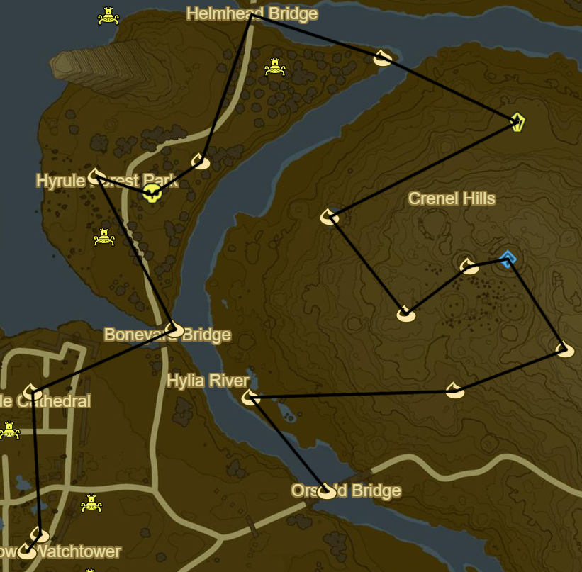
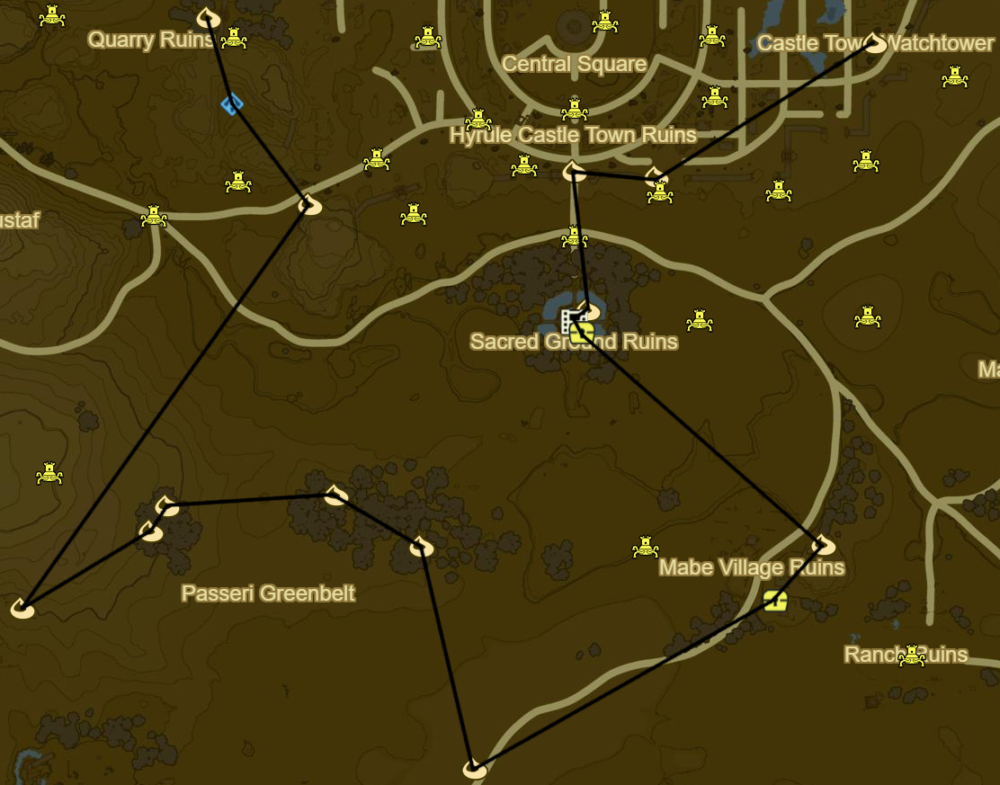

# Central Hyrule

* Korok 789: Lilies to NE
* Stone Talus: Centre of Lake (37/40)
* Korok 790: Hanging acorn to NW
* Recovered Memory 3 - Resolve and Grief to SW (7/12)
* Korok 791: Fairylights to N
* Side Quest: EX Treasure: Fairy Clothes to NE
  * Tingle Hood
* Korok 792: Flower trail to E

* Kaam Ya'tak Shrine to NW (114/120)
* Side Quest: EX Treasure: Phantasma to E in Hyrule Garrison Ruins
  * Phantom Greaves
* Korok 793: Fairylights atop flagpole to N
* Korok 794: Rock to NW past Tower
* Central Tower to SW
* Korok 795: Apple offering to SW atop Mount Daphne
* Korok 796: Lilies to NW
* Korok 797: Flower Trail to NE
* Hinox to N (36/40)
* Side Quest: EX Treasure: Twilight Relic to W
* Korok 798: Rock on wall to E of treasure
* Korok 799: Magnesis puzzle to S
* Korok 800: Rock in well to S
* Korok 801: Acorn in tree to S
* Korok 802: Magnesis stump to SW
* Korok 803: Rock circle to SW

* Korok 804: Rock pattern to SE
* Korok 805: Pinwheel acorns to S
* Korok 806: Rock to SE
* Outskirt Stable to W
  * Side Quest: My Hero
    * Should autocomplete
  * Side Quest: A Rare Find
    * 1 Gourmet Meat
* Rota Ooh Shrine to W (115/120)
* Korok 807: Rock on tree to SW
* Korok 808: Rock to SW
* Korok 809: Rock up cliff to SW
* Korok 810: Magnesis Puzzle to S
* Korok 811: Rock circle to E

* Korok 812: Acorn in log to NE
* Korok 813: Rock to NE
* Korok 814: Fairylights to E
* Side Quest: EX Treasure Phantasma
  * Phantom Helmet inside Coliseum
* Korok 815: Rock on top floor of Coliseum
* Korok 816: Race from tree to NW
* Korok 817: Hanging acorn to NE under bridge
* Korok 818: Rock on cliff ledge to NW
* Korok 819: Magnesis Puzzle to NE
* Korok 820: Rock pattern to SE

* Korok 821: Fairylights far to E
* Korok 822: Rock pattern to S
* Korok 823: Rock on tree to E

* Korok 824: Pinwheel shooting to SE
* Riverside Stable to N
  * Side Quest: A Royal Recipe
    * Fruitcake
      * 2 fruits
      * Tabantha Wheat
      * Cane Sugar
  * Side Quest: The Royal Guard's Gear
* Whago Katta Shrine to N (116/120)
* Horwell Bridge to NE
* Korok 825: Acorn in tree atop hill to W
* Korok 826: Fairylights to NW
* Korok 827: Apple offering to E
* Korok 828: Flower order to NW

* Korok 829: Rock to NE
* Hinox to S (37/40)
* Recovered Memory 16 - Despair to SE (15/18)
* Korok 830: Roll boulder to N
* Korok 831: Rock under bridge to NE
* Korok 832: Apple trees to NW
* Hinox to N (38/40)
* Korok 833: Acorn below bridge to NW

* Korok 834: Fairylights to NW
* Korok 835: Pinwheel shooting to E
* Korok 836: Rock in stump to E
* Namika Ozz Shrine to NW (117/120)
* Korok 837: Fairylights atop dead tree to W
* Korok 838: Rock to SW
* Korok 839: Lilies to NW
* Stone Talus to NE (38/40)
* Korok 840: Magnesis puzzle to NW
* Helmhead Bridge to NW
* Korok 841: Acorn in tree to S
* Stalnox to SW (39/40)
* Korok 842: Rock atop fountain to W
* Korok 843: Rock circle to SE
* Korok 844: Rock beneath leaves to SW
* Korok 845: Fairylights atop flagpole to S
* Korok 846: Rock beneath metal door to SW

* Korok 847: Pinwheel shooting atop wall to SW
* Korok 848: Shoot shield atop N side of gate to W
* Drop Travel Medallion
* Korok 849: Rock atop NE pillar to S
* Recovered Memory 1 - Subdued Ceremony (16/18)
* Side Quest: EX Treasure Phantasma
  * Phantom Armor
* Korok 850: Rock to SE
* Side Quest: EX Treasure: Fairy Clothes
  * Tingle Tights to SW
* Korok 851: Hanging carriage acorn to SW
* Korok 852: Pinwheel shooting to NW
* Korok 853: Balloon atop tree to NW
* Korok 854: Acorn in tree to W
* Korok 855: Fairylights
* Korok 856: Fairylights atop flagpole to SW
* Korok 857: Rock to NE
* Katah Chuki Shrine to NW (118/120)
* Korok 858: Balloon to NW

* Water Reservoir to NE
* Korok 859: Rock pattern to W
* Korok 860: Lilies to NE at Moat Bridge
* Side Quest: EX Treasure: Fairy Clothes
  * Tingle's shirt to NW
* Korok 861: Rusty Shield offering to N
* Korok 862: Magnesis Puzzle to N
* Korok 863: Rock on island to NW
* Stone Talus to S (39/40)
* Korok 864: Pinwheel shooting to W
* Korok 865: Rock to S
* Noya Neha Shrine within hill (119/120)
* Korok 866: Race to S
* Korok 867: Rock to SE
* Korok 868: Rock beneath cracked boulder to SE
* Korok 869: Rock to NE
* Korok 870: Rock pattern to N
* Korok 871: Rock behind cracked boulder to NE
* Return to Travel Medallion

* Korok 872: Race to W
* Korok 873: Hanging acorn under Hyrule Castle Bridge
* Korok 874: Flower trail below Hyrule Castle Bridge
