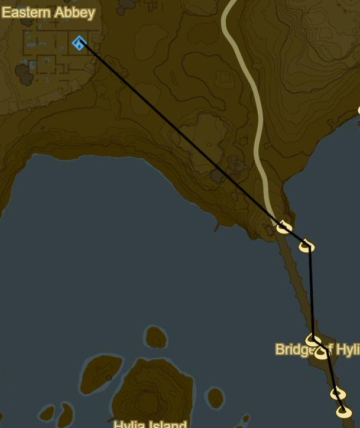
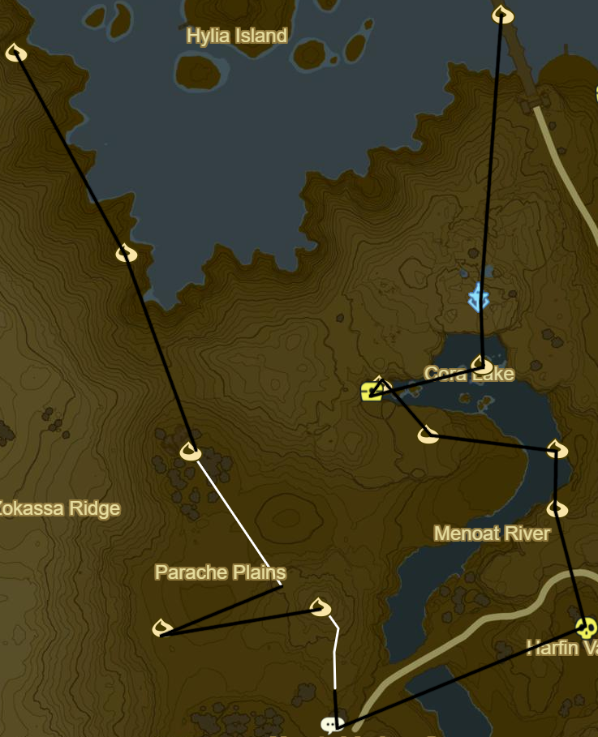
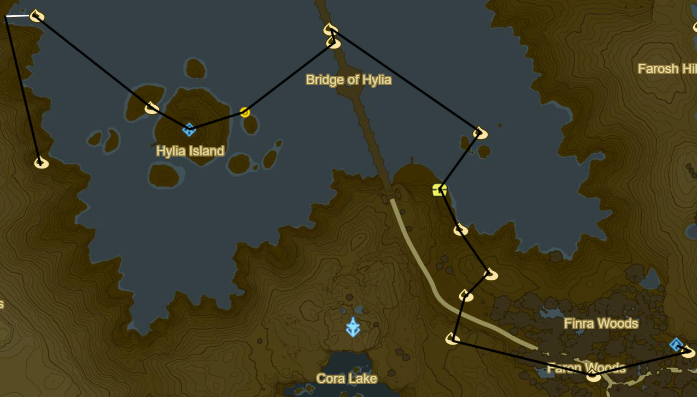
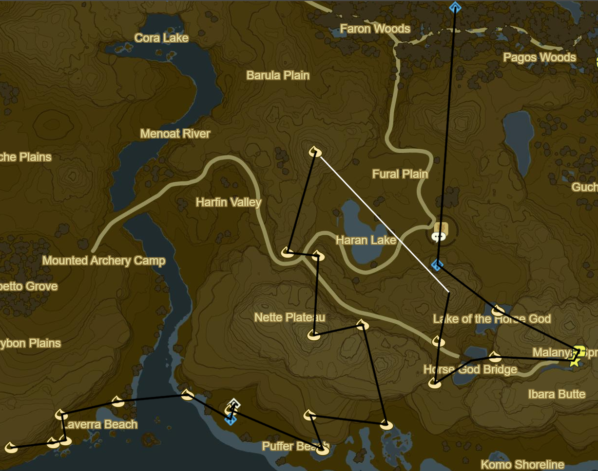
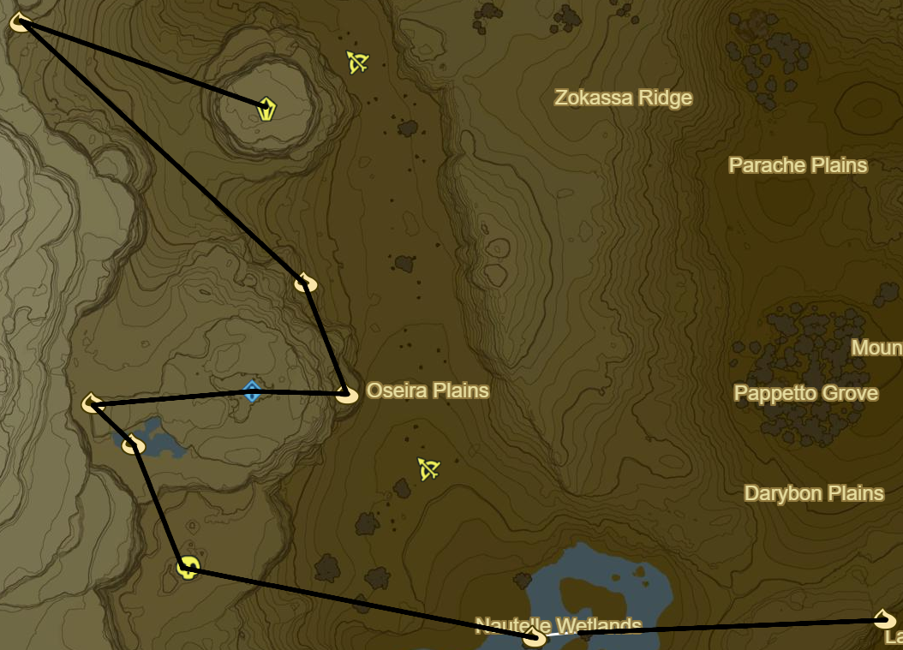
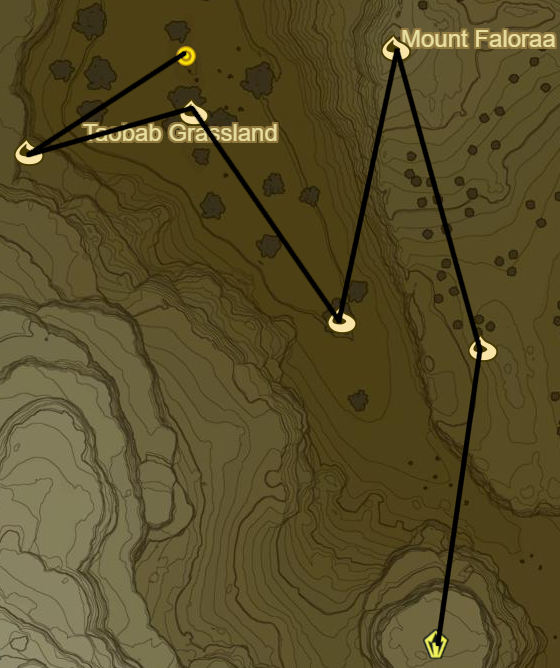
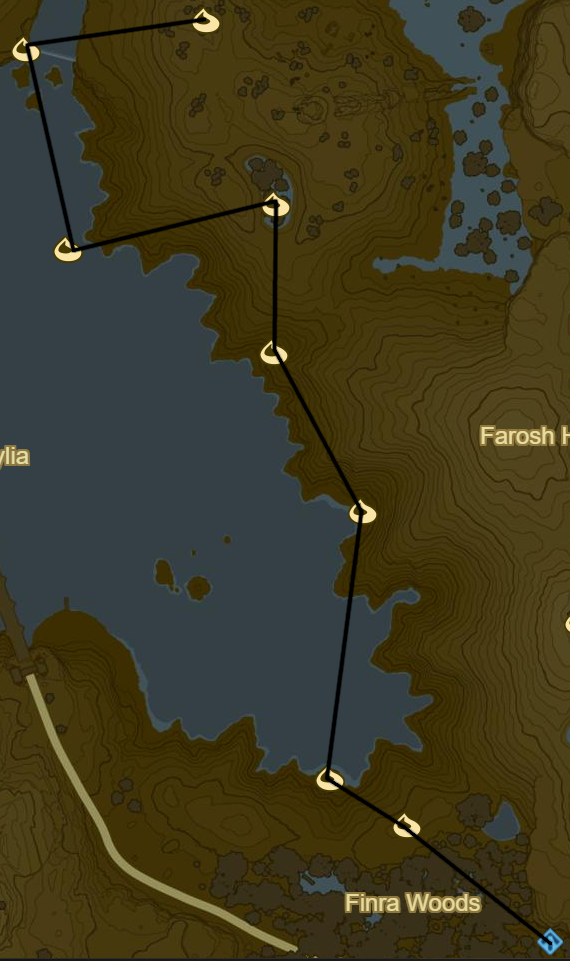
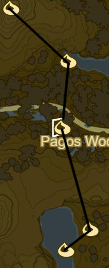
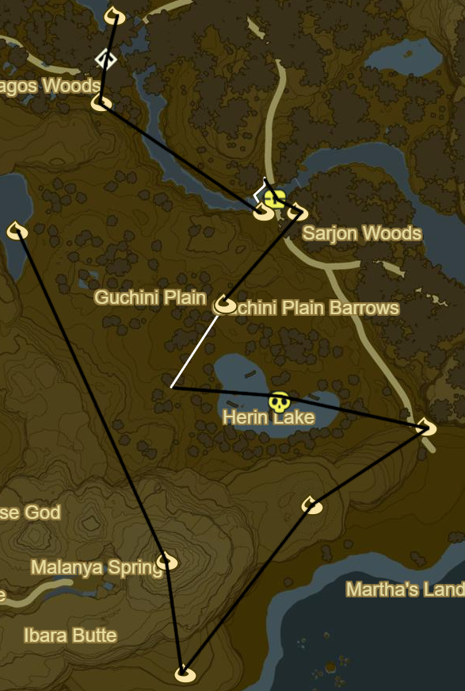
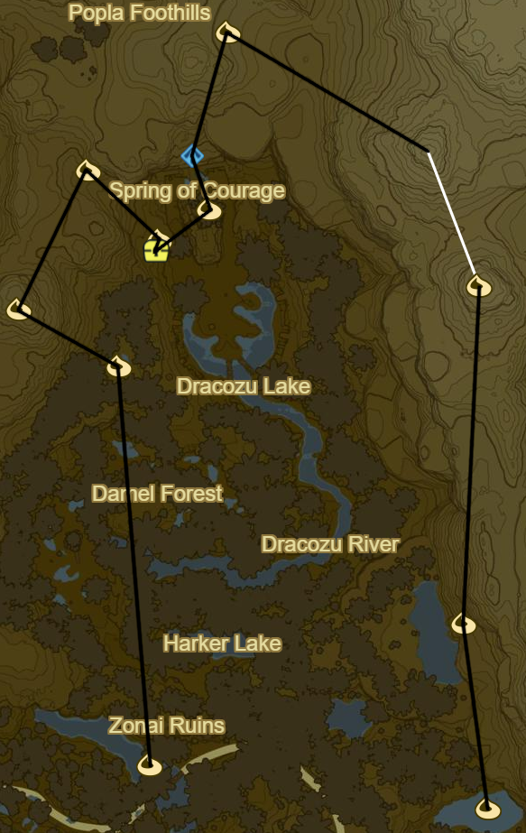

# Hylia 1

Traveller's Medallion can be useful between bridge levels

* Korok 661: Light torches atop bridge entrance to SE
* Korok 662: Rock circle to S
* Korok 663: Tree branch below bridge to S
* Korok 664: Fairylights atop fountain
* Side Quest: Xenoblade Chronicles 2
  * The southern sky from the middle of the largest bridge
* Korok 665: Flower Trail to S
* Korok 666: Rock below bridge to S

* Lake Tower to S
* Korok 667: Magnesis Puzzle to S
* Side Quest: EX Treasure: Garb of the Winds
  * Underwater to W
* Korok 668: Rock on ledge
* Korok 669: Rock pattern to SE
* Korok 670: Lilies to E
* Korok 671: Rock beneath cracked boulder to S
* Stalnox to S (26/40)
* Side Quest: Hunt for the Giant Horse to SW
* Korok 672: Flower Trail to N
* Korok 673: Apple offering to W
* Korok 674: Race to NE
* Korok 675: Magnesis Puzzle to NW
* Korok 676: Rock to NW

* Korok 677: Race to NW
* Korok 678: Fairylights atop tree to SE
* Ya Naga Shrine to SE (103/120)
* Side Quest: A Wife Washed Away to E
* Korok 679: Balloon beneath bridge to NE
* Korok 680: Rock beneath slab to N
* Korok 681: Metal cubes to SE
* Salvager Headwear to SW
* Korok 682: Rock to SE
* Korok 683: Roll boulder to SE
* Korok 684: Fairylights to SW
* Korok 685: Roll boulder to SW
* Korok 686: Rock atop pillar to SE
* Korok 687: Magnesis Stump to E
* Pumaag Nitae Shrine (104/120)

* Highland Stable to S
  * Mini Game
    * Sub 1.30: Extravagant Bridle
    * Sub 1.15: Extravagant Saddle
* Side Quest: The Horseback Hoodlums
* Ka'o Makagh Shrine to S (105/120)
* Korok 688: Lilies to SE
* Side Quest: EX Ancient Horse Rumors to SE
  * Ancient Saddle
* Horse God Malanya
* Korok 689: Rock pattern to W
* Korok 690: Rock pattern to SW
* Korok 691: Roll boulder to N
* Korok 692: Race to N
* Korok 693: Pinwheel shooting to SW
* Korok 694: Rock pattern to E
* Korok 695: Pinwheel shooting to S
* Korok 696: Roll boulder to E
* Korok 697: Magnesis puzzle to SE
* Korok 698: Fairylights to W
* Korok 699: Seaweed ring to S
* Korok 700: Rock atop mushroom to NW
* Shrine Quest: Guardian Slideshow
  * Shoqa Tatone Shrine (106/120)
* Korok 701: Rock beneath boulders to NW
* Korok 702: Rock pattern to W
* Korok 703: Rock behind cracked boulder to W
* Korok 704: Fairylights to S
* Korok 705: Fairylights atop palm tree to W
* Korok 706: Rock on cliff to W

* Korok 707: Race to W
* Stalnox to NW (27/40)
* Korok 708: Fairylights to NW
* Korok 709: Pinwheel shooting to NW
* Ishto Soh Shrine to E (107/120)
* Korok 710: Magnesis puzzle to E
* Korok 711: Rock behind cracked boulder to NW
* Stone Talus (Luminous) to NW (32/40)

* Korok 712: Acorn in log to NE
* Korok 713: Fairylights atop tree to NW
* Korok 714: Balloon atop tree to SW
* Korok 715: Hanging acorn to NW
* Korok 716: Magnesis Puzzle to W
* Korok 717: Pinwheel shooting to N
* Side Quest: Hunt for the Giant Horse to SE
  * Get horse and complete quest before registering at Highland Stables
  * Mounted Archery
    * 20-22: Knight's Bridle
    * 23-25: Knight's Saddle
* Warp back to Pumaag Nitae Shrine

* Korok 718: Roll boulder to NW
* Korok 719: Acorn in tree to NW
* Korok 720: Pinwheel shooting to NE
* Korok 721: Roll boulder to NW
* Korok 722: Magnesis Stump to N
* Korok 723: Lilies to W
* Korok 724: Magnesis puzzle to NW
* Korok 725: Magnesis stump to E

* Korok 726: Magnesis well to NE
* Stone Talus to NE (33/40)
* Korok 727: Rock to S
* Korok 728: Flower trail to S
* Korok 729: Fairylights to E
* Korok 730: Magnesis Puzzle to SE
* Korok 731: Fairylights to S
* Korok 732: Fairylights
* Korok 733: Flower order to SW
* Korok 734: Durian trees to SE

* Korok 735: Rock to S
* Korok 736: Lilies to SE
* Korok 737: Flower trail to S
* Korok 738: Rock beneath slab to SE
* Korok 739: Rock circle to SW

* Korok 740: Rock atop mountain to E of Malanya Spring
* Korok 741: Magnesis Puzzle to S
* Korok 742: Rock pattern to NE
* Korok 743: Rock atop ledge to NE
* Blue Hinox to W (28/40)
* Korok 744: Race atop pillar to W
* Korok 745: Balloon atop palm tree to NE
* Side Quest: EX Treasure: Usurper King
  * Phantom Ganon Armor to NW under bridge
* Korok 746: Flower Trail to NW
* Korok 747: Fairylights to NW
* Shrine Quest: The Serpent's Jaws to N
* Korok 748: Magnesis boulders to N

* Korok 749: Match boulder to N
* Korok 750: Rock to NW
* Korok 751: Rock beneath cracked boulder to NE
* Korok 752: Magnesis Puzzle to SE
* Side Quest: EX Treasure: Merchant Hood below hand
  * Ravio's Hood
* Korok 753: Rock atop tree to NE
* Shae Katha Shrine (108/120)
  * Farosh Scale
  * If don't have use traveller's medallion
* Korok 754: Roll boulders to N
* Korok 755: Race to SE
* Korok 756: Rock above waterfall to S
* Korok 757: Fairylights to S

Next: [Faron](24 - Faron1.md)
