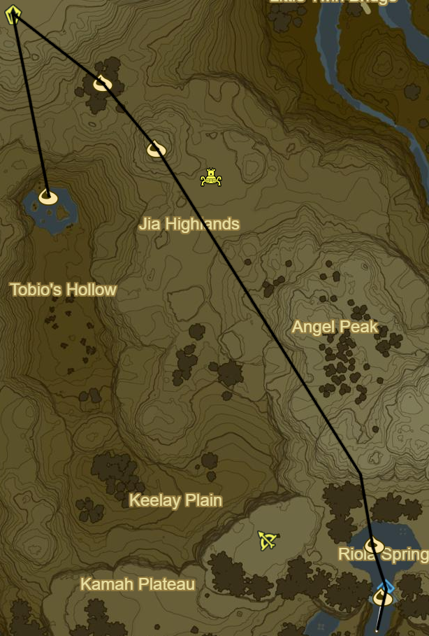
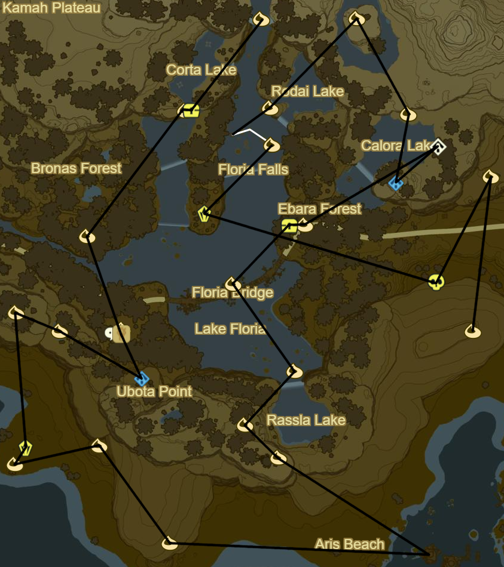

# Faron 1

* Faron Tower to SE
  * All towers!!!
* Korok 756: Durian offering to NE
* Korok 757: Fairylights to NW
* Hinox to SE (29/40)
* Korok 758: Race to NE
* Korok 759: Flower trail to NW
* Hinox to N (30/40)
* Korok 760: Rock pattern to N
* Side Quest: EX Treasure: Usurper King to W
  * Zant's Helmet
* Korok 761: Pinwheel shooting to NE

* Stone Talus(Junior) to N (34/40)
* Korok 762: Acorn in tree to SE
* Korok 763: Pinwheel shooting to SE
* Farosh morning farming through cave to SE
  * 0/3 scale
    * 0/1 for Shrine
    * 0/1 in castle
    * 0/3 for upgrades
  * 0/3 claw
    * 0/3 for upgrades
  * 0/5 horn
    * 0/5 for upgrades
  * 0/3 fang
    * 0/3 for upgrades
* Korok 764: Magnesis boulder in centre of Riola Spring
* Shoda Sah Shrine to S behind waterfall (109/120)
* Korok 765: Race to S

* Side Quest: EX Treasure: Dark Armor
  * Phantom Ganon Skull at waterfall to SW
* Korok 766: Magnesis puzzle
* Korok 767: Pinwheel shooting to SW
* Lakeside Stable to SE
* Korok 768: Burn leaves below horse head
* Side Quest: Thunder Magnet
  * Axe atop stable
* Shai Uto Shrine to S (110/120)
* Korok 769: Rock in middle of bog to NW
* Korok 770: Durian offering to NW
* Stone Talus (Junior) to S (35/40)
* Korok 771: Stone pattern to SW
* Korok 772: Stone on ledge to E
* Korok 773: Balloon to SE
* Clear out Monster Camp to E
* Korok 774: Rock atop cliff to NW
* Korok 775: Banana offering to NW
* Korok 776: Magnesis puzzle to NE
* Korok 777: Pinwheel shooting to NW at centre of bridge
* Side Quest: EX Treasure: Dark Armor to NE
  * Phantom Ganon Greaves
* Korok 778: Remove Luminous ore to E
* Stone Talus to W (36/40)
* Korok 779: Flower trail to NE
* Korok 780: Rock to N
* Korok 781: Durian trees to NE
* Korok 782: Magnesis Puzzle to SE
* Shrine Quest: A Song of Storms to SE
  * Qukah Nata Shrine (111/120)
* Korok 783: Durian Trees to E
* Stalnox to SW (31/40)
* Korok 784: Rock pattern to SE

* Korok 785: Rock pattern to SE(follow path)
* Korok 786: Rock atop mountain to NE
* Side Quest: A Gift of Nightshade
  * Nightshade
* Korok 787: Rock beneath leaves to N
* Yah Rin Shrine to SE (112/120)
* Lurelin Village
  * Side Quest: Take Back the Sea
    * Use Travel Medallion for fast return if necessary
  * Side Quest: What's for Dinner?
    * Goat Butter
    * Hearty Blueshell Snail
  * Korok 788: Remove apple from between palm trees to W
  * Side Quest: Sunken Treaure
* Korok 789: Rock pattern to S of earlier Korok
* Side Quest: Sunken Treasure
  * Chests in center of rocks to SE
* Warp back to Yah Rin Shrine
* Korok 790: Rock pattern atop roof to SE
* Korok 791: Flower trail atop inn
* Complete Side Quest: Sunken Treasure
* Korok 792: Flower trail to SE
* Korok 793: Seaweed to SE

* Korok 794: Rock by palm tree to Soka Point
* Take picture of monument
* Korok 795: Seaweed to W
* Take Picture of monument to N
* Take picture of monument to NE
* Shrine Quest: A Fragmented Monument
  * Kah Yah Shrine (113/120)
* Stone Talus to SW (37/40)
* Korok 796: Lilies to N
* Muwo Jeem Shrine to E (114/120)
* Korok 797: Rock on ledge to NW
* Korok 798: Rock pattern to NW
* Korok 799: Fairylights to SW
* Hinox to N (32/40)

* Korok 800: Apple trees to N
* Korok 801: Rock behind cracked boulders to W
* Korok 802: Flower trail to SW
* Hinox (Middle Kin) to W (33/40)
  * Take orb
* Shrine Quest: The Three Giant Brothers to NW
* Hinox (Yougest Kin) to NE (34/40)
* Korok 803: Lilies to E
* Grab orb to W and bring to Shrine Quest
* Hinox (Oldest Kin) to NW (35/40)
* Take orb and finish quest
* Tawa Jinn Shrine (115/120)
* Korok 804: Apple offering to SW
* Korok 805: Rock by tree to N
* Korok 806: Fairylights to NE
* Korok 807: Rock atop Breman Peak to W
* Korok 808: Rock circle to SW
* Korok 809: Rock atop tree to W
* Korok 810: Flower Trail to SE
* Korok 811: Rock atop Mount Floria to W
* Warp to Ne'ez Yohma to and rest at a inn(Water Bed)
* Warp to Keo Ruug Shrine and Complete the Trial of the sword to prepare for Central Hyrule
* Then warp to Rota Ooh Shrine

Next: [Central Hyrule 2](25 - Central2.md)
