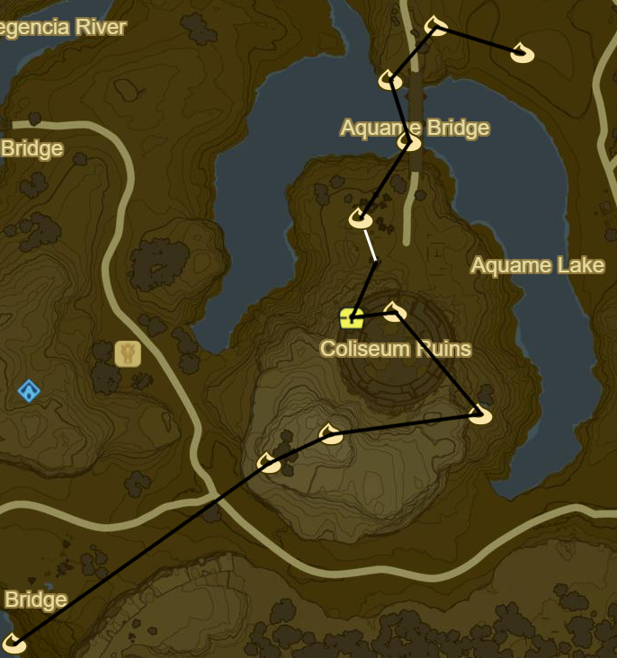
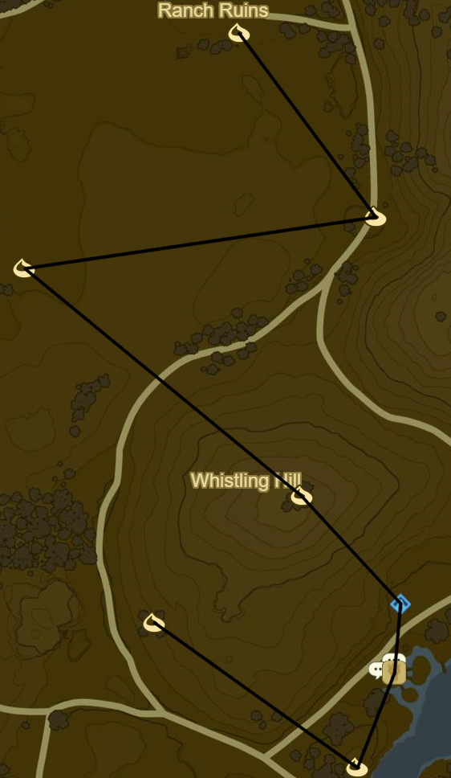
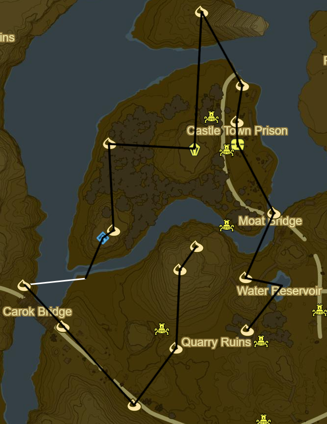

# Central Hyrule 2

* Korok 814: Acorn in log to SE
* Korok 815: Rock to NE
* Korok 816: Fairylights to E
* Side Quest: EX Treasure Phantasma
  * Phantom Helmet inside Coliseum
* Korok 817: Rock on top floor of Coliseum
* Korok 818: Race from tree to NW
* Korok 819: Hanging acorn to NE under bridge
* Korok 820: Rock on cliff ledge to NW
* Korok 821: Magnesis Puzzle to NE
* Korok 822: Rock pattern to SE

* Korok 823: Fairylights far to E
* Korok 824: Rock pattern to S
* Korok 825: Rock on tree to E

* Korok 826: Pinwheel shooting to SE
* Riverside Stable to N
  * Side Quest: A Royal Recipe
    * Fruitcake
      * 2 fruits
      * Tabantha Wheat
      * Cane Sugar
  * Side Quest: The Royal Guard's Gear
* Whago Katta Shrine to N (116/120)
* Korok 827: Acorn in tree atop hill to NW
* Korok 828: Fairylights to NW
* Korok 829: Apple offering to E
* Korok 830: Flower order to NW

* Korok 831: Rock to NE
* Blue Hinox to S (36/40)
* Recovered Memory 16 to SE (15/18)
* Korok 832: Roll boulder to N
* Korok 833: Rock under bridge to NE
* Korok 834: Apple trees to NW
* Blue Hinox to N (37/40)
* Korok 835: Acorn below bridge to NW

* Korok 836: Fairylights to NW
* Korok 837: Pinwheel shooting to E
* Korok 838: Rock in stump to E
* Namika Ozz Shrine to NW (117/120)
* Korok 839: Fairylights atop dead tree to W
* Korok 840: Rock to SW
* Korok 841: Lilies to NW
* Stone Talus Luminous to NE (38/40)
* Korok 842: Magnesis puzzle to NW
* Korok 843: Acorn in tree to SW
* Stalnox to SW (38/40)
* Korok 844: Rock atop fountain to W
* Korok 845: Rock circle to SE
* Korok 846: Rock beneath leaves to SW
* Korok 847: Fairylights atop flagpole to S
* Korok 848: Rock beneath metal door to SW

* Korok 849: Pinwheel shooting atop wall to SW
* Korok 850: Shoot shield atop N side of gate to W
* Drop Travel Medallion
* Korok 851: Rock atop NE pillar to S
* Recovered Memory 1 (16/18)
* Side Quest: EX Treasure Phantasma
  * Phantom Armor
* Korok 852: Rock to SE
* Side Quest: EX Treasure: Fairy Clothes
  * Tingle Tights to SW
* Korok 853: Hanging carriage acorn to SW
* Korok 854: Pinwheel shooting to NW
* Korok 855: Balloon atop tree to NW
* Korok 856: Acorn in tree to W
* Korok 857: Fairylights
* Korok 858: Fairylights atop flagpole to SW
* Korok 859: Rock to NE
* Katah Chuki Shrine to NW (118/120)
* Korok 860: Balloon to NW

* Korok 861: Rock pattern to N
* Korok 862: Lilies to NE at Moat Bridge
* Side Quest: EX Treasure: Fairy Clothes
  * Tingle's shirt to NW
* Korok 863: Rusty Shield offering to N
* Korok 864: Magnesis Puzzle to N
* Korok 865: Rock on island to NW
* Stone Talus (Rare) to S (39/40)
* Korok: Pinwheel shooting to W
* Korok 866: Rock to S
* Noya Neha Shrine within hill (119/120)
* Korok 867: Race to S
* Korok 868: Rock to SE
* Korok 869: Rock beneath cracked boulder to SE
* Korok 870: Rock to NE
* Korok 871: Rock pattern to N
* Korok 872: Rock behind cracked boulder to NE
* Return to Travel Medallion

* Korok 873: Race to W
* Korok 874: Hanging acorn under Hyrule Castle Bridge
* Korok 875: Flower trail below Hyrule Castle Bridge

Next: [Hyrule Castle](26 - Hyrule Castle.md)
