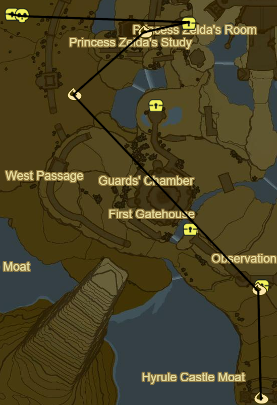
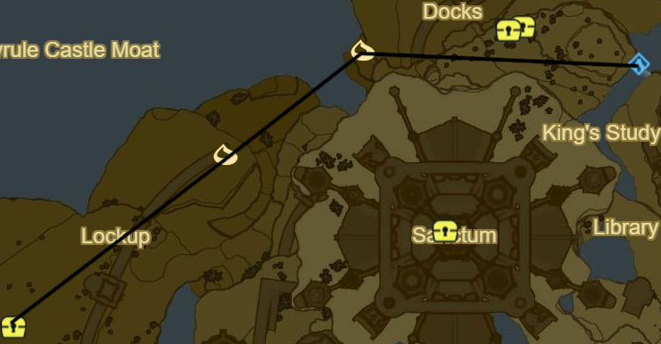
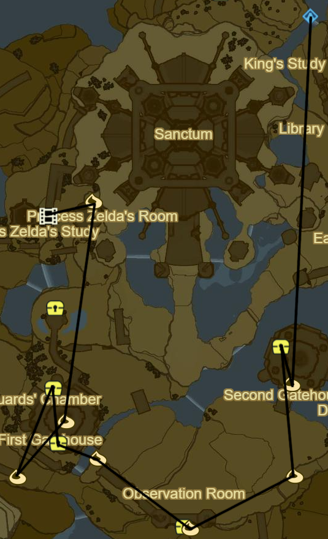
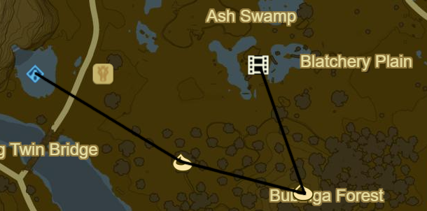
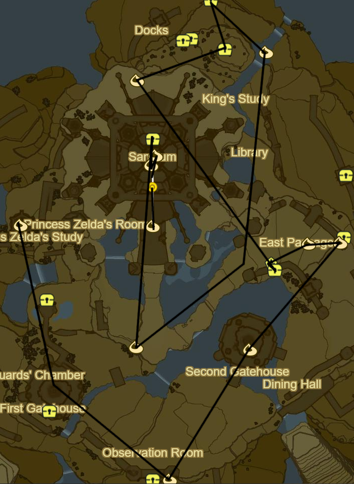

# Hyrule Castle

* Korok 876: Rock atop bridge gate
* Korok 877: Shoot coat of arms dead ahead
* Use lower entrance to W
* Take Mine cart
* Korok 878: Egg offering
* Take turn to right
* Korok 879: Rock halfway up deep shaft
* Shard of Dinraal's Fang side area midway up shaft with ladder behind cracked wall
* Break into Lockup
* Follow path to Left to Stalnox (40/40)
* Hylian Shield

* Follow path the other direction until outside
* Korok 880: Pinwheel shooting atop wall above exit
* Korok 881: Rock to E just past the Docks Entrance
* Take Entrance to E into Docks
* Light large torch atop docks to reveal Shrine
* Saas Ko'sah Shrine (120/120)
  * Shrine 120!
  * Side Quest: A Gift From the Monks
    * Warp to Rona Kachta Shrine
    * Cap of the Wild
    * Tunic of the Wild
    * Trousers of the Wild
    * Use the remaining Spirit Orbs
    * Return once done

* Take stairs up to Library
* Take third floor exit on opposite side of Library
* Follow passage
  * Royal Guard Bow
* Take broken stairwell up
* Korok 882: Acorn behind cracked wall after stairwell
* Take right Turn
  * Royal Guard Sword
* Side Quest: EX Royal Guard Rumors
  * Royal Guard Uniform
* Follow Passage into Dining Hall
  * Royal Guard Spear in fireplace
* Korok 883: Rock beneath cracked boulder down and towards main entrance
* Return through Dining hall Entrance and head left to Observation Room
* Korok 884: Pinwheel shooting on balcony
* Return to main path and take entrance on right
* Korok 885: Hanging acorn behind cracked wall
* Shard of Nayrda's Fang
  * Chest under stairs in Guards' Chamber
* Side Quest: EX Royal Guard Rumors
  * Chest atop wooden platform
  * Royal Guard Boots
* Royal Guard Claymore
  * Moblin in downstairs sparring area
* Take stairs up and back outside
* Korok 886: Rock atop wall just past Malice
* Follow path to First Gatehouse
* Korok 887: Fairylights atop First Gatehouse Spire
* Head North
* Follow stairs up to Princess Zelda's Room
* Korok 888: Rock on balcony
* Climb up to bridge

* Recovered Memory 12 (17/18)
  * Drop Travel Medallion
  * Warp to Ta'loh Naeg Shrine
  * Speak to Impa
  * Warp to Ha Dahamar Shrine
  * Korok 889: Rock atop tree SE of Stable to N
  * Korok 890: Pinwheel shooting to E
  * Recovered Memory 17 to NW (18/18)
  * Warp back to castle

* Korok 891: Fairylight atop spire atop Princess Zelda's Study
* Take Inside passage below Zelda's Study
* Clear out Malice
* Glide back towards First Gatehouse
* Take Wall around malice to S
* Korok 892: Pinwheel shooting to E above Observation Room
* Glide around and destroy malice
* Continue ahead into Second Gatehouse
* Korok 893: Fairylights atop Second Gatehouse Spire
* Korok 894: Rock on Wall above to NE
* Head N for entrance to East Passage
* Take minecart to ice blocks
* Korok 895: Fairylights inside largest ice
* Stone Talus (Rare) at end of tracks (40/40)
* Shard of Farosh's Fang opposite passage using Updraft
* Take Updraft passage back into Library
* King's Study at opposite end of Library
  * Royal Guard Shield
* Take exit above study out of castle
* Korok 896: Rock beneath cracked boulder atop cliff outside passage
* Naydra's Scale under slab above exit
* Dinraal's Scale behind cracked boulder to NW
* Korok 897: Lilies to SE up Waterfall
* Follow path back around Castle to main path
* Korok 898: Rock beneath cracked boulder just S of Main Castle Entrance
* Side Quest: EX Royal Guard Rumors
  * Royal Guard Cap in Upper Sanctum
* Korok 899: Castle Tower Balloon above Bell
* Korok 900: Fairylights atop spire
* Korok 899: Race from Sanctum Balcony
* Enter Castle and Face Calamity Ganon
