# Introduction

Welcome to my 100% guide for The Legend of Zelda: Breath of the Wild. This guide is designed with minimal spoilers and covers all 900 Korok Seeds, 136 Shrines, 76 Side Quests, 42 Shrine Quests, 40 'Noxes', 40 Taluses, 20 Main Quests, 18 Memories and 5 Molduga. At present it does not cover all Map Locations, although they could be added later.

# FAQs

## Hyrule Compendium

The guide does not cover the Hyrule Compendium. The easiest way to fill the Compendium would be as you go. If you miss anything you can also use Rupees to fill the Compendium at the Hateno Ancient Tech Lab.

## Shrines

For true 100% completion it is necessary to open all chests within Shrines. This will open a small chest icon next to the Shrine's name on the map.

Within the guide there almost no Shrine solutions. The only exceptions will be for especially tedious Shrines. Shrines with hidden armor will also be marked within the guide.

## amiibo

amiibo are completely optional for this guide. Admittedly the Super Smash Bros. Link amiibo makes at least 1 Korok particularly easy as it will allow you to spawn in Epona thus skipping capturing a horse.

## Koroks

This guide covers all 900 Koroks in the game. The terms used in referenceing the Koroks are explained below

| Term | Image | Solution |
| ---- | ----- | -------- |
| Rock | 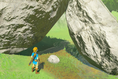 | Rock Koroks are Koroks hidden under conspicuous lone rocks |
| Rock Circle | 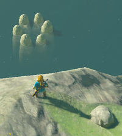 | Rock circles in water require you to throw a nearby rock into the rock circle formation |
| Rock Pattern | 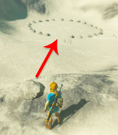 | Rock pattern Koroks involving finding one or more nearby rocks and using them to complete a pattern embedded in the ground |
| Magnesis Well/Stump | 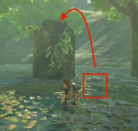 | Magnesis Well/Stump Koroks involve finding a nearby metal rock on a chain and placing it in the well/stump |
| Magnesis Puzzle |  | Magnesis puzzles involve matching two cube formations using a nearby metal cube |
| Offering | 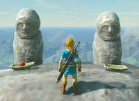 | Offering Koroks involve dropping 1 or more of a certain fruit into a bowl in front of statues such that all have an offering |
| Apple Trees/Cacti | 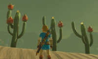 | Cacti/Apple Tree Koroks involve shooting fruits off of a tree/cactus in a group of 3 until they all match. A quick trick is to statis the fruit to keep and chop down the tree/cactus |
| Fairylights | 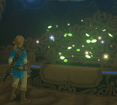 | Fairylight Koroks will either be atop tall objects or moving around an area. You'll only need to interact with them |
| Pinwheel Shooting |  | Standing at the pinwheel will cause balloons to appear. Shoot all the Balloons. |
| Lilies |  | Lily circles on water can be completed by simply diving through the middle |
| Flower Trail |
| Flower Patches |

## Mini-bosses

Mini-bosses will be covered as they're found along the planned path. If you're having trouble towards the early-game just leave a marker and return later. Lynels and Guardian Stalkers will usually be shown on the map, allowing you to fight or avoid as you see fit.

## Map

The Map sections used in the map were created using [Zelda Dungeon's Interactive BOTW Map](https://www.zeldadungeon.net/breath-of-the-wild-interactive-map/). This can also be a useful tool for tracking your progress. Any chests shown on the map but not explicitly along the path will be those containing valuable items such as Star Fragments. Master Chest exclusive chests will not be shown on the map.

## Master Mode

This guide should be usable in Master Mode. However do so at your own risk. It also does not include Master Mode exclusive treasures and Lynels within the map.

# Using the guide

This guide is effectively a series of bullet points guiding you from objective to objective. The maps should make navigation a little easier but do not cover all of Hyrule. The directions used will all use compass directions for navigation, occasionally skewing a little more specific (ENE).

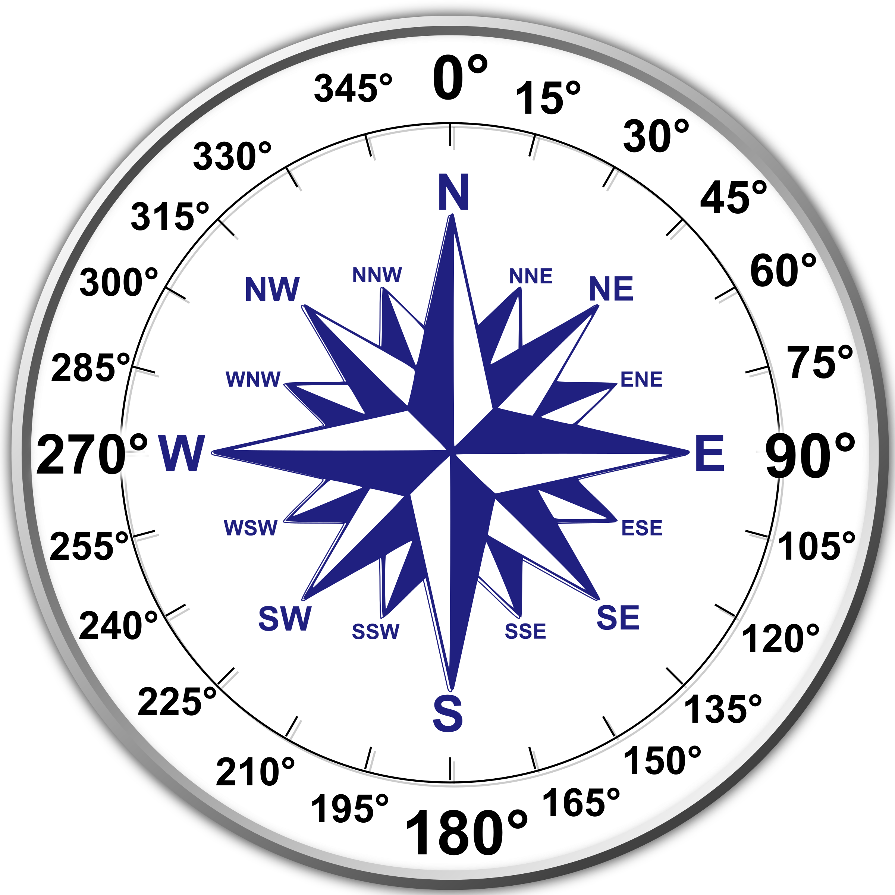

The in-game minimap will walways show North so navigation shouldn't be too difficult.

## Cooking

I highly recommend cooking as much stamina restoration food as possible. Endura Shrooms and Carrots cooked alone will completely fill all Stamina wheels.

## Spirit Orbs

Your first 36 Spirit Orbs should be used on Heart Containers to complete a later Main Quests with maximum efficiency. Afterwards I would recommend Stamina Vessels, however it remains completely up to the individual.

## Side Quests and Upgrades

When a Side Quest can be completed during a later backtrack it will be noted. All other Side Quests can be completed between planned warps at your own discretion.

Spirit Orbs can be exchanged at most settlements as you visit them. You will be able to exchange all Orbs immediately after you get the last one.

Armor can be upgraded as you go past the 'Upgrade Points'. After you unlock the fourth one you can upgrade at your own discretion.

## Camera

Once you unlock the Camera you'll need to take pictures of the following enemies at your own discretion. Do not delete these pictures before using them for Side Quests.

| Enemy | Image |
| ----- | ----- |
| Guardian Scout |  |
| Guardian Stalker |  |
| Guardian Skywatcher |  |
| Lynel |  |
| Blupee |  |
| Stalhorse |  |

## Weapons

You'll need the following weapons for Side Quests

| Weapon | Image |
| ------ | ----- |
| Ice/Blizzard Rod | 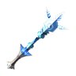 |
| Royal Guard Weapons | 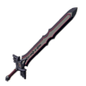 |
| Traveler's Sword |  |
| Fire Rod | 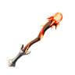 |
| Moblin Club | 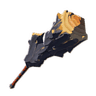 |
| Duplex Bow | 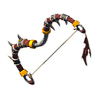 |
| Windcleaver | 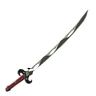 |
| Ancient Battleaxe+ | 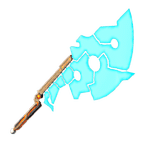 |
| Frostspear | 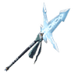 |
| Ancient Short Sword | 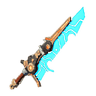 |
