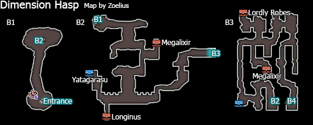

# Table of Contents

<!-- toc orderedList:0 depthFrom:1 depthTo:6 -->

* [Table of Contents](#table-of-contents)
* [Gaining Access](#gaining-access)
* [Dimension Hasp](#dimension-hasp)
  * [Easy Mode Method](#easy-mode-method)
  * [Jump Method](#jump-method)

<!-- tocstop -->

# Gaining Access

Speak to Sage Yulyana during the True Final Chapter

# Dimension Hasp

Boss | Health | Stolen Item | Drop
--- | --- | --- | ---
Adventurer | Normal: 530000HP   Hard: 715500HP | Tengu's Breath   X-Potion | Adventurer's Mark
Comrade | Normal: 50000HP   Hard: 67500HP | Antidote | N/A

The ultimate boss in Bravely Default, the Adventurer hits extremely hard, her "All Slash" attack can hit an entire party from 6000 to 7000 HP, which can instantly wipe out an underlevel party. Also her loyal fox companion is real annoying. The fox can take damage for the Adventurer and the two bosses has the ability to revive each other. If you're using single attack skills, you can't hit the adventurer until you have defeated the fox first. The adventurer will revive the fox immediately. If you defeated the adventurer without killing the fox, the fox will bring the adventurer back to life, leaving all your efforts down in the drain. If you want to cheese through this boss battle, then you should ask or add friend that create an attack using Bravely Second that does more then do more than 530000 to 720000 within one turn and then use Merchant class Full leverage and then summon all your friends at once 500000 damage does around 170000 damage in full leverage. So you will need about 4 to 5 friends in this damage range to achieve this. If you plan on fighting this boss legit, then I suggest you maxed out Templar Job class and Spiritmaster. Your physical attackers are most likely going to be Pirates for this fight. Holy Arts will be useful because of the Rampart skill, Spiritmaster has stillness which is great for protecting the later half of the battle when the adventurer start spamming meteor. If you plan on beating the Adventurer on hard mode, I would suggest you to use the Merchant ability Low Leverage, it will reduce everyone's damage output by half. This will make this a very long battle, but it's a safe way of defeating her.

## Easy Mode Method

For players that has played the original Bravely Default from 2012, there is Pirate and Ninja combo that can defeat the Adventurer. However because this combo was nerfed, it only works on easy mode and requires little bit of luck. What you need to do for that combo is to mastered the Ranger's job level for three of your physical attackers, you will also need a Templar at job level 11 for BP limit Up. Once you do, equip your physical attacker with double Excalibur and equip lustrous robe, and then with following support ability, Precision, Hawkeye, BP Limit up. Then for your support unit you need a maxed out Performer and also have maxed out Time mage. You will also need to have Spiritmaster as secondary job command. The support unit should equip Hasten World as his/her job ability and also must be with accessories that boost his/her speed because it needs to go first. Now fight the Adventurer and die. Once you have been wiped. Revive your characters, but do not heal them. Then fight the Adventurer again. Your support unit needs to go first. On the first turn, have your support unit use Brave once, and then cast Convert BP and then Stillness. The rest of the attackers use Default. Then on the next turn, the support unit should use Love Rush to boost the party member speed. The rest of the attack unit should default. Now on the third turn, use your support unit use Love Power twice. The attack unit that should all use Brave four times and all select Mass Attack from the pirate job command. This will cause all your party member that is low on HP to attack the Adventurer all at once. Once the command is over, you will need a bit of luck so the adventurer doesn't kill all your party members at once, and then repeat the same thing again.

## Jump Method

The Jump Method works on defeating the Adventurer on hard mode. However it takes about 30 to 40 mins on the fastest battle speed setting to finish. To perform this setup you need to setup 4 Valkyries and one of them with the Hasten World ability. Then also equip each with Speed Up 30% and Speed up 10% from the Thief class. You need also wear Hermes Shoes to get another 20 agility. As long you faster then the Adventurer then this method will work. Begin the battle and have all Valkyries use high jump, the one that has Hasten World equipped might be too slow without the extra speed and will be K.O. do not bother resurrecting the K.O. Ally, just keep the game on auto battle by pressing Y once and wait about 30 to 40 mins and the Adventurer should be defeated if everything goes according to plan.
