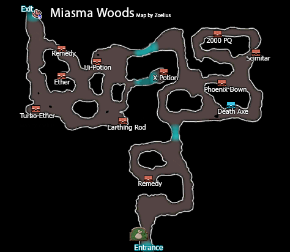
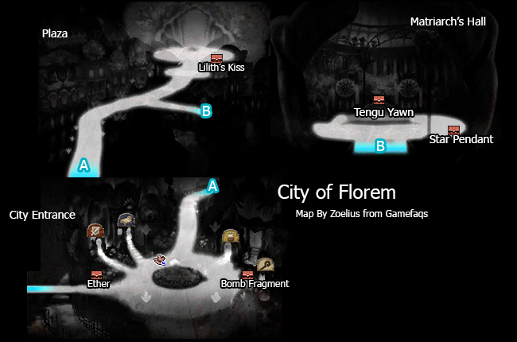
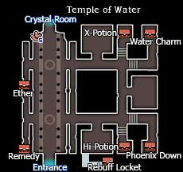
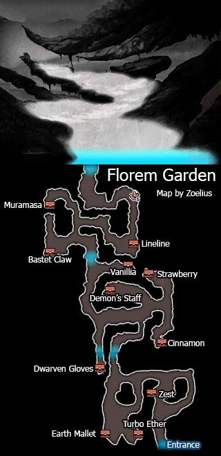
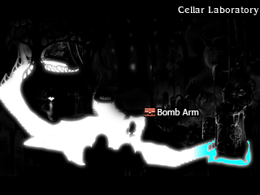
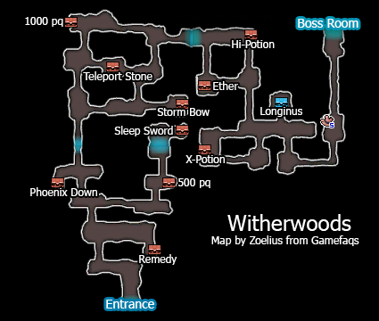
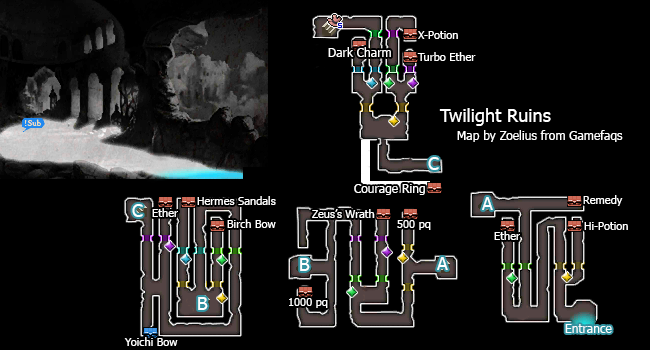

# Table of Contents

<!-- toc orderedList:0 depthFrom:1 depthTo:6 -->

* [Table of Contents](#table-of-contents)
* [Miasma Woods](#miasma-woods)
* [Florem](#florem)
  * [Shops](#shops)
    * [Item Shop](#item-shop)
    * [Magic Shop](#magic-shop)
    * [Equipment Shop](#equipment-shop)
* [Temple of Water](#temple-of-water)
* [Florem Garden](#florem-garden)
  * [Boss Battles](#boss-battles)
* [Mount Fragmentum](#mount-fragmentum)
* [Cellar Laboratory](#cellar-laboratory)
* [Witherwoods](#witherwoods)
* [Twilight Ruins](#twilight-ruins)

<!-- tocstop -->

# Miasma Woods

# Florem

## Shops

### Item Shop

Item | Cost
--- | ---
Potion | 20pg
Hi-Potion | 150pg
Phoenix Down | 100pg
Antidote | 10pg
Eye Drops | 20pg
Echo Herbs | 25pg
Balsam | 100pg
Remedy | 500pg
Teleport Stone | 100pg

### Magic Shop

Spell | Cost
--- | ---
Cura | 1600pg
Raise | 1600pg
Esuna | 1600pg
Fira | 1600pg
Blizzara | 1600pg
Thundara | 1600pg
Haste | 800pg
Teleport | 800pg
Quara | 800pg

### Equipment Shop

Item | Cost
--- | ---
Scimitar | 2000pg
Valkyrie Halberd | 1850pg
Rod of Fire | 1500pg
Jade Crosier | 1200pg
Frenzy Dagger | 1200pg
Composite Bow | 1950pg
Spiked Knuckles | 1200pg
Cross Shield | 1000pg
Yggdrasil Helm | 700pg
Laurel Wreath | 650pg
Acron Hat | 600pg
Yggdrasil Armour | 2000pg
Floral Robe | 1500pg
Mirage Vest | 1600pg
Earthing Rod | 2000pg
Peace Ring | 2000pg

# Temple of Water

# Florem Garden

## Boss Battles

Boss | Health | Stolen Item | Drop
--- | --- | --- | ---
Mephilia Venus | Normal: 9999HP   Hard: 13498HP | Turbo Ether | Fairy Wings   Ice Rod

Boss | Health | Stolen Item | Drop
--- | --- | --- | ---
Aretemia Venus | Normal: 15000HP   Hard: 20250HP | Artisan Gloves | X-Potion

# Mount Fragmentum

Boss | Health | Stolen Item | Drop
--- | --- | --- | ---
Land Turtle | Normal: 15000HP   Hard: 20250HP | Hard Scale   Iron Pole | Hi-Potion   Light Curtain

# Cellar Laboratory

Boss | Health | Stolen Item | Drop
--- | --- | --- | ---
Fiore DeRosa | Normal: 20000HP   Hard: 27000HP | Ether   Hermes Sandal | Mirage Vest

# Witherwoods

Boss | Health | Stolen Item | Drop
--- | --- | --- | ---
Einheria Venus | Normal: 20000HP   Hard: 27000HP | Hi-Potion   Power Wrist | Valkyrie Halberd

# Twilight Ruins

Boss | Health | Stolen Item | Drop
--- | --- | --- | ---
Victor | Normal: 50000HP   Hard: 81000HP | Force Bracelet | N/A
Victoria | Normal: 50000HP   Hard: 108000HP | Amulet | N/A

Boss | Health | Stolen Item | Drop
--- | --- | --- | ---
Rusalka | Normal: 30000   Hard: 40500HP | Arctic Wind | Hi-Ether
Rusalka (Fake) | Normal: 2000   Hard: 2700HP | N/A | N/A
