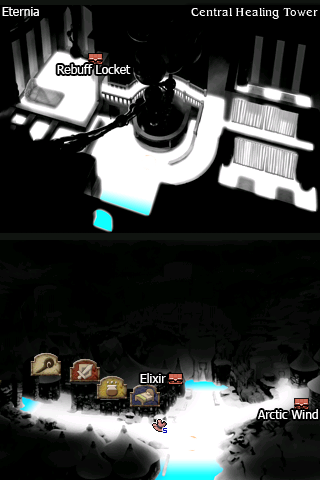
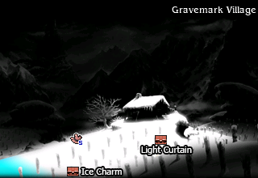
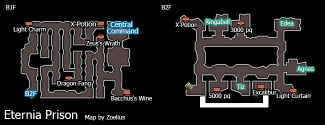
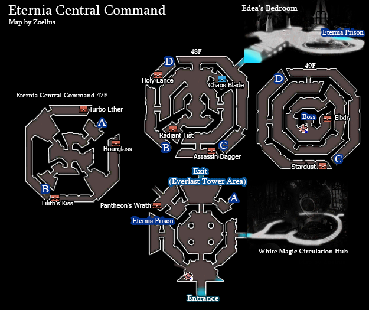
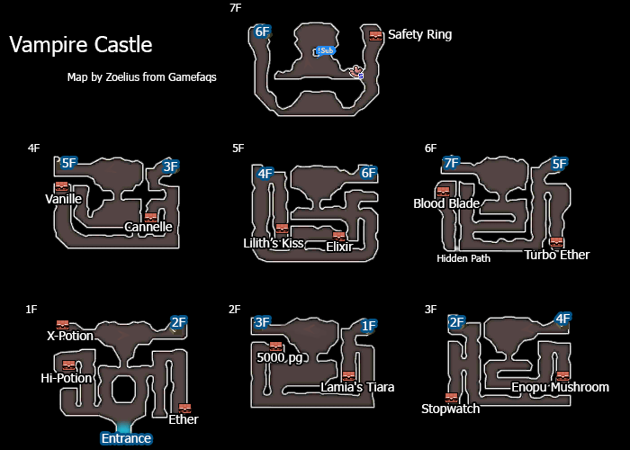
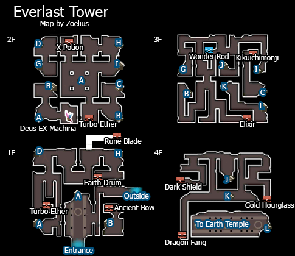
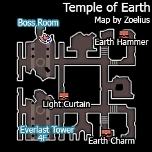

# Table of Contents

<!-- toc orderedList:0 depthFrom:1 depthTo:6 -->

* [Table of Contents](#table-of-contents)
* [Eternia Overworld](#eternia-overworld)
* [Eternia City](#eternia-city)
  * [Shops](#shops)
    * [Item Shop](#item-shop)
    * [Magic Shop](#magic-shop)
    * [Equipment Shop](#equipment-shop)
* [Gravemark Village](#gravemark-village)
* [Eternia Council Headquarters](#eternia-council-headquarters)
* [Eternia Prison](#eternia-prison)
* [Eternia Central Command](#eternia-central-command)
* [Vampire Asterisk](#vampire-asterisk)
* [Everlast Tower](#everlast-tower)
* [Temple of Earth](#temple-of-earth)

<!-- tocstop -->

# Eternia Overworld

Boss | Health | Stolen Item | Drop
--- | --- | --- | ---
Ice Golem | Normal: 60000HP   Hard: 81000HP | Permacrystal | Turbo Ether   Arctic Wind

# Eternia City

## Shops

### Item Shop

Item | Cost
--- | ---
Potion | 20pg
Hi-Potion | 150pg
Phoenix Down | 100pg
Ether | 1000pg
Antidote | 10pg
Eye Drops | 20pg
Echo Herbs | 25pg
Balsam | 100pg
Remedy | 500pg
Teleport Stone | 100pg

### Magic Shop

Spell | Cost
--- | ---
Esunaga | 3200pg
Curada | 3200pg
Aeroga | 3200pg
Firaga | 3200pg
Blizzaga | 3200pg
Thundaga | 3200pg
Quick | 3200pg
Stop | 3200pg
Quaga | 3200pg

### Equipment Shop

Item | Cost
--- | ---
Flametongue | 15000pg
War Axe | 18000pg
Cross Spear | 14000pg
Wizard Rod | 9000pg
Staff of Life | 12000pg
Assassin Dagger | 10000pg
Killer Bow | 14800pg
Kotetsu | 9800pg
Toxic Claw | 7500pg
Adamantinum Shield | 4500pg
Adamantinum Helm | 4500pg
Circlet | 4000pg
Adamantinum Hat | 4200pg
Adamantinum Armour | 15000pg
Gaia Gear | 11000pg
Adamantinum Vest | 10000pg
Adamantinum Bangle | 2500pg
Barrier Shroud | 10000pg
Rebuff Locket | 8000pg

Boss | Health | Stolen Item | Drop
--- | --- | --- | ---
Guardian | Normal: 90000HP   Hard: 121500HP | Permacrystal | X-Potion

Boss | Health | Stolen Item | Drop
--- | --- | --- | ---
Dragon Zombie | Normal: 25000HP x2   Hard: 33750HP x2 | Permacrystal   Dragon Fang | Elixir   Dark Matter

# Gravemark Village

# Eternia Council Headquarters

Boss | Health | Stolen Item | Drop
--- | --- | --- | ---
Victor | Normal: 70000HP   Hard: 94500HP | Poison Rod | Amulet
Victoria | Normal: 80000HP   Hard: 108000HP | Yggdrasil Staff | Force Bracelet

# Eternia Prison

# Eternia Central Command

Boss | Health | Stolen Item | Drop
--- | --- | --- | ---
Braev | Normal: 125000HP   Hard: 167250HP | Claymore | Elixir x3

# Vampire Asterisk

* Fire: East of Starkfort/North of Grapp Keep
* Water: Island North of Yulyana Forest
* Wind: Near Ancheim Oasis
* Earth: Southwest Region of Eternia
* Light: Northeast of Yulyana Forest
* Dark: North of Lontano Villa

Boss | Health | Stolen Item | Drop
--- | --- | --- | ---
Salamander | Normal: 99999HP   Hard: 134998HP | Dragon Fang | Dragon Fang
Mizuichi | Normal: 99999HP   Hard: 134998HP | Dragon Fang | Dragon Fang
Wyvern | Normal: 99999HP   Hard: 134998HP | Dragon Fang | Dragon Fang
Ladon | Normal: 99999HP   Hard: 134998HP | Dragon Fang | Dragon Fang
Shinryu | Normal: 99999HP   Hard: 134998HP | Dragon Fang | Dragon Fang
Jabberwock | Normal: 99999HP   Hard: 134998HP | Dragon Fang | Dragon Fang

Boss | Health | Stolen Item | Drop
--- | --- | --- | ---
Lord DeRosso | Normal: 150000HP   Hard: 202500HP | Megalixir | Megalixir

# Everlast Tower

# Temple of Earth

Boss | Health | Stolen Item | Drop
--- | --- | --- | ---
Gigas Lich | Normal: 125000HP   Hard: 167250HP | Giant's Glove   Giant's Axe | Giant's Axe

Boss | Health | Stolen Item | Drop
--- | --- | --- | ---
Alternis | Normal: 100000HP   Hard: 135000HP | Masamune | Dark Matter
