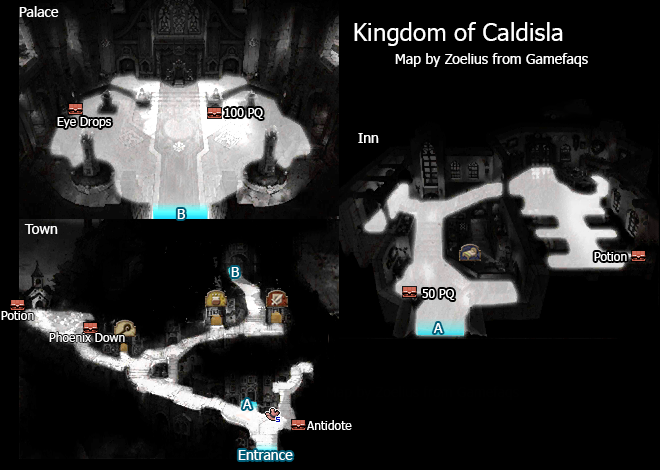
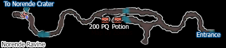
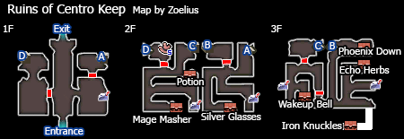
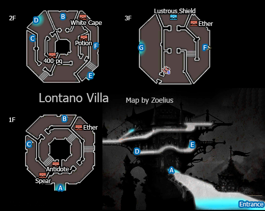

# Table of Contents
<!-- toc orderedList:0 depthFrom:1 depthTo:6 -->

* [Table of Contents](#table-of-contents)
* [Kingdom of Caldisla](#kingdom-of-caldisla)
  * [Shops](#shops)
    * [Item Shop](#item-shop)
    * [Magic Shop](#magic-shop)
    * [Equipment Shop](#equipment-shop)
* [Norende Ravine](#norende-ravine)
  * [Boss Battle](#boss-battle)
* [Centro Keep Ruins](#centro-keep-ruins)
  * [Boss Battle](#boss-battle-1)
* [Lontano Villa](#lontano-villa)
  * [Boss Battle](#boss-battle-2)

<!-- tocstop -->

# Kingdom of Caldisla

## Shops

### Item Shop

Item | Cost
--- | ---
Potion | 20pg
Phoenix Down | 100pg
Antidote | 10pg
Eye Drops | 20pg
Echo Herbs | 25pg
Teleport Stone | 100pg

### Magic Shop

Spell | Cost
--- | ---
Cure | 200pg
Poisona | 200pg
Blindna | 200pg
Fire | 200pg
Blizzard | 200pg
Thunder | 200pg

### Equipment Shop

Item | Cost
--- | ---
Broadsword | 70pg
Rod | 60pg
Dagger | 50pg
Buckler | 50pg
Linen Clothing | 20pg
Linen Cuirass | 80pg
Bronze Bangle | 40pg
Bronze Helmet | 40pg
Leather Hat | 15pg
Pointed Hat | 20pg
Leather Armour | 120pg
Kenpo Gi | 100pg
Bronze Glove | 40pg

# Norende Ravine

## Boss Battle

Boss | Health | Stolen Item | Drop
--- | --- | --- | ---
Barras Lehr | Normal: 300HP   Hard: 405HP | N/A | Hi-Potion
Holly White | Normal: 250HP   Hard 337HP | N/A | Hi-Potion

# Centro Keep Ruins

## Boss Battle

Boss | Health | Stolen Item | Drop
--- | --- | --- | ---
Ominas Crowe | Normal: 1800HP   Hard: 2430HP | N/A | Ether

# Lontano Villa

## Boss Battle

Boss | Health | Stolen Item | Drop
--- | --- | --- | ---
Argent Heinkel | Normal: 2000HP   Hard: 3250HP | N/A | Ether
