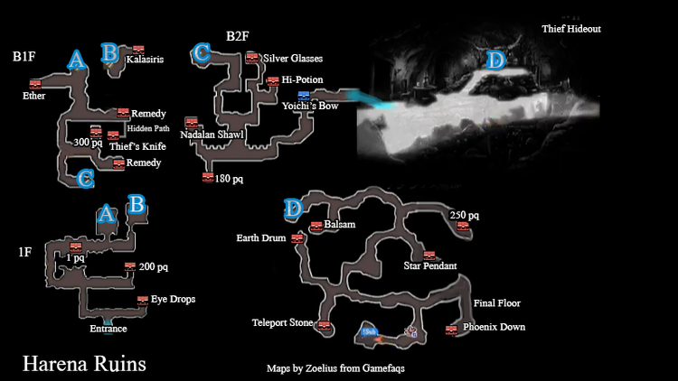
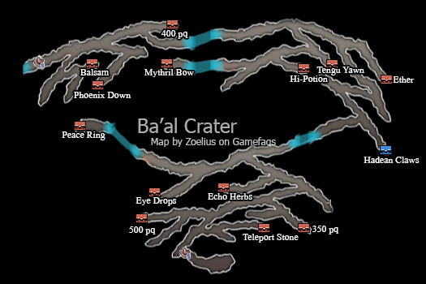
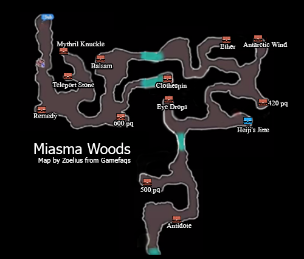
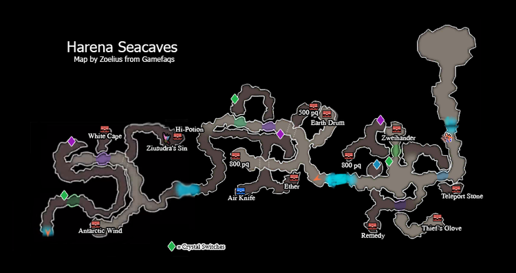
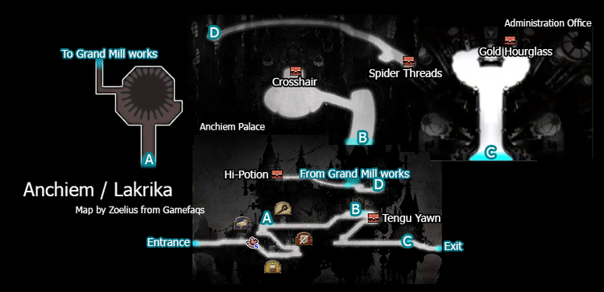
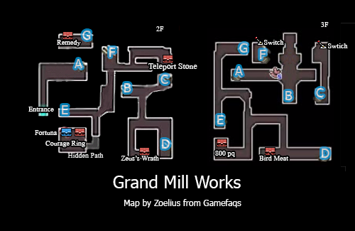

# Table of Contents
<!-- toc orderedList:0 depthFrom:1 depthTo:6 -->

* [Table of Contents](#table-of-contents)
* [Al-Khampis](#al-khampis)
  * [Stores](#stores)
    * [Item Shop](#item-shop)
    * [Equipment Shop](#equipment-shop)
    * [Magic Shop](#magic-shop)
* [Harena Ruins](#harena-ruins)
* [Ba'al Crater](#baal-crater)
* [Miasma Woods](#miasma-woods)
* [Harena Seacaves](#harena-seacaves)
* [Ancheim](#ancheim)
  * [Stores](#stores-1)
    * [Item Shop](#item-shop-1)
    * [Equipment Shop](#equipment-shop-1)
    * [Magic Shop](#magic-shop-1)
* [Grand Mill Works](#grand-mill-works)

<!-- tocstop -->

# Al-Khampis

## Stores

### Item Shop

Item | Cost
--- | ---
Potion | 20pg
Hi-Potion | 150pg
Phoenix Down | 100pg
Ether | 500pg
Antidote | 10pg
Eye Drops | 20pg
Echo Herbs | 25pg
Remedy | 500pg
Teleport Stone | 100pg

### Equipment Shop

Item | Cost
--- | ---
Broadsword | 500pg
Broadaxe | 600pg
Glaive | 450pg
Wizard Rod | 375pg
Staff | 300pg
Oak Stick | 300pg
Magic Dagger | 350pg
Steel Bow | 425pg
Nodachi | 475pg
Large Shield | 300pg
Desert Cap | 100pg
Academia Hat | 150pg
Legion Helm | 200pg
Nadalan Sleeves | 400pg
Academia Gown | 350pg
Ring Mail | 500pg
Red Glasses | 500pg

### Magic Shop

Spell | Class | Cost
--- | --- | ---
Aero | White Mage | 400pg
Fire | Black Mage | 400pg
Blizzard | Black Mage | 400pg
Open Eyes | Bishop | 400pg
Holy Night | Bishop | 400pg
Tornado | Wizard | 200pg
Soil | Wizard | 200pg
Physical Boon | Astrologian | 200pg
Magic Boon | Astrologian | 200pg

# Harena Ruins

<table>
  <tr>
    <th>Boss</th>
    <th>HP</th>
    <th>Stolen Items</th>
    <th>Drop Items</th>
  </tr>
  <tr>
    <td rowspan="3">Jackal</td>
    <td>Casual: 2250HP</td>
    <td rowspan="3">N/A</td>
    <td rowspan="3">Ether</td>
  </tr>
  <tr>
    <td>Normal: 3000HP</td>
  </tr>
  <tr>
    <td>Hard: 4500HP</td>
  </tr>
</table>

<table>
  <tr>
    <th>Boss</th>
    <th>HP</th>
    <th>Stolen Items</th>
    <th>Drop Items</th>
  </tr>
  <tr>
    <td rowspan="3">Fiore DeRosa</td>
    <td>Casual: 2250HP</td>
    <td rowspan="3">N/A</td>
    <td rowspan="3">Hi-Potion</td>
  </tr>
  <tr>
    <td>Normal: 3000HP</td>
  </tr>
  <tr>
    <td>Hard: 4500HP</td>
  </tr>
</table>

# Ba'al Crater

<table>
  <tr>
    <th>Boss</th>
    <th>HP</th>
    <th>Stolen Items</th>
    <th>Drop Items</th>
  </tr>
  <tr>
    <td rowspan="3">Ba'al V; Urchin</td>
    <td>Casual: 3750HP</td>
    <td rowspan="3">Mythril Spear</td>
    <td rowspan="3">Antarctic Wind</td>
  </tr>
  <tr>
    <td>Normal: 5000HP</td>
  </tr>
  <tr>
    <td>Hard: 7500HP</td>
  </tr>
</table>

<table>
  <tr>
    <th>Boss</th>
    <th>HP</th>
    <th>Stolen Items</th>
    <th>Drop Items</th>
  </tr>
  <tr>
    <td rowspan="3">Norzen</td>
    <td>Casual: 3750HP</td>
    <td rowspan="3">Red Glasses</td>
    <td rowspan="3">Potion, Stardust</td>
  </tr>
  <tr>
    <td>Normal: 5000HP</td>
  </tr>
  <tr>
    <td>Hard: 7500HP</td>
  </tr>
</table>

# Miasma Woods

<table>
  <tr>
    <th>Boss</th>
    <th>HP</th>
    <th>Stolen Items</th>
    <th>Drop Items</th>
  </tr>
  <tr>
    <td rowspan="3">Mephilia</td>
    <td>Casual: 3750HP</td>
    <td rowspan="3">Mythril Rod</td>
    <td rowspan="3">Turbo Ether</td>
  </tr>
  <tr>
    <td>Normal: 5000HP</td>
  </tr>
  <tr>
    <td>Hard: 7500HP</td>
  </tr>
</table>

<table>
  <tr>
    <th>Boss</th>
    <th>HP</th>
    <th>Stolen Items</th>
    <th>Drop Items</th>
  </tr>
  <tr>
    <td rowspan="3">Kamiizumi</td>
    <td>Casual: 3750HP</td>
    <td rowspan="3">Red Glasses</td>
    <td rowspan="3">Catch Me Conch</td>
  </tr>
  <tr>
    <td>Normal: 5000HP</td>
  </tr>
  <tr>
    <td>Hard: 7500HP</td>
  </tr>
</table>

# Harena Seacaves

<table>
  <tr>
    <th>Boss</th>
    <th>HP</th>
    <th>Stolen Items</th>
    <th>Drop Items</th>
  </tr>
  <tr>
    <td rowspan="3">Minette</td>
    <td>Casual: 5250HP</td>
    <td rowspan="3">Mythril Axe</td>
    <td rowspan="3">Cat Food</td>
  </tr>
  <tr>
    <td>Normal: 7000HP</td>
  </tr>
  <tr>
    <td>Hard: 10500HP</td>
  </tr>
  <tr>
    <td rowspan="3">Bismarck</td>
    <td>Casual: 3750HP</td>
    <td rowspan="3">Remedy</td>
    <td rowspan="3">Cat Feather</td>
  </tr>
  <tr>
    <td>Normal: 5000HP</td>
  </tr>
  <tr>
    <td>Hard: 7500HP</td>
  </tr>
</table>

# Ancheim

## Stores

### Item Shop

Item | Cost
--- | ---
Potion | 20pg
Hi-Potion | 150pg
Phoenix Down | 100pg
Ether | 500pg
Antidote | 10pg
Eye Drops | 20pg
Echo Herbs | 25pg
Remedy | 500pg
Teleport Stone | 100pg

### Equipment Shop

Item | Cost
--- | ---
Mythril Sword | 1000pg
Mythril Axe | 1200pg
Mythril Spear | 900pg
Mythril Rod | 750pg
Mythril Staff | 600pg
Mythril Dagger | 700pg
Mythril Bow | 850pg
Osafune | 950pg
Mythril Knuckle | 1100pg
Zweihander | 1300pg
Tannenberg | 1250pg
Mythril Shield | 600pg
Nadalan Sleeves | 200pg
Turban | 300pg
Horned Helm | 400pg
Caravan Coat | 800pg
Kalasiris | 700pg
Spirit Mail | 1000pg
Star Pendant | 500pg
Clothespin | 100pg

### Magic Shop

Spell | Class | Cost
--- | --- | ---
Esuna | White Mage | 800pg
Raise | White Mage | 800pg
Curada | White Mage | 1600pg
Thunder | Black Mage | 800pg
Aspir | Black Mage | 800pg
Fira | Black Mage | 1600pg
Blizzara | Black Mage | 1600pg
Blessing | Bishop | 800pg
Cure | Bishop | 800pg
Evade Boon | Astrologian | 400pg
Elemental Ward | Astrologian | 400pg

# Grand Mill Works

<table>
  <tr>
    <th>Boss</th>
    <th>HP</th>
    <th>Stolen Items</th>
    <th>Drop Items</th>
  </tr>
  <tr>
    <td rowspan="3">Amphisbaena x2</td>
    <td>Casual: 3750HP</td>
    <td rowspan="3">Bacchus's Wine</td>
    <td rowspan="3">Bacchus's Wine</td>
  </tr>
  <tr>
    <td>Normal: 5000HP</td>
  </tr>
  <tr>
    <td>Hard: 7500HP</td>
  </tr>
</table>
