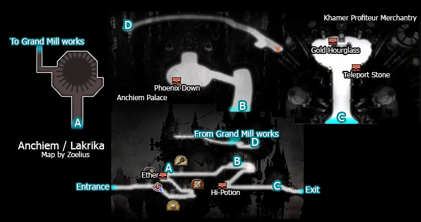
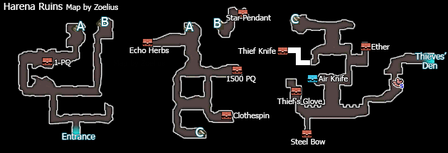
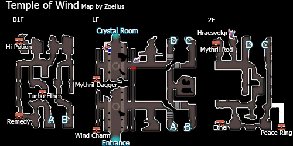
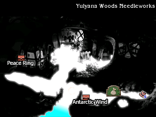
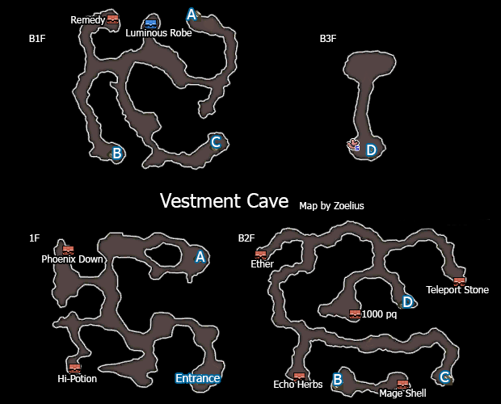
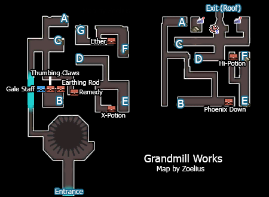

# Table of Contents

<!-- toc orderedList:0 depthFrom:1 depthTo:6 -->

* [Table of Contents](#table-of-contents)
* [Ancheim](#ancheim)
  * [Shops](#shops)
    * [Item Shop](#item-shop)
    * [Magic Shop](#magic-shop)
    * [Equipment Shop](#equipment-shop)
* [Harena Ruins](#harena-ruins)
  * [Boss Battles](#boss-battles)
* [Temple of Wind](#temple-of-wind)
* [Yulyana Woods Needleworks](#yulyana-woods-needleworks)
  * [Shops](#shops-1)
    * [Item Shop](#item-shop-1)
    * [Magic Shop](#magic-shop-1)
    * [Equipment Shop](#equipment-shop-1)
* [Vestment Cave](#vestment-cave)
  * [Boss Battles](#boss-battles-1)
* [Grand Mill Works](#grand-mill-works)

<!-- tocstop -->

# Ancheim

## Shops

### Item Shop

Item | Cost
--- | ---
Potion | 20pg
Hi-Potion | 150pg
Phoenix Down | 100pg
Antidote | 10pg
Eye Drops | 20pg
Echo Herbs | 25pg
Teleport Stone | 100pg

### Magic Shop

Spell | Cost
--- | ---
Protect | 400pg
Shell | 400pg
Aero | 400pg
Silence | 400pg
Poison | 400pg
Sleep | 400pg
Slow | 400pg
Regen | 400pg
Quake | 400pg

### Equipment Shop
Item | Cost
--- | ---
Longsword | 500pg
Mace | 300pg
Oak Stick | 250pg
Kukri | 350pg
Iron Knuckle | 280pg
Round Shield | 300pg
Iron Helm | 200pg
Bronze Bangle | 40pg
Iron Armour | 500pg
Silk Robe | 350pg
Copper Breastplate | 400pg
Gauntlet | 120pg
Iron Bangle | 75pg
Star Pendant | 500pg
Red Glasses | 500pg

# Harena Ruins

## Boss Battles

Boss | Health | Stolen Item | Drop
--- | --- | --- | ---
Jackal | Normal: 3000HP   Hard: 6150HP | N/A | Hi-Potion
Ciggma Khint | 5000HP | N/A | None

Boss | Health | Stolen Item | Drop
--- | --- | --- | ---
Profiteur | Normal: 6000HP   Hard: 8100HP | Mithril Staff | Hi-Potion   Gold Hourglass
Ciggma Khint | Nromal:5000HP   Hard: 6750HP | Hi-Potion   Mythril Plate | None

# Temple of Wind

# Yulyana Woods Needleworks

## Shops

### Item Shop

Item | Cost
--- | ---
Potion | 20pg
Hi-Potion | 150pg
Phoenix Down | 100pg
Antidote | 10pg
Eye Drops | 20pg
Echo Herbs | 25pg
Teleport Stone | 100pg

### Magic Shop

Spell | Cost
--- | ---
Cure | 200pg
Poisona | 200pg
Blindna | 200pg
Fire | 200pg
Blizzard | 200pg
Thunder | 200pg

### Equipment Shop

Item | Cost
--- | ---
Mythril Sword | 1000pg
Mythril Axe | 1200pg
Mythril Spear | 900pg
Mythril Rod | 750pg
Mythril Staff | 600pg
Mythril Dagger | 700pg
Mythril Bow | 850pg
Mythril Knuckle | 500pg
Mythril Helm | 600pg
Mythril Armour | 400pg
Mythril Plate | 1000pg
Tabby Suit | 700pg
Tiger Mask | 850pg
Cat-Ear Hood | 222pg
Mythril Gloves | 200pg
Mythril Bangle | 150pg
White Cape | 500pg
Clothespin | 100pg

# Vestment Cave

## Boss Battles

Boss | Health | Stolen Item | Drop
--- | --- | --- | ---
Dragon | Normal:6000HP   Hard: 10125HP | Dragon Fang   Spike Knuckle | Thunder Amulet

Boss | Health | Stolen Item | Drop
--- | --- | --- | ---
Ultros(Ice) | Normal: 4000HP   Hard: 6750HP | Antarctic Wind   Antarctic Wind | Antarctic Wind   Potion
Ultros(Fire) | Normal: 4000HP   Hard: 6750HP | Bomb Fragment   Bomb Arm | Bomb Fragment   Ether

# Grand Mill Works

Boss | Health | Stolen Item | Drop
--- | --- | --- | ---
Khamer VIII | Normal: 3000HP   Hard: 8100HP | Ether   Jade Staff | Ether
Ciggma Khint | Normal: 5000HP   Hard: 8100HP | Hi-Potion   Scimitar | Hi-Potion
