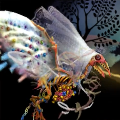

# Table of Contents
<!-- toc orderedList:0 depthFrom:1 depthTo:6 -->

* [Table of Contents](#table-of-contents)
* [Seven Deadly Sins](#seven-deadly-sins)
  * [Beelzebub](#beelzebub)
  * [Mammon](#mammon)
  * [Asmodeus](#asmodeus)
  * [Belphegor](#belphegor)
  * [Satan](#satan)
  * [Lucifer](#lucifer)
* [Ba'al](#baal)
  * [Ba'al I; Turtle Dove](#baal-i-turtle-dove)
  * [Ba'al IV; Goldie](#baal-iv-goldie)
* [Special Bosses](#special-bosses)

<!-- tocstop -->

# Seven Deadly Sins

## Beelzebub

Level | Health | Stolen Item | Drop
--- | --- | --- | ---
10 | Normal: 3000HP   Hard: 5400HP | N/A | Mind Bun   Dexterity Bun
99 | Normal: 300000HP   Hard: 405000HP | N/A | Mind Bun   Dexterity Bun

## Mammon

Level | Health | Stolen Item | Drop
--- | --- | --- | ---
25 | Normal: 20000HP   Hard: 27000HP | Elixir   Ether(Some versions) | HP Booster Bun
99 | Normal: 500000HP   Hard: 675000HP | Ether | HP Booster Bun   Intelligence Bun

## Asmodeus

Level | Health | Stolen Item | Drop
--- | --- | --- | ---
70 | Normal: 300000HP   Hard: 405000HP | N/A | MP Booster Bun
99 | Normal: 500000HP   Hard: 675000HP | N/A | MP Booster Bun

## Belphegor

Level | Health | Stolen Item | Drop
--- | --- | --- | ---
80 | Normal: 250000HP   Hard: 337500HP | N/A | Mind Bun

## Satan

Level | Health | Stolen Item | Drop
--- | --- | --- | ---
40 | Normal: 150000HP   Hard: 202500HP | N/A | Agility Bun   Vitality Bun
99 | Normal: 300000HP   Hard: 405000HP | N/A | Agility Bun   Vitality Bun

## Lucifer

Level | Health | Stolen Item | Drop
--- | --- | --- | ---
70 | Normal: 200000HP   Hard: 270000HP | N/A | Strength Bun   Agility Bun

# Ba'al

## Ba'al I; Turtle Dove

Level | Health | Stolen Item | Drop
--- | --- | --- | ---
20 | Normal: 15000HP   Hard: 20250HP | N/A | Unearthly Bun
99 | Normal: 500000HP   Hard: 675000HP | N/A | Unearthly Bun

Turtle Dove is a very difficult boss to defeat legitimately. Turtle Dove's has attacks that are guaranteed to hit you for 9999 and it does that twice in a turn. The Turtle Dove can also put your character in Love state, when a character is in love, it will mimic the action of the character it's in love with. There is nothing that can dispel these status effects, which can be a real pain for this battle. When Turtle Dove reach to a lower HP, it can use love triangle which act similar to confuse. If you want to cheese through this battle, the four Valkyrie combo can destroy Turtle Dove without fail. To set up the Valkyrie combo, you need to have four Valkyries equip them with the fastest gear and equip them with speed increasing abilities. One of the party member needs the ability Hasten World. If you have one free slot in your ability list, you should use the Two-Handed ability to maximize your attack power. Once you start the battle have everyone use High Jump. Then press Y to the game to auto. This method should kill the Turtle Dove on the hardest difficulty level within 3 minutes, as long as you're have around 101 to 110 agility then it should work.

## Ba'al IV; Goldie

Level | Health | Stolen Item | Drop
--- | --- | --- | ---
99 | Normal: 500000HP   Hard: 675000HP | N/A | Unearthly Bun

Goldie is one of the newer Ba'al Bosses. One of the main things you need to bring for this battle is units with support abilities that can nullify a physical attack such as Rampart from Templar or Utsusemi from Ninja. The main reason is when it attacks, it will use bouncy ball, this can hit your party extremely hard and including itself. The main thing you need to watch out for is when it summons the little fishes, Goldie can eat them to gain a different status property such as HP regen. If you want to cheese through this battle by using the High Jump method, then you need to modify the setup a little bit for it to work. First you need to have Ninja's ability for your character, then when you fight the boss on the very first turn, have the entire party default and then on the next turn, use Brave once, then Utsusemi then High Jump. Once you everything set to action, leave the game on auto battle the boss should be dead in 4 to 5 mins.

# Special Bosses

Boss | Health | Stolen Item | Drop
--- | --- | --- | ---
Tako-Izumi | Normal: 120000HP   Hard: 1620000HP | N/A | Unearthly Bun

Do not bring melee units for this battle. This version of Kamiizumi has 9999 defense, so your physical attacks does only 1 damage to him no matter how strong you are and besides if you attack him, he will automatically counter you for 9999. He does have low magic defense, so magic is the only to defeat him. Tako will use Susano-O very often, this can hit your party up to 4000 to 8000 to the whole party. If you plan on surviving, I suggest you to bring a merchant for the Low Leverage ability and also a Templar for Rampart because Tako's status is ridiculous high and also Unlike other Nemesis, you cannot run away from Tako-Izumi. Due to Tako's enormous HP, it will take at least one to two hours to kill him. One of the benefits of winning this battle is that Tako-Izumi has a very high chance of dropping an Unearthly Bun.

Boss | Health | Stolen Item | Drop
--- | --- | --- | ---
Adventurer | Normal: 530000HP   Hard: 715500HP | Tengu's Breath   X-Potion | Adventurer's Mark
Comrade | Normal: 50000HP   Hard: 67500HP | Antidote | N/A

This bosses was distributed during Valentines day. It is an super buff up version of Barras and Holly. This boss is alot easier then the New Year Boss, Tako-Izumi. Barras has high resistance towards Physical Attacks and Holly is almost immune to magical attacks. So you will need to balance your party with a melee unit and mage user.
