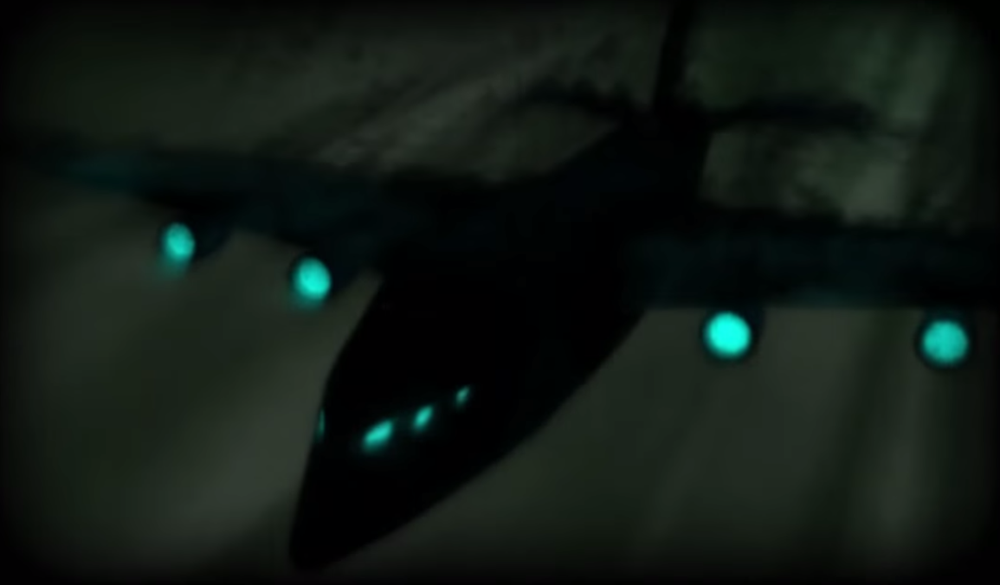
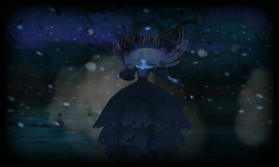
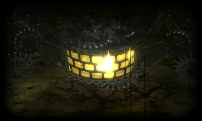

# Table of Contents
<!-- toc orderedList:0 depthFrom:1 depthTo:6 -->

* [Table of Contents](#table-of-contents)
* [Girtablulu](#girtablulu)
* [Hresvelgr](#hresvelgr)
* [Ziusudra's Sin](#ziusudras-sin)
* [Promethean Fire](#promethean-fire)
* [Deus Ex](#deus-ex)
* [Susano-o](#susano-o)

<!-- tocstop -->

# Girtablulu

Cost | Effect | Location
--- | --- | ---
40 MP | Deal Earth damage to all enemies | Defeeat Mephilia

# Hresvelgr

Cost | Effect | Location
--- | --- | ---
40 MP | Deal Wind damage to all enemies | Temple of Wind 2F

# Ziusudra's Sin

Cost | Effect | Location
--- | --- | ---
40 MP | Deal Water damage to all enemies | Mount Fragmentum

# Promethean Fire

Cost | Effect | Location
--- | --- | ---
40 MP | Deal Fire damage to all enemies | Temple of Fire

# Deus Ex

Cost | Effect | Location
--- | --- | ---
40 MP | Deal Lightning Damage to all enemies | Everlast Tower 2F

# Susano-o

Cost | Effect | Location
--- | --- | ---
60 MP | Deal non-elemental damage to all enemies | Northeast Crescent Island
