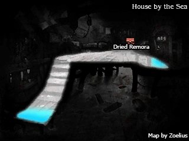
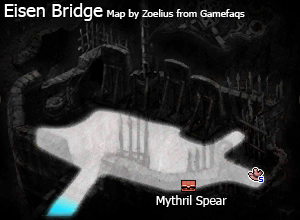
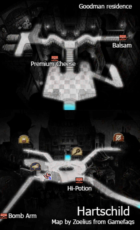
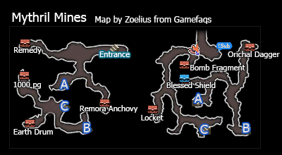
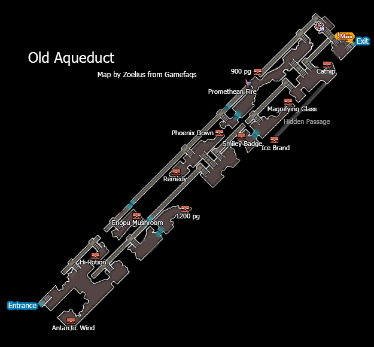
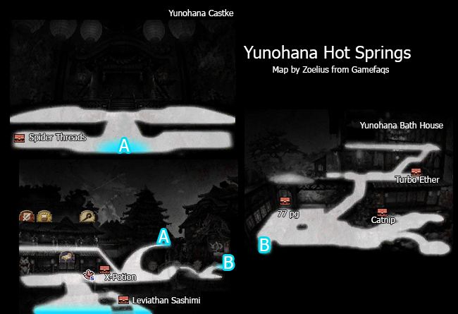
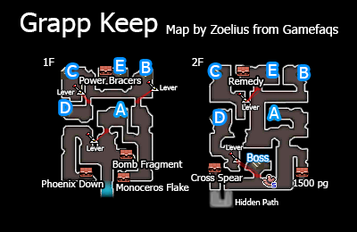
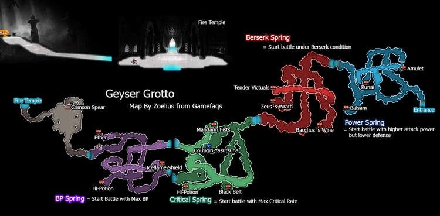

# Table of Contents
<!-- toc orderedList:0 depthFrom:1 depthTo:6 -->

* [Table of Contents](#table-of-contents)
* [Eisen Region](#eisen-region)
* [Hartschild](#hartschild)
  * [Stores](#stores)
    * [Item Shop](#item-shop)
    * [Equipment Shop](#equipment-shop)
    * [Magic Shop](#magic-shop)
* [Mythril Mines](#mythril-mines)
* [Old Aqueduct](#old-aqueduct)
* [Yunohana Hot Springs](#yunohana-hot-springs)
    * [Item Shop](#item-shop-1)
    * [Equipment Shop](#equipment-shop-1)
    * [Magic Shop](#magic-shop-1)
* [Grapp Keep](#grapp-keep)
* [Geyser Grotto](#geyser-grotto)
* [Starkfort](#starkfort)
* [Yunohana Castle](#yunohana-castle)

<!-- tocstop -->

# Eisen Region

# Hartschild

## Stores

### Item Shop

Item | Cost
--- | ---
Potion | 20pg
Hi-Potion | 150pg
Phoenix Down | 100pg
Ether | 500pg
Antidote | 10pg
Eye Drops | 20pg
Echo Herbs | 25pg
Remedy | 500pg
Teleport Stone | 100pg

### Equipment Shop

Item | Cost
--- | ---
Defender | 2000pg
War Axe | 2000pg
Halberd | 1800pg
Iron Pole | 1200pg
Main Gauche | 1400pg
Composite Bow | 1700pg
Samidare | 980pg
Toxic Claw | 2200pg
Shamshir | 2600pg
Serpentis | 2500pg
Shako | 400pg
Tactician's Hat | 600pg
Eisenhut | 800pg
Doublet | 1600pg
Flame Robe | 1400pg
Plate Mail | 2000pg
Vambrace | 200pg
White Cape | 1000pg
Locket | 8000pg
Courage Ring | 10000pg
Sky Knight Garb | 50000pg

### Magic Shop

Spell | Class | Cost
--- | --- | ---
Benevolence | Bishop | 1600pg
Innocence | Bishop | 1600pg
Shining | Wizard | 200pg
Shadow | Wizard | 200pg
Speed Boon | Astrologian | 800pg
Elemental Mirror | Astrologian | 800pg

# Mythril Mines

<table>
  <tr>
    <th>Boss</th>
    <th>HP</th>
    <th>Stolen Items</th>
    <th>Drop Items</th>
  </tr>
  <tr>
    <td rowspan="3">Holly</td>
    <td>Casual: 11250HP</td>
    <td rowspan="3">Jade Crosier</td>
    <td rowspan="3">Light Curtain</td>
  </tr>
  <tr>
    <td>Normal: 15000HP</td>
  </tr>
  <tr>
    <td>Hard: 22500HP</td>
  </tr>
</table>

<table>
  <tr>
    <th>Boss</th>
    <th>HP</th>
    <th>Stolen Items</th>
    <th>Drop Items</th>
  </tr>
  <tr>
    <td rowspan="3">Profiteur</td>
    <td>Casual: 11250HP</td>
    <td rowspan="3">Rare Cheese</td>
    <td rowspan="3">Gold Hourglass</td>
  </tr>
  <tr>
    <td>Normal: 15000HP</td>
  </tr>
  <tr>
    <td>Hard: 22500HP</td>
  </tr>
</table>

# Old Aqueduct

<table>
  <tr>
    <th>Boss</th>
    <th>HP</th>
    <th>Stolen Items</th>
    <th>Drop Items</th>
  </tr>
  <tr>
    <td rowspan="3">Aimee</td>
    <td>Casual: 15000HP</td>
    <td rowspan="3">Tane-ga-Shima</td>
    <td rowspan="3">Bomb Fragment</td>
  </tr>
  <tr>
    <td>Normal: 20000HP</td>
  </tr>
  <tr>
    <td>Hard: 30000HP</td>
  </tr>
</table>

# Yunohana Hot Springs

### Item Shop

Item | Cost
--- | ---
Potion | 20pg
Hi-Potion | 150pg
Phoenix Down | 100pg
Ether | 500pg
Antidote | 10pg
Eye Drops | 20pg
Echo Herbs | 25pg
Remedy | 500pg
Teleport Stone | 100pg

### Equipment Shop

Item | Cost
--- | ---
Grinder Axe | 3940pg
Cross Spear | 3150pg
Noxious Rod | 2625pg
Jade Crosier | 2100pg
Carving Knife | 2450pg
Birch Bow | 2975pg
Kotetsu | 3325pg
Tane-ga-Shima | 4375pg
Serrated Shield | 2100pg
Hachigane | 700pg
Ascetic's Cap | 1050pg
Ikaboshi Kabuto | 1400pg
Ninja Garb | 2800pg
Suzukaze | 2450pg
Aka-Ito-Odoshi | 3500pg
Shepherd's Garb | 80000pg

### Magic Shop

Spell | Class | Cost
--- | --- | ---
Cura | White Mage | 1600pg
Aerora | White Mage | 1600pg
Curada | White Mage | 3200pg
Esunaga | White Mage | 3200pg
Fira | Black Mage | 1600pg
Blizzara | Black Mage | 1600pg
Thundara | Black Mage | 1600pg
Drain | Black Mage | 3200pg
Benevolence | Bishop |1600pg
Innocence | Bishop | 1600pg
Shining | Wizard | 200pg
Shadow | Wizard | 200pg
Speed Boon | Astrologian | 800pg
Elemental Mirror | Astrologian | 800pg
Physical Ward | Astrologian | 1600pg
Mystic Ward | Astrologian | 1600pg

# Grapp Keep

<table>
  <tr>
    <th>Boss</th>
    <th>HP</th>
    <th>Stolen Items</th>
    <th>Drop Items</th>
  </tr>
  <tr>
    <td rowspan="3">Artemia</td>
    <td>Casual: 18750HP</td>
    <td rowspan="3">Roc Filet</td>
    <td rowspan="3">Beast Flesh</td>
  </tr>
  <tr>
    <td>Normal: 25000HP</td>
  </tr>
  <tr>
    <td>Hard: 37500HP</td>
  </tr>
</table>

<table>
  <tr>
    <th>Boss</th>
    <th>HP</th>
    <th>Stolen Items</th>
    <th>Drop Items</th>
  </tr>
  <tr>
    <td rowspan="3">Ominas Crowe</td>
    <td>Casual: 7500HP</td>
    <td rowspan="3">Ether</td>
    <td rowspan="3">N/A</td>
  </tr>
  <tr>
    <td>Normal: 10000HP</td>
  </tr>
  <tr>
    <td>Hard: 15000HP</td>
  </tr>
  <tr>
    <td rowspan="3">Bahamut</td>
    <td>Casual: 11250HP</td>
    <td rowspan="3">Bomb Arm</td>
    <td rowspan="3">Bomb Fragment</td>
  </tr>
  <tr>
    <td>Normal: 15000HP</td>
  </tr>
  <tr>
    <td>Hard: 22500HP</td>
  </tr>
</table>

# Geyser Grotto

<table>
  <tr>
    <th>Boss</th>
    <th>HP</th>
    <th>Stolen Items</th>
    <th>Drop Items</th>
  </tr>
  <tr>
    <td rowspan="3">Janne</td>
    <td>Casual: 15000HP</td>
    <td rowspan="3">Scimitar</td>
    <td rowspan="3">X-Potion</td>
  </tr>
  <tr>
    <td>Normal: 20000HP</td>
  </tr>
  <tr>
    <td>Hard: 30000HP</td>
  </tr>
</table>

# Starkfort

<table>
  <tr>
    <th>Boss</th>
    <th>HP</th>
    <th>Stolen Items</th>
    <th>Drop Items</th>
  </tr>
  <tr>
    <td rowspan="3">Heinkel</td>
    <td>Casual: 15000HP</td>
    <td rowspan="3">Adamant Shield</td>
    <td rowspan="3">X-Potion</td>
  </tr>
  <tr>
    <td>Normal: 20000HP</td>
  </tr>
  <tr>
    <td>Hard: 30000HP</td>
  </tr>
</table>

<table>
  <tr>
    <th>Boss</th>
    <th>HP</th>
    <th>Stolen Items</th>
    <th>Drop Items</th>
  </tr>
  <tr>
    <td rowspan="3">Kikiyo</td>
    <td>Casual: 15000HP</td>
    <td rowspan="3">Kunai</td>
    <td rowspan="3">Gale Hairpin</td>
  </tr>
  <tr>
    <td>Normal: 20000HP</td>
  </tr>
  <tr>
    <td>Hard: 30000HP</td>
  </tr>
</table>

# Yunohana Castle

<table>
  <tr>
    <th>Boss</th>
    <th>HP</th>
    <th>Stolen Items</th>
    <th>Drop Items</th>
  </tr>
  <tr>
    <td rowspan="3">Panettone</td>
    <td>Casual: 18750HP</td>
    <td rowspan="3">Kukri</td>
    <td rowspan="3">Cake related items</td>
  </tr>
  <tr>
    <td>Normal: 25000HP</td>
  </tr>
  <tr>
    <td>Hard: 37500HP</td>
  </tr>
</table>

<table>
  <tr>
    <th>Boss</th>
    <th>HP</th>
    <th>Stolen Items</th>
    <th>Drop Items</th>
  </tr>
  <tr>
    <td rowspan="3">Super'nought Bael</td>
    <td>Casual: 22500HP</td>
    <td rowspan="3">Arctic Wind</td>
    <td rowspan="3">Normalizer</td>
  </tr>
  <tr>
    <td>Normal: 30000HP</td>
  </tr>
  <tr>
    <td>Hard: 45000HP</td>
  </tr>
</table>
