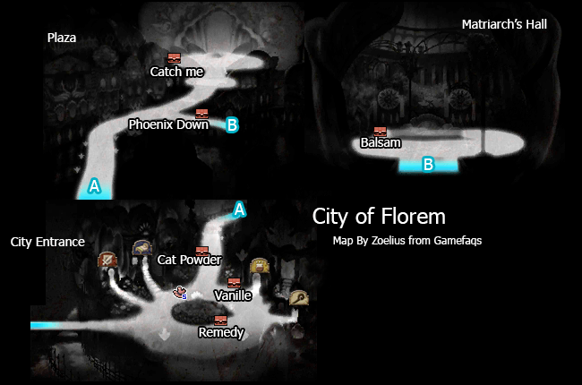

# Table of Contents
<!-- toc orderedList:0 depthFrom:1 depthTo:6 -->

* [Table of Contents](#table-of-contents)
* [Florem](#florem)
  * [Shops](#shops)
    * [Item Store](#item-store)
    * [Equipment Store](#equipment-store)
    * [Magic Store](#magic-store)
* [Twilight Ruins](#twilight-ruins)
* [Sagitta Forest](#sagitta-forest)
* [Sagitta Village](#sagitta-village)
  * [Shops](#shops-1)
    * [Item Store](#item-store-1)
    * [Equipment Store](#equipment-store-1)
* [Witherwoods](#witherwoods)
* [Old Sagitta](#old-sagitta)
* [Water Temple](#water-temple)
* [Grandship](#grandship)
  * [Shops](#shops-2)
    * [Item Stores](#item-stores)
    * [Equipment Store](#equipment-store-2)
    * [Magic Store](#magic-store-1)
* [Engine Room](#engine-room)

<!-- tocstop -->

# Florem

## Shops

### Item Store

Item | Cost
--- | ---
Potion | 20pg
Hi-Potion | 150pg
Phoenix Down | 100pg
Ether | 500pg
Antidote | 10pg
Eye Drops | 20pg
Echo Herbs | 25pg
Remedy | 500pg
Balsam | 500pg
Teleport Stone | 100pg
Magic Bottle | 200pg

### Equipment Store

Item | Cost
--- | ---
Scimitar | 5000pg
Heavy Axe | 6000pg
Valkyrie Halberd | 4500pg
Rod of Fire | 3750pg
Staff of Life | 3000pg
Kukri | 3500pg
Aeolian Bow | 4250pg
Kiku-Ichimonji | 4750pg
Thumbing Claw | 5500pg
Bastard Sword | 6500pg
Petronel | 6250pg
Adamant Shield | 3000pg
Acorn Hat | 1000pg
Laurel Wreath | 1500pg
Sugarloaf | 2000pg
Justaucorps | 4000pg
Floral Robe | 3500pg
Cuirass | 5000pg
Earthing Rod | 2000pg
Peace Ring | 2000pg
Cadet Uniform | 100000pg

### Magic Store

Spell | Class | Cost
--- | --- | ---
Benediction | Bishop | 3200pg
Resurrect | Bishop | 3200pg
Spirit | Wizard | 200pg
Lucky Day | Astrologian | 3200pg
Elemental Mirror | Astrologian | 3200pg

# Twilight Ruins

<table>
  <tr>
    <th>Boss</th>
    <th>HP</th>
    <th>Stolen Items</th>
    <th>Drop Items</th>
  </tr>
  <tr>
    <td rowspan="3">Einheria Venus</td>
    <td>Casual: 22500HP</td>
    <td rowspan="3">Silver Glaive</td>
    <td rowspan="3">X-Potion</td>
  </tr>
  <tr>
    <td>Normal: 30000HP</td>
  </tr>
  <tr>
    <td>Hard: 45000HP</td>
  </tr>
  <tr>
    <td rowspan="3">Veeling</td>
    <td>Casual: 7500HP</td>
    <td rowspan="3">Lilith's Kiss</td>
    <td rowspan="3">N/A</td>
  </tr>
  <tr>
    <td>Normal: 10000HP</td>
  </tr>
  <tr>
    <td>Hard: 15000HP</td>
  </tr>
</table>

<table>
  <tr>
    <th>Boss</th>
    <th>HP</th>
    <th>Stolen Items</th>
    <th>Drop Items</th>
  </tr>
  <tr>
    <td rowspan="3">Barras Lehr</td>
    <td>Casual: 22500HP</td>
    <td rowspan="3">Bear Knuckles</td>
    <td rowspan="3">X-Potion</td>
  </tr>
  <tr>
    <td>Normal: 30000HP</td>
  </tr>
  <tr>
    <td>Hard: 45000HP</td>
  </tr>
  <tr>
    <td rowspan="3">Transcute</td>
    <td>Casual: 9000HP</td>
    <td rowspan="3">Eye Drops</td>
    <td rowspan="3">X-Potion</td>
  </tr>
  <tr>
    <td>Normal: 12000HP</td>
  </tr>
  <tr>
    <td>Hard: 18000HP</td>
  </tr>
</table>

# Sagitta Forest

# Sagitta Village

## Shops

### Item Store

Item | Cost
--- | ---
Potion | 20pg
Hi-Potion | 150pg
Phoenix Down | 100pg
Ether | 500pg
Antidote | 10pg
Eye Drops | 20pg
Echo Herbs | 25pg
Remedy | 500pg
Balsam | 500pg
Teleport Stone | 100pg
Magic Bottle | 200pg

### Equipment Store

Item | Cost
--- | ---
Sleep Blade | 7500pg
Labrys | 9000pg
Silver Glaive | 6750pg
Jadagna | 5625pg
Diamond Staff | 4500pg
Frenzy Dagger | 4250pg
Killer Bow | 6375pg
Masamune | 7125pg
Bear Knuckles | 5500pg
Faussar | 9750pg
Carbon Cap | 1500pg
Headgear | 2250pg
Full-Face Helm | 3000pg
Nano Suit | 6000pg
Amplifier | 5250pg
Liquid Armour | 7500pg
Flame Charm | 3000pg
Ice Charm | 3000pg
Thunder Charm | 3000pg
Wind Charm | 3000pg
Earth Charm | 3000pg
Light Charm | 3000pg
Dark Charm | 3000pg
Research Lab Coat | 150000pg
Dimensional Garb | 150000pg

# Witherwoods

<table>
  <tr>
    <th>Boss</th>
    <th>HP</th>
    <th>Stolen Items</th>
    <th>Drop Items</th>
  </tr>
  <tr>
    <td rowspan="3">Barbarossa</td>
    <td>Casual: 33750HP</td>
    <td rowspan="3">Labrys</td>
    <td rowspan="3">Arctic Wind</td>
  </tr>
  <tr>
    <td>Normal: 45000HP</td>
  </tr>
  <tr>
    <td>Hard: 67500HP</td>
  </tr>
</table>

<table>
  <tr>
    <th>Boss</th>
    <th>HP</th>
    <th>Stolen Items</th>
    <th>Drop Items</th>
  </tr>
  <tr>
    <td rowspan="3">Praline</td>
    <td>Casual: 30000HP</td>
    <td rowspan="3">Diamond Staff</td>
    <td rowspan="3">Star Dust</td>
  </tr>
  <tr>
    <td>Normal: 40000HP</td>
  </tr>
  <tr>
    <td>Hard: 60000HP</td>
  </tr>
</table>

# Old Sagitta

<table>
  <tr>
    <th>Boss</th>
    <th>HP</th>
    <th>Stolen Items</th>
    <th>Drop Items</th>
  </tr>
  <tr>
    <td rowspan="3">Geist</td>
    <td>Casual: 45000HP</td>
    <td rowspan="3">Red Muleta</td>
    <td rowspan="3">Turbo Ether</td>
  </tr>
  <tr>
    <td>Normal: 60000HP</td>
  </tr>
  <tr>
    <td>Hard: 90000HP</td>
  </tr>
</table>

# Water Temple

<table>
  <tr>
    <th>Boss</th>
    <th>HP</th>
    <th>Stolen Items</th>
    <th>Drop Items</th>
  </tr>
  <tr>
    <td rowspan="3">Vucub-Caquix</td>
    <td>Casual: 37500HP</td>
    <td rowspan="3">Remedy</td>
    <td rowspan="3">Turbo Ether</td>
  </tr>
  <tr>
    <td>Normal: 50000HP</td>
  </tr>
  <tr>
    <td>Hard: 75000HP</td>
  </tr>
</table>

<table>
  <tr>
    <th>Boss</th>
    <th>HP</th>
    <th>Stolen Items</th>
    <th>Drop Items</th>
  </tr>
  <tr>
    <td rowspan="3">Nikolai</td>
    <td>Casual: 15500HP</td>
    <td rowspan="3">Ether</td>
    <td rowspan="3">Turbo Ether</td>
  </tr>
  <tr>
    <td>Normal: 20000HP</td>
  </tr>
  <tr>
    <td>Hard: 30000HP</td>
  </tr>
</table>

# Grandship

## Shops

### Item Stores

Item | Cost
--- | ---
Potion | 20pg
Hi-Potion | 150pg
Phoenix Down | 100pg
Ether | 500pg
Antidote | 10pg
Eye Drops | 20pg
Echo Herbs | 25pg
Remedy | 500pg
Balsam | 500pg
Teleport Stone | 100pg
Magic Bottle | 200pg

### Equipment Store

Item | Cost
--- | ---
Colichemarde | 10000pg
Viking Axe | 12000pg
Rod of Ice | 7500pg
Gale Staff | 6000pg
Assassin Dagger | 7000pg
Gale Bow | 8500pg
Spiked Knuckles | 11000pg
Claymore | 13000pg
Brown Bess | 12500pg
Cross Shield | 6000pg
Tricorne | 2000pg
Guanyin Headdress | 3000pg
Bassinet | 4000pg
Dalmatica | 7000pg
Viking Coat | 8000pg
Maximilian | 10000pg
Gauntlets | 1000pg

### Magic Store

Spell | Class | Cost
--- | --- | ---
Curaga | White Mage | 6400pg
Aeroga | White Mage | 6400pg
Firaga | Black Mage | 6400pg
Blizzaga | Black Mage | 6400pg
Haste | Time Mage | 400pg
Quake | Time Mage | 400pg
Regen | Time Mage | 800pg
Quick | Time Mage | 800pg
Quara | Time Mage | 1600pg
Gravity | Time Mage | 1600pg
Comet | Time Mage | 3200pg
Hastega | Time Mage | 3200pg

# Engine Room

<table>
  <tr>
    <th>Boss</th>
    <th>HP</th>
    <th>Stolen Items</th>
    <th>Drop Items</th>
  </tr>
  <tr>
    <td rowspan="3">Alternis</td>
    <td>Casual: 37500HP</td>
    <td rowspan="3">Dark Charm</td>
    <td rowspan="3">X-Potion</td>
  </tr>
  <tr>
    <td>Normal: 50000HP</td>
  </tr>
  <tr>
    <td>Hard: 75000HP</td>
  </tr>
</table>

<table>
  <tr>
    <th>Boss</th>
    <th>HP</th>
    <th>Stolen Items</th>
    <th>Drop Items</th>
  </tr>
  <tr>
    <td rowspan="3">Khamer</td>
    <td>Casual: 33750HP</td>
    <td rowspan="3">Gold Hourglass</td>
    <td rowspan="3">Crosshair</td>
  </tr>
  <tr>
    <td>Normal: 45000HP</td>
  </tr>
  <tr>
    <td>Hard: 67500HP</td>
  </tr>
</table>
