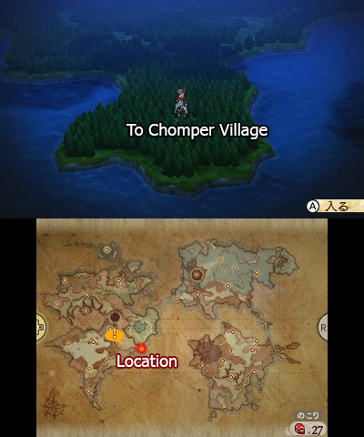
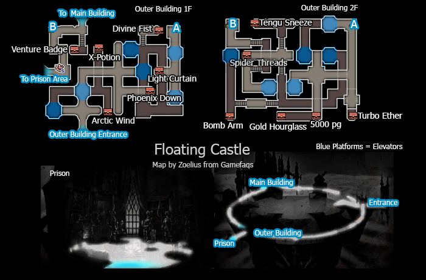
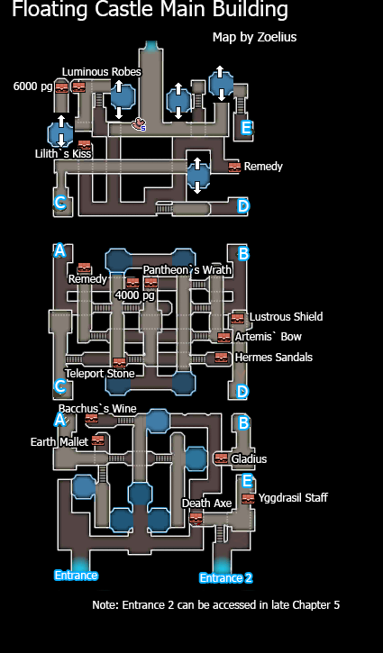

# Table of Contents
<!-- toc orderedList:0 depthFrom:1 depthTo:6 -->

* [Table of Contents](#table-of-contents)
* [Chompshire](#chompshire)
  * [Shops](#shops)
    * [Item Store](#item-store)
    * [Equipment Store](#equipment-store)
    * [Magic Store](#magic-store)
* [Skyhold I](#skyhold-i)
  * [Central Castle](#central-castle)

<!-- tocstop -->

# Chompshire

## Shops

### Item Store

Item | Cost
--- | ---
Elixir | 50000pg

### Equipment Store

Item | Cost
--- | ---
Darkbringer | 200000pg
Bloodrose | 200000pg
Vendetta | 200000pg
Doomsday | 200000pg
Iron Duke | 200000pg
Juggernaut | 200000pg
Moon Glaive Type-0 | 200000pg
Rossweisse | 200000pg
Neo Gae Bolg | 200000pg
Another Mind | 200000pg
Meggido Flame | 200000pg
Arianrhod | 200000pg
Superstar's Mic | 200000pg
Eternal Grudge | 200000pg
Gambantainn | 200000pg
Kronos Scepter | 200000pg
Swindler's Staff | 200000pg
Nirvana | 200000pg
Kuzu-no-Ha | 200000pg
Highroad Star | 200000pg
Sweet Kiss | 200000pg
Sylvan Bow | 200000pg
Nagareboshi | 200000pg
Kogitsune-Maru | 200000pg
God Hand | 200000pg
Shieldcutter | 200000pg
Lightbringer | 200000pg
Revolution | 200000pg
Guncleaver | 200000pg
Unbreakable | 200000pg
Astroche | 200000pg
S. Berry Shieldcake | 200000pg
Flame Charm | 3000pg
Ice Charm | 3000pg
Thunder Charm | 3000pg
Wind Charm | 3000pg
Earth Charm | 3000pg
Light Charm | 3000pg
Dark Charm | 3000pg
Growth Egg | 999999pg
Golden Egg | 999999pg
Freelancer Garb | 200000pg
Washcloth | 200000pg

### Magic Store

Spell | Class | Cost
--- | --- | ---
Cure | White Mage | 400pg
Aero | White Mage | 400pg
Esuna | White Mage | 800pg
Raise | White Mage | 800pg
Cura | White Mage | 1600pg
Aerora | White Mage | 1600pg
Curada | White Mage | 3200pg
Esunaga | White Mage | 3200pg
Curaga | White Mage | 6400pg
Aeroga | White Mage | 6400pg
Arise | White Mage | 12800pg
Holy | White Mage | 12800pg
Fire | Black Mage | 400pg
Blizzard | Black Mage | 400pg
Thunder | Black Mage | 800pg
Aspir | Black Mage | 800pg
Fira | Black Mage | 1600pg
Blizzara | Black Mage | 1600pg
Thundara | Black Mage | 3200pg
Drain | Black Mage | 3200pg
Firaga | Black Mage | 6400pg
Blizzaga | Black Mage | 6400pg
Thundaga | Black Mage | 12800pg
Dark | Black Mage | 12800pg
Haste | Time Mage | 400pg
Quake | Time Mage | 400pg
Regen | Time Mage | 800pg
Quick | Time Mage | 800pg
Quara | Time Mage | 1600pg
Gravity | Time Mage | 1600pg
Comet | Time Mage | 3200pg
Hastega | Time Mage | 3200pg
Stop | Time Mage | 6400pg
Quaga | Time Mage | 6400pg
Reraise | Time Mage | 12800pg
Meteor | Time Mage | 12800pg
Heal | Bishop | 200pg
Antidote | Bishop | 200pg
Open Eyes | Bishop | 400pg
Holy Night | Bishop | 400pg
Blessing | Bishop | 800pg
Vivify | Bishop | 800pg
Benevolence | Bishop | 1600pg
Innocence | Bishop | 1600pg
Benediction | Bishop | 3200pg
Resurrect | Bishop | 3200pg
Calm | Bishop | 6400pg
Heat | Wizard | 200pg
Frost | Wizard | 200pg
Lightning | Wizard | 200pg
Tornado | Wizard | 200pg
Soil | Wizard | 200pg
Shining | Wizard | 200pg
Spirit | Wizard | 200pg
Physical Boon | Astrologian | 200pg
Mystic Boon | Astrologian | 200pg
Evade Boon | Astrologian | 400pg
Elemental Boon | Astrologian | 400pg
Speed Boon | Astrologian | 800pg
Magic Mirror | Astrologian | 800pg
Physical Ward | Astrologian | 1600pg
Mystic Ward | Astrologian | 1600pg
Lucky Day | Astrologian | 3200pg
Elemental Mirror | Astrologian | 3200pg
Elemental Boon | Astrologian | 6400pg
Elemental Barrier | Astrologian | 6400pg

# Skyhold I

<table>
  <tr>
    <th>Boss</th>
    <th>HP</th>
    <th>Stolen Items</th>
    <th>Drop Items</th>
  </tr>
  <tr>
    <td rowspan="3">Revenant</td>
    <td>Casual: 37500HP</td>
    <td rowspan="3">Maximillian</td>
    <td rowspan="3">X-Potion</td>
  </tr>
  <tr>
    <td>Normal: 50000HP</td>
  </tr>
  <tr>
    <td>Hard: 75000HP</td>
  </tr>
</table>

## Central Castle

<table>
  <tr>
    <th>Boss</th>
    <th>HP</th>
    <th>Stolen Items</th>
    <th>Drop Items</th>
  </tr>
  <tr>
    <td rowspan="3">Janne</td>
    <td>Casual: 37500HP</td>
    <td rowspan="3">Colichemarde</td>
    <td rowspan="3">X-Potion</td>
  </tr>
  <tr>
    <td>Normal: 50000HP</td>
  </tr>
  <tr>
    <td>Hard: 75000HP</td>
  </tr>
</table>

<table>
  <tr>
    <th>Boss</th>
    <th>HP</th>
    <th>Stolen Items</th>
    <th>Drop Items</th>
  </tr>
  <tr>
    <td rowspan="3">Anne</td>
    <td>Casual: 37500HP</td>
    <td rowspan="3">Elixir</td>
    <td rowspan="3">Chocolat</td>
  </tr>
  <tr>
    <td>Normal: 50000HP</td>
  </tr>
  <tr>
    <td>Hard: 75000HP</td>
  </tr>
</table>
