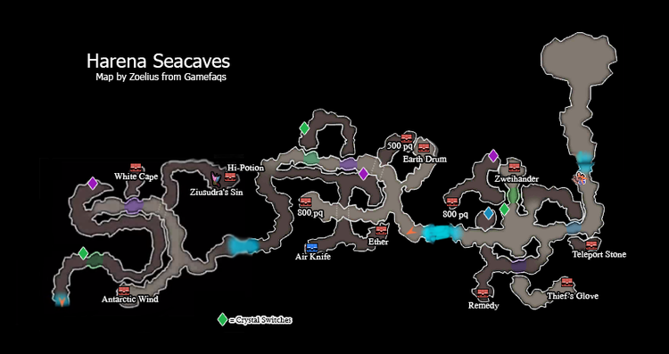
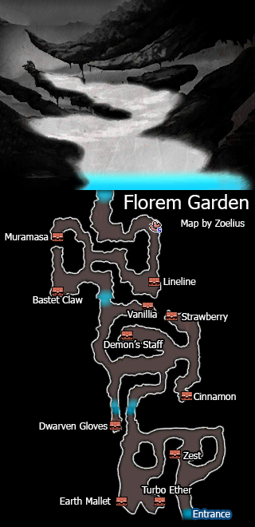
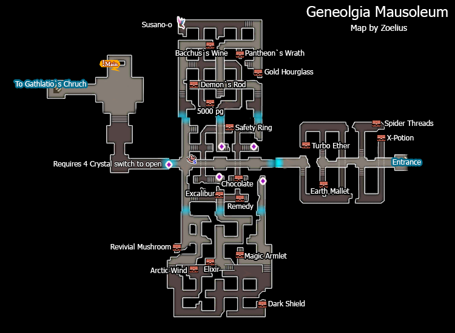

# Table of Contents
<!-- toc orderedList:0 depthFrom:1 depthTo:6 -->

* [Table of Contents](#table-of-contents)
* [Gathelatio](#gathelatio)
* [Blue Treasure Chest Hunt](#blue-treasure-chest-hunt)
* [Asterisk Redux](#asterisk-redux)
  * [Thief/Red Mage](#thiefred-mage)
  * [Summoner/Swordmaster](#summonerswordmaster)
  * [Merchant/White Mage](#merchantwhite-mage)
  * [Ranger/Black Made](#rangerblack-made)
  * [Ninja/Knight](#ninjaknight)
  * [Monk/Valkrie](#monkvalkrie)
  * [Performer/Pirate](#performerpirate)
  * [Dark Knight/Time Mage](#dark-knighttime-mage)
* [Harena Seacaves II](#harena-seacaves-ii)
* [Florem Garden](#florem-garden)
* [Skyhold II](#skyhold-ii)
* [Geneolgia Mausoleum](#geneolgia-mausoleum)

<!-- tocstop -->

# Gathelatio

<table>
  <tr>
    <th>Boss</th>
    <th>HP</th>
    <th>Stolen Items</th>
    <th>Drop Items</th>
  </tr>
  <tr>
    <td rowspan="3">Kaiser Oblivion</td>
    <td>Casual: 37500HP</td>
    <td rowspan="3">Claymore</td>
    <td rowspan="3">X-Potion</td>
  </tr>
  <tr>
    <td>Normal: 50000HP</td>
  </tr>
  <tr>
    <td>Hard: 75000HP</td>
  </tr>
</table>

<table>
  <tr>
    <th>Boss</th>
    <th>HP</th>
    <th>Stolen Items</th>
    <th>Drop Items</th>
  </tr>
  <tr>
    <td rowspan="3">Bella</td>
    <td>Casual: 30000HP</td>
    <td rowspan="3">Turbo Ether</td>
    <td rowspan="3">X-Potion</td>
  </tr>
  <tr>
    <td>Normal: 40000HP</td>
  </tr>
  <tr>
    <td>Hard: 60000HP</td>
  </tr>
  <tr>
    <td rowspan="3">Cu Chulainn</td>
    <td>Casual: 37500HP</td>
    <td rowspan="3">Monocerous Flake</td>
    <td rowspan="3">Gaebolg</td>
  </tr>
  <tr>
    <td>Normal: 50000HP</td>
  </tr>
  <tr>
    <td>Hard: 75000HP</td>
  </tr>
</table>

# Blue Treasure Chest Hunt

Item | Location
--- | ---
Longinus | Eternian Central Command 48F
Yoichi's Bow | Harena Ruins B2
Hadean Claws | Ba'al Crater Descent
Heiji's Jitte | Miasma Woods Central
Air Knife | Harena Sea Caves Central
Fortuna | Grand Mill Works 2F Hidden Passage
Blessed Shield | Mythril Mines B2
Doujigiri-Yasutsuna | Geyser Grotto Central
Kokusenpu | Starkfort Interior 3F
Musashi's Oar | Witherwood Interior
Kokusenpu | Grandship Engine Room B28
Ripper | Everlast Tower 3F

# Asterisk Redux

## Thief/Red Mage

<table>
  <tr>
    <th>Boss</th>
    <th>HP</th>
    <th>Stolen Items</th>
    <th>Drop Items</th>
  </tr>
  <tr>
    <td rowspan="3">Jackal</td>
    <td>Casual: 60000HP</td>
    <td rowspan="3">Nadalan Sleeves</td>
    <td rowspan="3">X-Potion</td>
  </tr>
  <tr>
    <td>Normal: 80000HP</td>
  </tr>
  <tr>
    <td>Hard: 120000HP</td>
  </tr>
</table>

<table>
  <tr>
    <th>Boss</th>
    <th>HP</th>
    <th>Stolen Items</th>
    <th>Drop Items</th>
  </tr>
  <tr>
    <td rowspan="3">Fiore DeRosa</td>
    <td>Casual: 60000HP</td>
    <td rowspan="3">Lilith's Kiss</td>
    <td rowspan="3">Remedy</td>
  </tr>
  <tr>
    <td>Normal: 80000HP</td>
  </tr>
  <tr>
    <td>Hard: 120000HP</td>
  </tr>
</table>

## Summoner/Swordmaster

<table>
  <tr>
    <th>Boss</th>
    <th>HP</th>
    <th>Stolen Items</th>
    <th>Drop Items</th>
  </tr>
  <tr>
    <td rowspan="3">Mephilia</td>
    <td>Casual: 60000HP</td>
    <td rowspan="3">Mythril Rod</td>
    <td rowspan="3">Turbo Ether</td>
  </tr>
  <tr>
    <td>Normal: 80000HP</td>
  </tr>
  <tr>
    <td>Hard: 120000HP</td>
  </tr>
</table>

<table>
  <tr>
    <th>Boss</th>
    <th>HP</th>
    <th>Stolen Items</th>
    <th>Drop Items</th>
  </tr>
  <tr>
    <td rowspan="3">Kamiizumi</td>
    <td>Casual: 67500HP</td>
    <td rowspan="3">Osafune</td>
    <td rowspan="3">N/A</td>
  </tr>
  <tr>
    <td>Normal: 90000HP</td>
  </tr>
  <tr>
    <td>Hard: 135000HP</td>
  </tr>
</table>

## Merchant/White Mage

<table>
  <tr>
    <th>Boss</th>
    <th>HP</th>
    <th>Stolen Items</th>
    <th>Drop Items</th>
  </tr>
  <tr>
    <td rowspan="3">Holly Whyte</td>
    <td>Casual: 60000HP</td>
    <td rowspan="3">Jade Crosier</td>
    <td rowspan="3">Light Curtain</td>
  </tr>
  <tr>
    <td>Normal: 80000HP</td>
  </tr>
  <tr>
    <td>Hard: 120000HP</td>
  </tr>
</table>

<table>
  <tr>
    <th>Boss</th>
    <th>HP</th>
    <th>Stolen Items</th>
    <th>Drop Items</th>
  </tr>
  <tr>
    <td rowspan="3">Profiteur</td>
    <td>Casual: 60000HP</td>
    <td rowspan="3">Rare Cheese</td>
    <td rowspan="3">Gold Hourglass</td>
  </tr>
  <tr>
    <td>Normal: 80000HP</td>
  </tr>
  <tr>
    <td>Hard: 120000HP</td>
  </tr>
</table>

## Ranger/Black Made

<table>
  <tr>
    <th>Boss</th>
    <th>HP</th>
    <th>Stolen Items</th>
    <th>Drop Items</th>
  </tr>
  <tr>
    <td rowspan="3">Artemia</td>
    <td>Casual: 67500HP</td>
    <td rowspan="3">Dragon Steak</td>
    <td rowspan="3">Beast Flesh</td>
  </tr>
  <tr>
    <td>Normal: 90000HP</td>
  </tr>
  <tr>
    <td>Hard: 135000HP</td>
  </tr>
</table>

<table>
  <tr>
    <th>Boss</th>
    <th>HP</th>
    <th>Stolen Items</th>
    <th>Drop Items</th>
  </tr>
  <tr>
    <td rowspan="3">Ominas Crowe</td>
    <td>Casual: 52500HP</td>
    <td rowspan="3">Turbo Ether</td>
    <td rowspan="3">N/A</td>
  </tr>
  <tr>
    <td>Normal: 70000HP</td>
  </tr>
  <tr>
    <td>Hard: 105000HP</td>
  </tr>
  <tr>
    <td rowspan="3">Bahamut</td>
    <td>Casual: 45000HP</td>
    <td rowspan="3">Bomb Arm</td>
    <td rowspan="3">Bomb Arm</td>
  </tr>
  <tr>
    <td>Normal: 60000HP</td>
  </tr>
  <tr>
    <td>Hard: 90000HP</td>
  </tr>
</table>

## Ninja/Knight

<table>
  <tr>
    <td rowspan="3">Heinkel</td>
    <td>Casual: 67500HP</td>
    <td rowspan="3">Adamant Shield</td>
    <td rowspan="3">X-Potion</td>
  </tr>
  <tr>
    <td>Normal: 90000HP</td>
  </tr>
  <tr>
    <td>Hard: 135000HP</td>
  </tr>
</table>

<table>
  <tr>
    <td rowspan="3">Kikiyou</td>
    <td>Casual: 60000HP</td>
    <td rowspan="3">Kunai</td>
    <td rowspan="3">Gale Hairpin</td>
  </tr>
  <tr>
    <td>Normal: 90000HP</td>
  </tr>
  <tr>
    <td>Hard: 120000HP</td>
  </tr>
</table>

## Monk/Valkrie

<table>
  <tr>
    <th>Boss</th>
    <th>HP</th>
    <th>Stolen Items</th>
    <th>Drop Items</th>
  </tr>
  <tr>
    <td rowspan="3">Barras</td>
    <td>Casual: 60000HP</td>
    <td rowspan="3">Bear Knuckles</td>
    <td rowspan="3">X-Potion</td>
  </tr>
  <tr>
    <td>Normal: 80000HP</td>
  </tr>
  <tr>
    <td>Hard: 120000HP</td>
  </tr>
  <tr>
    <td rowspan="3">Transcute</td>
    <td>Casual: 9750HP</td>
    <td rowspan="3">Eye Drops</td>
    <td rowspan="3">X-Potion</td>
  </tr>
  <tr>
    <td>Normal: 13000HP</td>
  </tr>
  <tr>
    <td>Hard: 19500HP</td>
  </tr>
</table>

<table>
  <tr>
    <th>Boss</th>
    <th>HP</th>
    <th>Stolen Items</th>
    <th>Drop Items</th>
  </tr>
  <tr>
    <td rowspan="3">Einheria</td>
    <td>Casual: 60000HP</td>
    <td rowspan="3">Silver Glaive</td>
    <td rowspan="3">X-Potion</td>
  </tr>
  <tr>
    <td>Normal: 80000HP</td>
  </tr>
  <tr>
    <td>Hard: 120000HP</td>
  </tr>
  <tr>
    <td rowspan="3">Veeling</td>
    <td>Casual: 9750HP</td>
    <td rowspan="3">Lilith's Kiss</td>
    <td rowspan="3">X-Potion</td>
  </tr>
  <tr>
    <td>Normal: 13000HP</td>
  </tr>
  <tr>
    <td>Hard: 19500HP</td>
  </tr>
</table>

## Performer/Pirate

<table>
  <tr>
    <td rowspan="3">Barbarossa</td>
    <td>Casual: 67500HP</td>
    <td rowspan="3">Labrys</td>
    <td rowspan="3">Arctic Wind</td>
  </tr>
  <tr>
    <td>Normal: 90000HP</td>
  </tr>
  <tr>
    <td>Hard: 135000HP</td>
  </tr>
</table>

<table>
  <tr>
    <td rowspan="3">Praline</td>
    <td>Casual: 60000HP</td>
    <td rowspan="3">Diamond Staff</td>
    <td rowspan="3">X-Potion</td>
  </tr>
  <tr>
    <td>Normal: 80000HP</td>
  </tr>
  <tr>
    <td>Hard: 120000HP</td>
  </tr>
</table>

## Dark Knight/Time Mage

<table>
  <tr>
    <td rowspan="3">Alternis</td>
    <td>Casual: 67500HP</td>
    <td rowspan="3">Dark Charm</td>
    <td rowspan="3">X-Potion</td>
  </tr>
  <tr>
    <td>Normal: 90000HP</td>
  </tr>
  <tr>
    <td>Hard: 135000HP</td>
  </tr>
</table>

<table>
  <tr>
    <td rowspan="3">Khamer</td>
    <td>Casual: 60000HP</td>
    <td rowspan="3">Gold Hourglass</td>
    <td rowspan="3">Crosshair</td>
  </tr>
  <tr>
    <td>Normal: 80000HP</td>
  </tr>
  <tr>
    <td>Hard: 120000HP</td>
  </tr>
</table>

# Harena Seacaves II

<table>
  <tr>
    <th>Boss</th>
    <th>HP</th>
    <th>Stolen Items</th>
    <th>Drop Items</th>
  </tr>
  <tr>
    <td rowspan="3">Geist</td>
    <td>Casual: 22500HP</td>
    <td rowspan="3">Bloody Shield</td>
    <td rowspan="3">X-Potion</td>
  </tr>
  <tr>
    <td>Normal: 30000HP</td>
  </tr>
  <tr>
    <td>Hard: 45000HP</td>
  </tr>
  <tr>
    <td rowspan="3">Revenant</td>
    <td>Casual: 37500HP</td>
    <td rowspan="3">Dragon Scale</td>
    <td rowspan="3">Ether</td>
  </tr>
  <tr>
    <td>Normal: 50000HP</td>
  </tr>
  <tr>
    <td>Hard: 75000HP</td>
  </tr>
</table>

# Florem Garden

<table>
  <tr>
    <th>Boss</th>
    <th>HP</th>
    <th>Stolen Items</th>
    <th>Drop Items</th>
  </tr>
  <tr>
    <td rowspan="3">Aimee</td>
    <td>Casual: 37500HP</td>
    <td rowspan="3">M2348</td>
    <td rowspan="3">Bomb Arm</td>
  </tr>
  <tr>
    <td>Normal: 50000HP</td>
  </tr>
  <tr>
    <td>Hard: 75000HP</td>
  </tr>
  <tr>
    <td rowspan="3">Panettone</td>
    <td>Casual: 35000HP</td>
    <td rowspan="3">Falcon Knife</td>
    <td rowspan="3">Anglaise, Feuilletage</td>
  </tr>
  <tr>
    <td>Normal: 45000HP</td>
  </tr>
  <tr>
    <td>Hard: 67500HP</td>
  </tr>
</table>

<table>
  <tr>
    <th>Boss</th>
    <th>HP</th>
    <th>Stolen Items</th>
    <th>Drop Items</th>
  </tr>
  <tr>
    <td rowspan="3">Minette</td>
    <td>Casual: 37500HP</td>
    <td rowspan="3">Cross Axe</td>
    <td rowspan="3">Tender Victuals</td>
  </tr>
  <tr>
    <td>Normal: 50000HP</td>
  </tr>
  <tr>
    <td>Hard: 75000HP</td>
  </tr>
  <tr>
    <td rowspan="3">Bismarck</td>
    <td>Casual: 45000HP</td>
    <td rowspan="3">Tender Victuals</td>
    <td rowspan="3">Cat Feather</td>
  </tr>
  <tr>
    <td>Normal: 60000HP</td>
  </tr>
  <tr>
    <td>Hard: 90000HP</td>
  </tr>
</table>

# Skyhold II

<table>
  <tr>
    <th>Boss</th>
    <th>HP</th>
    <th>Stolen Items</th>
    <th>Drop Items</th>
  </tr>
  <tr>
    <td rowspan="3">Janne</td>
    <td>Casual: 37500HP</td>
    <td rowspan="3">Rune Blade</td>
    <td rowspan="3">Tender Victuals</td>
  </tr>
  <tr>
    <td>Normal: 50000HP</td>
  </tr>
  <tr>
    <td>Hard: 75000HP</td>
  </tr>
  <tr>
    <td rowspan="3">Nikolai</td>
    <td>Casual: 45000HP</td>
    <td rowspan="3">Sage's Staff</td>
    <td rowspan="3">Cat Feather</td>
  </tr>
  <tr>
    <td>Normal: 60000HP</td>
  </tr>
  <tr>
    <td>Hard: 90000HP</td>
  </tr>
</table>

# Geneolgia Mausoleum

<table>
  <tr>
    <th>Boss</th>
    <th>HP</th>
    <th>Stolen Items</th>
    <th>Drop Items</th>
  </tr>
  <tr>
    <td rowspan="3">Denys</td>
    <td>Casual: 37500HP x2</td>
    <td rowspan="3">Chaos Blade</td>
    <td rowspan="3">Elixir</td>
  </tr>
  <tr>
    <td>Normal: 50000HP x2</td>
  </tr>
  <tr>
    <td>Hard: 75000HP x2</td>
  </tr>
</table>

<table>
  <tr>
    <th>Boss</th>
    <th>HP</th>
    <th>Stolen Items</th>
    <th>Drop Items</th>
  </tr>
  <tr>
    <td rowspan="3">Ultimate Ba'al; Diamante</td>
    <td>Casual: 30000HP x2</td>
    <td rowspan="3">Light Curtain</td>
    <td rowspan="3">Crystal Mail</td>
  </tr>
  <tr>
    <td>Normal: 45000HP x2</td>
  </tr>
  <tr>
    <td>Hard: 60000HP x2</td>
  </tr>
</table>
