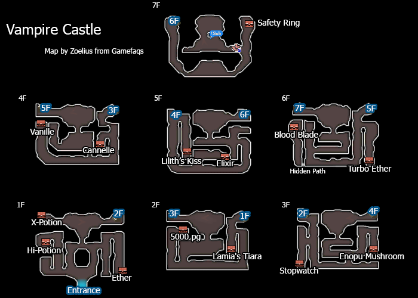

# Table of Contents
<!-- toc orderedList:0 depthFrom:1 depthTo:6 -->

* [Table of Contents](#table-of-contents)
* [Caldisla](#caldisla)
  * [Shops](#shops)
    * [Item Store](#item-store)
    * [Equipment Store](#equipment-store)
    * [Magic Store](#magic-store)
* [Everlast Tower](#everlast-tower)
* [Eternia Prison](#eternia-prison)
* [Vestment Cave](#vestment-cave)
* [Lee's Needleworks](#lees-needleworks)
* [Lontano Villa](#lontano-villa)
* [Vampire Castle](#vampire-castle)
* [Seven Deadly Sins](#seven-deadly-sins)
  * [Asmodeus](#asmodeus)
  * [Beelzebub](#beelzebub)
  * [Belphegor](#belphegor)
  * [Mammon](#mammon)
  * [Leviathan](#leviathan)
  * [Lucifer](#lucifer)
  * [Satan](#satan)
* [Norende Ravine](#norende-ravine)
* [Celestial Road](#celestial-road)

<!-- tocstop -->

# Caldisla

## Shops

### Item Store

Item | Cost
--- | ---
Potion | 20pg
Hi-Potion | 150pg
Phoenix Down | 100pg
Ether | 500pg
Antidote | 10pg
Eye Drops | 20pg
Echo Herbs | 25pg
Remedy | 500pg
Balsam | 500pg
Teleport Stone | 100pg
Magic Bottle | 200pg

### Equipment Store

Item | Cost
--- | ---
Rune Blade | 20000pg
Cross Axe | 24000pg
Roncone | 18000pg
Wonder Rod | 15000pg
Hammer Mace | 15000pg
Sage's Staff | 12000pg
Simian Staff | 12000pg
Falcon Knife | 14000pg
Elven Bow | 17000pg
Mutsu-no-Kami | 19000pg
Hammer Knuckle | 22000pg
Flambege | 26000pg
M2348 | 25000pg
Pentangle | 12000pg
Circlet | 6000pg
Armlet | 8000pg
Battle Techtor | 16000pg
Sage's Robe | 14000pg
Dragon Scale | 20000pg
Adamant  Glove | 2000pg
Safety Ring | 20000pg
Lifeline | 10000pg

### Magic Store

Spell | Class | Cost
--- | --- | ---
Arise | White Mage | 12800pg
Holy | White Mage | 12800pg
Thundaga | Black Mage | 12800pg
Dark | Black Mage | 12800pg
Stop | Time Mage | 12800pg
Quaga | Time Mage | 12800pg
Reraise | Time Mage | 12800pg
Meteor | Time Mage | 12800pg

# Everlast Tower

# Eternia Prison

# Vestment Cave

<table>
  <tr>
    <th>Boss</th>
    <th>HP</th>
    <th>Stolen Items</th>
    <th>Drop Items</th>
  </tr>
  <tr>
    <td rowspan="3">Braev</td>
    <td>Casual: 22500HP</td>
    <td rowspan="3">Flamberge</td>
    <td rowspan="3">Light Curtain</td>
  </tr>
  <tr>
    <td>Normal: 30000HP</td>
  </tr>
  <tr>
    <td>Hard: 45000HP</td>
  </tr>
</table>

# Lee's Needleworks

# Lontano Villa

<table>
  <tr>
    <th>Boss</th>
    <th>HP</th>
    <th>Stolen Items</th>
    <th>Drop Items</th>
  </tr>
  <tr>
    <td rowspan="3">Ba'al I; Turle Dove</td>
    <td>Casual: 75000HP</td>
    <td rowspan="3">Phoenix Down</td>
    <td rowspan="3">Elixir</td>
  </tr>
  <tr>
    <td>Normal: 100000HP</td>
  </tr>
  <tr>
    <td>Hard: 150000HP</td>
  </tr>
</table>

# Vampire Castle

<table>
  <tr>
    <th>Boss</th>
    <th>HP</th>
    <th>Stolen Items</th>
    <th>Drop Items</th>
  </tr>
  <tr>
    <td rowspan="3">Yoko</td>
    <td>Casual: 98625HP</td>
    <td rowspan="3">Muramasa</td>
    <td rowspan="3">Elixir</td>
  </tr>
  <tr>
    <td>Normal: 131500HP</td>
  </tr>
  <tr>
    <td>Hard: 197250HP</td>
  </tr>
</table>

# Seven Deadly Sins

## Asmodeus

<table>
  <tr>
    <th>Boss</th>
    <th>HP</th>
    <th>Stolen Items</th>
    <th>Drop Items</th>
  </tr>
  <tr>
    <td rowspan="3">Asmodeus</td>
    <td>Casual: 75000HP</td>
    <td rowspan="3">Turbo Ether</td>
    <td rowspan="3">Elixir</td>
  </tr>
  <tr>
    <td>Normal: 100000HP</td>
  </tr>
  <tr>
    <td>Hard: 150000HP</td>
  </tr>
</table>

## Beelzebub

<table>
  <tr>
    <th>Boss</th>
    <th>HP</th>
    <th>Stolen Items</th>
    <th>Drop Items</th>
  </tr>
  <tr>
    <td rowspan="3">Beelzebub</td>
    <td>Casual: 75000HP</td>
    <td rowspan="3">Turbo Ether</td>
    <td rowspan="3">Elixir</td>
  </tr>
  <tr>
    <td>Normal: 100000HP</td>
  </tr>
  <tr>
    <td>Hard: 150000HP</td>
  </tr>
</table>

## Belphegor

<table>
  <tr>
    <th>Boss</th>
    <th>HP</th>
    <th>Stolen Items</th>
    <th>Drop Items</th>
  </tr>
  <tr>
    <td rowspan="3">Asmodeus</td>
    <td>Casual: 75000HP</td>
    <td rowspan="3">Turbo Ether</td>
    <td rowspan="3">Elixir</td>
  </tr>
  <tr>
    <td>Normal: 100000HP</td>
  </tr>
  <tr>
    <td>Hard: 150000HP</td>
  </tr>
  <tr>
    <td rowspan="3">Sphere</td>
    <td>Casual: 1125HP</td>
    <td rowspan="3">Turbo Ether</td>
    <td rowspan="3">Elixir</td>
  </tr>
  <tr>
    <td>Normal: 1500HP</td>
  </tr>
  <tr>
    <td>Hard: 2250HP</td>
  </tr>
</table>

## Mammon

<table>
  <tr>
    <th>Boss</th>
    <th>HP</th>
    <th>Stolen Items</th>
    <th>Drop Items</th>
  </tr>
  <tr>
    <td rowspan="3">Mammon</td>
    <td>Casual: 75000HP</td>
    <td rowspan="3">Turbo Ether</td>
    <td rowspan="3">Elixir</td>
  </tr>
  <tr>
    <td>Normal: 100000HP</td>
  </tr>
  <tr>
    <td>Hard: 150000HP</td>
  </tr>
</table>

## Leviathan

<table>
  <tr>
    <th>Boss</th>
    <th>HP</th>
    <th>Stolen Items</th>
    <th>Drop Items</th>
  </tr>
  <tr>
    <td rowspan="3">Leviathan</td>
    <td>Casual: 75000HP</td>
    <td rowspan="3">Turbo Ether</td>
    <td rowspan="3">Elixir</td>
  </tr>
  <tr>
    <td>Normal: 100000HP</td>
  </tr>
  <tr>
    <td>Hard: 150000HP</td>
  </tr>
</table>

## Lucifer

<table>
  <tr>
    <th>Boss</th>
    <th>HP</th>
    <th>Stolen Items</th>
    <th>Drop Items</th>
  </tr>
  <tr>
    <td rowspan="3">Lucifer</td>
    <td>Casual: 75000HP</td>
    <td rowspan="3">Turbo Ether</td>
    <td rowspan="3">Elixir</td>
  </tr>
  <tr>
    <td>Normal: 100000HP</td>
  </tr>
  <tr>
    <td>Hard: 150000HP</td>
  </tr>
</table>

## Satan

<table>
  <tr>
    <th>Boss</th>
    <th>HP</th>
    <th>Stolen Items</th>
    <th>Drop Items</th>
  </tr>
  <tr>
    <td rowspan="3">Satan</td>
    <td>Casual: 75000HP</td>
    <td rowspan="3">Turbo Ether</td>
    <td rowspan="3">Elixir</td>
  </tr>
  <tr>
    <td>Normal: 100000HP</td>
  </tr>
  <tr>
    <td>Hard: 150000HP</td>
  </tr>
</table>

# Norende Ravine

<table>
  <tr>
    <th>Boss</th>
    <th>HP</th>
    <th>Stolen Items</th>
    <th>Drop Items</th>
  </tr>
  <tr>
    <td rowspan="3">Ultimate Anne</td>
    <td>Casual: 112500HP</td>
    <td rowspan="3">Turbo Ether</td>
    <td rowspan="3">Elixir</td>
  </tr>
  <tr>
    <td>Normal: 150000HP</td>
  </tr>
  <tr>
    <td>Hard: 225000HP</td>
  </tr>
</table>

# Celestial Road

<table>
  <tr>
    <th>Boss</th>
    <th>HP</th>
    <th>Stolen Items</th>
    <th>Drop Items</th>
  </tr>
  <tr>
    <td rowspan="3">Providence</td>
    <td>Casual: 75000HP</td>
    <td rowspan="3">Elixir</td>
    <td rowspan="3">Megalixir</td>
  </tr>
  <tr>
    <td>Normal: 100000HP</td>
  </tr>
  <tr>
    <td>Hard: 150000HP</td>
  </tr>
</table>

<table>
  <tr>
    <th>Boss</th>
    <th>HP</th>
    <th>Stolen Items</th>
    <th>Drop Items</th>
  </tr>
  <tr>
    <td rowspan="3">ProvidenceA</td>
    <td>Casual: 112000HP</td>
    <td rowspan="3">Elixir</td>
    <td rowspan="3">Megalixir</td>
  </tr>
  <tr>
    <td>Normal: 100000HP</td>
  </tr>
  <tr>
    <td>Hard: 150000HP</td>
  </tr>
  <tr>
    <td rowspan="3">ProvidenceAb</td>
    <td>Casual: 7499HP</td>
    <td rowspan="3">Elixir</td>
    <td rowspan="3">Megalixir</td>
  </tr>
  <tr>
    <td>Normal: 9999HP</td>
  </tr>
  <tr>
    <td>Hard: 14988HP</td>
  </tr>
  <tr>
    <td rowspan="3">ProvidenceB</td>
    <td>Casual: 7499HP</td>
    <td rowspan="3">Elixir</td>
    <td rowspan="3">Megalixir</td>
  </tr>
  <tr>
    <td>Normal: 9999HP</td>
  </tr>
  <tr>
    <td>Hard: 14988HP</td>
  </tr>
</table>
