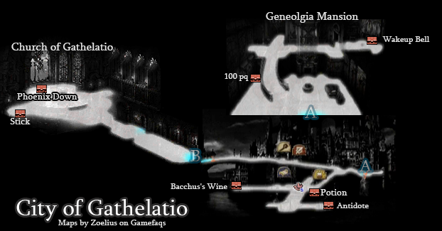
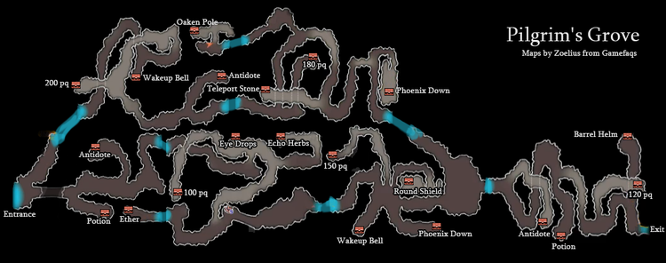
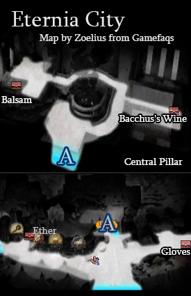
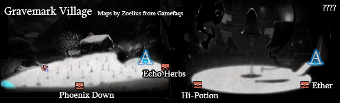
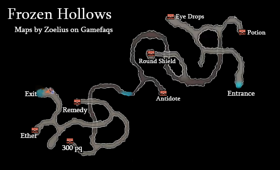
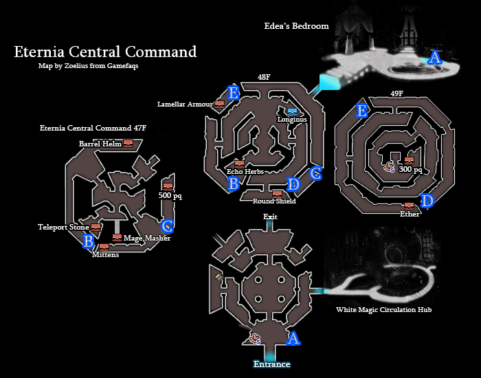

# Table of Contents
<!-- toc orderedList:0 depthFrom:1 depthTo:6 -->

* [Table of Contents](#table-of-contents)
* [City of Gathelatio](#city-of-gathelatio)
  * [Stores](#stores)
    * [Item Shop](#item-shop)
    * [Equipment Shop](#equipment-shop)
    * [Magic Shop](#magic-shop)
* [Pilgrim's Grove](#pilgrims-grove)
* [Eternia City](#eternia-city)
    * [Item Shop](#item-shop-1)
    * [Equipment Shop](#equipment-shop-1)
    * [Magic Shop](#magic-shop-1)
* [Gravemark Village](#gravemark-village)
* [Frozen Hollows](#frozen-hollows)
* [Eternia Central Command](#eternia-central-command)

<!-- tocstop -->

# City of Gathelatio

## Stores

### Item Shop

Item | Cost
--- | ---
Potion | 20pg
Phoenix Down | 100pg
Antidote | 100pg
Eye Drops | 20pg
Echo Herbs | 25pg
Teleport Stone | 100pg

### Equipment Shop

Item | Cost
--- | ---
Rapier | 50pg
Spear | 80pg
Buckler | 30pg
Leather Gloves | 10pg
Chain Coif | 20pg
Pilgrim's Robe | 35pg
Padded Armour | 50pg

### Magic Shop

Item | Class | Cost
--- | --- | ---
Heal | Bishop | 200pg
Antidote | Bishop | 200pg
Frost | Wizard | 200pg
Lightning | Wizard | 200pg

# Pilgrim's Grove

<table>
  <tr>
    <th>Boss</th>
    <th>HP</th>
    <th>Stolen Items</th>
    <th>Drop Items</th>
  </tr>
  <tr>
    <td rowspan="3">Troll</td>
    <td>Casual: 150HP</td>
    <td rowspan="3">N/A</td>
    <td rowspan="3">Phoenix Down</td>
  </tr>
  <tr>
    <td>Normal: 200HP</td>
  </tr>
  <tr>
    <td>Hard: 300HP</td>
  </tr>
</table>

<table>
  <tr>
    <th>Boss</th>
    <th>HP</th>
    <th>Stolen Items</th>
    <th>Drop Items</th>
  </tr>
  <tr>
    <td rowspan="3">Bella</td>
    <td>Casual: 525HP</td>
    <td rowspan="3">N/A</td>
    <td rowspan="3">Heat</td>
  </tr>
  <tr>
    <td>Normal: 700HP</td>
  </tr>
  <tr>
    <td>Hard: 1050HP</td>
  </tr>
</table>

# Eternia City

### Item Shop

Item | Cost
--- | ---
Potion | 20pg
Phoenix Down | 100pg
Antidote | 100pg
Eye Drops | 20pg
Echo Herbs | 25pg
Teleport Stone | 100pg

### Equipment Shop

Item | Cost
--- | ---
Short Sword | 200pg
Francisca | 240pg
Rod | 150pg
Mace | 150pg
Dagger | 140pg
Iron Knuckle | 220pg
Round Shield | 120pg
Knitted Cap | 40pg
Mystic Hood | 60pg
Barrel Helm | 80pg
Tunic | 160pg
Manarobe | 200pg
Mittens | 20pg

### Magic Shop

Item | Class | Cost
--- | --- | ---
Heal | Bishop | 200pg
Antidote | Bishop | 200pg
Heat | Wizard | 200pg
Frost | Wizard | 200pg
Lightning | Wizard | 200pg

# Gravemark Village

# Frozen Hollows

<table>
  <tr>
    <th>Boss</th>
    <th>HP</th>
    <th>Stolen Items</th>
    <th>Drop Items</th>
  </tr>
  <tr>
    <td rowspan="3">Bella</td>
    <td>Casual: 600HP</td>
    <td rowspan="3">N/A</td>
    <td rowspan="3">Ether</td>
  </tr>
  <tr>
    <td>Normal: 800HP</td>
  </tr>
  <tr>
    <td>Hard: 1200HP</td>
  </tr>
  <tr>
    <td rowspan="3">Cu Chulainn</td>
    <td>Casual: 1125HP</td>
    <td rowspan="3">N/A</td>
    <td rowspan="3">Hi-Potion</td>
  </tr>
  <tr>
    <td>Normal: 1500HP</td>
  </tr>
  <tr>
    <td>Hard: 2250HP</td>
  </tr>
</table>

# Eternia Central Command

<table>
  <tr>
    <th>Boss</th>
    <th>HP</th>
    <th>Stolen Items</th>
    <th>Drop Items</th>
  </tr>
  <tr>
    <td rowspan="3">Nikolai</td>
    <td>Casual: 1125HP</td>
    <td rowspan="3">N/A</td>
    <td rowspan="3">Ether</td>
  </tr>
  <tr>
    <td>Normal: 1500HP</td>
  </tr>
  <tr>
    <td>Hard: 2500HP</td>
  </tr>
  <tr>
    <td rowspan="3">Janne</td>
    <td>Casual: 1500HP</td>
    <td rowspan="3">N/A</td>
    <td rowspan="3">Hi-Potion</td>
  </tr>
  <tr>
    <td>Normal: 2000HP</td>
  </tr>
  <tr>
    <td>Hard: 3000HP</td>
  </tr>
</table>
