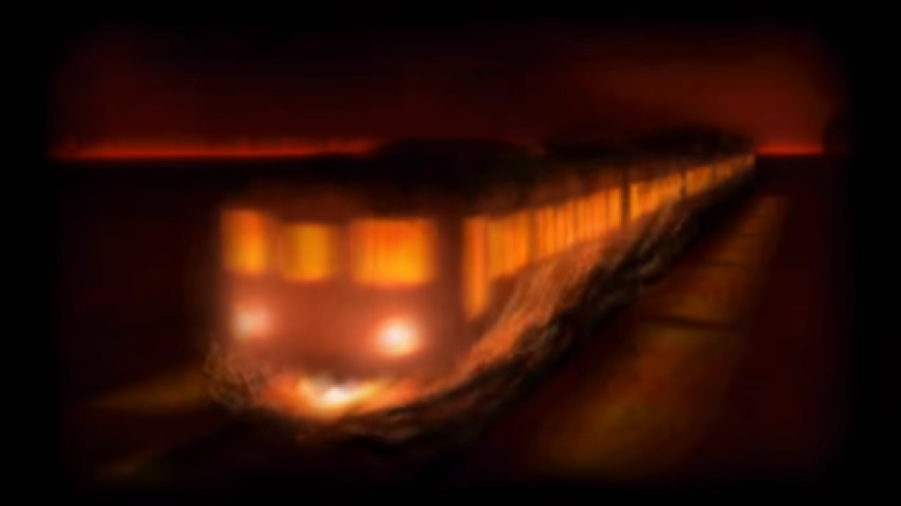

# Table of Contents
<!-- toc orderedList:0 depthFrom:1 depthTo:6 -->

* [Table of Contents](#table-of-contents)
* [Hresvelgr](#hresvelgr)
* [Deus Ex](#deus-ex)
* [Ziusudra's Sin](#ziusudras-sin)
* [Promethean Fire](#promethean-fire)
* [Girtablulu](#girtablulu)
* [Charybdis](#charybdis)
* [Susano-o](#susano-o)
* [Amaterasu](#amaterasu)

<!-- tocstop -->

# Hresvelgr

Name | Level | Cost | Effect | Location
--- | --- | --- | --- | ---
Hresvelgr | 1 | 40 MP | Deal wind damage to all enemies | Default summon

# Deus Ex

Name | Level | Cost | Effect | Location
--- | --- | --- | --- | ---
Deus Ex | 2 | 40 MP | Deal lightning damage to all enemies | Ba'al Crater

# Ziusudra's Sin

Name | Level | Cost | Effect | Location
--- | --- | --- | --- | ---
Ziusudra's Sin | 2 | 40 MP | Deal water damage to all enemies | Harena Seacaves

# Promethean Fire

Name | Level | Cost | Effect | Location
--- | --- | --- | --- | ---
Promethean Fire | 2 | 40 MP | Deal fire damage to all enemies | Old Aqueduct

# Girtablulu

Name | Level | Cost | Effect | Location
--- | --- | --- | --- | ---
Girtablulu | 3 | 40 MP | Deal earth damage to all enemies | Everlast Tower

# Charybdis

Name | Level | Cost | Effect | Location
--- | --- | --- | --- | ---
Charybdis | 3 | 60 MP | Reduce Physical and Magic Attack by 50% | Grandship Engine Room

# Susano-o

Name | Level | Cost | Effect | Location
--- | --- | --- | --- | ---
Susano-o | 4 | 60 MP | Deal non-elemental damage to all enemies | Geneolgia Mausoleum

# Amaterasu

Name | Level | Cost | Effect | Location
--- | --- | --- | --- | ---
Amaterasu | 4 | 60 MP | Restores HP for all allies, can be used for hurting the undead | World Map

