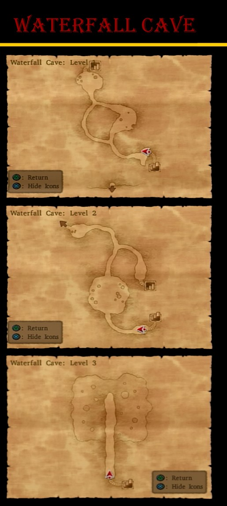

# Farebury

## Collectable Items

* Secluded Grove
  * Medical Herb - Barrel
* Farebury
  * 4G - Barrel outside Inn
  * Holy Water - Inn 2F Closet
  * Plain Clothes - Inn 2F Closet
  * Chimaera Wing - Inn 2F Chest
  * Cypress Stick - Inn 2F Closet
  * Antidotal Herb - Inn 2F Bag
  * Medicinal Herb - Inn 2F Bag
  * 3G - Inn backdoor Bag
  * 5G - Armour Shop House Barrel
  * Antidotal Herb - Armour Shop House Closet
  * Medicinal Herb - Pot behind pub
  * Leather Shield - Well
  * 8G - House near Well Pot
  * Plain Clothes - House near Well Cabinet
  * 20G - House near weapon shop Closet
  * Seed of Defense - Pot Behind Church
  * Medicinal Herb - Church Pot
  * Pot Lid - Church Closet
  * 2G - Upper Area Barrel
  * Medicinal Herb - Upper Area Barrel
  * 10G - Pub backdoor barrel
  * Antidotal Herb - Pub Barrel
  * 4G - Kalderasha's Cabinet
  * Medicinal Herb - Kalderasha's Pot
  * 7G - Kalderasha's Barrel
  * Thief's Key Recipe - Church Bell Tower (Night)
* World Map
  * Seed of Life - North of Farebury
  * Boxer Shorts - Far West of Farebury
  * 82G - Southeast of Farebury
* Waterfall Hut
  * Seed of Agility - Waterfall Hut Bag
  * Holy Water - Waterfall Hut Bag
  * 8 Plain Cheese - Retrieve Tool Bag from Crimson Tree E of Farebury

## Blue Chests

* Southwest of town
* South of town
* Further south of town
* A corner east of town
* SW of town near Waterfall Cave

## Stores

### Item Shop

| Item           | Cost | DEF | H | Y | J | A | M | R |Effect |
| -------------- | :--: | :-: | - | - | - | - | - | - |------ |
| Medicinal Herb | 8G   |  -  | * | * | * | * | * | * | Restores 30-40HP for one character |
| Antidotal Herb | 10G  |  -  | * | * | * | * | * | * | Cures Poison for one character |
| Chimaera Wing  | 25G  |  -  | * | * | * | * | * | * | Allows you to teleport to any town and some dungeons you have already visited |
| Plain Clothes  | 30G  |  4  | * | * | * | * | * | * | An unremarkable garment made from cotton |

### Armour Shop

| Item                 | Cost | DEF | H | Y | J | A | M | R | Effect |
| --------------       | :--: | :-: | - | - | - | - | - | - | ------ |
| Bandit's Grass Skirt | 35G  |  5  | - | * | - | - | - | - | A rough grass kilt of the king preferred by Yangus |
| Wayfarer's Clothes   | 70G  |  7  | * | * | * | * | * | * | Rugged hempen garments loved by travelers for their sturdiness |
| Leather Armour       | 180G |  11 | * | - | - | * | * | - | Lightweight armour made of leather |
| Leather Shield       |  70G |  4  | * | * | - | * | * | - | A simple shield made of leather stretched over wood |
| Leather Hat          |  65G |  3  | * | * | * | * | * | * | A popular hat made of leather |

### Weapon Shop

| Item          | Cost | ATK | H | Y | J | A | M | R | Effect |
| ------------- | :--: | :-: | - | - | - | - | - | - | ------ |
| Cypress Stick | 10G  |  4  | * | - | - | - | - | - | A simple wooden stick carved from a strudy cypress branch |
| Oaken Club    | 110G |  7  | - | * | - | - | * | - | A simple club fashioned from sturdy oak |
| Giant Mallet  | 240G |  13 | - | * | - | - | * | - | A giant wooden hammer of the sort often carried by monsters as well as humans |
| Copper Sword  | 270G |  13 | * | - | - | - | - | - | A widely used sword made of copper |
| Boomerang     | 420G | 19  | * | * | * | * | * | * | A throwing weapon capable of felling multiple enemies in an instant |

## Walkthrough Tasks

1. Purchases: (145 G)
  * 4 Cypress Sticks
  * 1 Bandit's Grass Skirt
  * 1 Leather Shield

# Waterfall Cave

Recommended Level: 5

## Collectable Items

* 100G - Junction
* Chimaera Wing - Right Fork
* Medicinal Herb - North of Chimaera Wing
* Leather Hat - With Medicinal Herb
* Copper Sword - Left after Hammerhood
